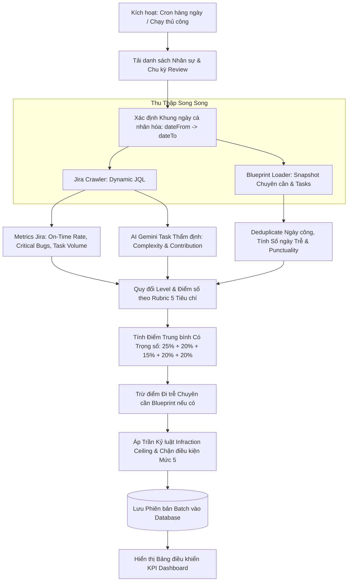

# HƯỚNG DẪN KỸ THUẬT: CƠ CHẾ THU THẬP DỮ LIỆU JIRA & BLUEPRINT CLV VÀ CÔNG THỨC TÍNH ĐIỂM KPI

> **Tài liệu Kỹ thuật & Đặc tả Vận hành Hệ thống Đánh giá Hiệu suất Nhân sự (KPI System)**  
> **Phiên bản:** 3.0 (Cập nhật chuẩn hóa: Công thức Trọng số Rubric kết hợp Khống chế Trần Kỷ luật)  
> **Phạm vi áp dụng:** Toàn bộ nhân sự, Team Lead, Manager, HR Admin và Ban Giám Đốc.

---

## MỤC LỤC
1. [Tổng quan Kiến trúc Tích hợp Đa nguồn](#1-tổng-quan-kiến-trúc-tích-hợp-đa-nguồn)
2. [Cơ chế Thu thập Dữ liệu từ Jira PIM (Jira Crawler)](#2-cơ-chế-thu-thập-dữ-liệu-từ-jira-pim-jira-crawler)
   - 2.1. Cửa sổ Thời gian Review Cá nhân hóa (`dateFrom` $\to$ `dateTo`)
   - 2.2. Phân giải Đa tài khoản Định danh (Multi-Identifier Resolution)
   - 2.3. Cấu trúc Truy vấn JQL Động
   - 2.4. Trích xuất và Phân loại Chỉ số Công việc
3. [Cơ chế Thu thập Dữ liệu từ Cổng Blueprint CLV](#3-cơ-chế-thu-thập-dữ-liệu-từ-cổng-blueprint-clv)
   - 3.1. Cơ chế Xác thực Keycloak SSO
   - 3.2. Dữ liệu Chuyên cần Chấm công (`UI_TAT_028` & `UI_TAT_029`)
   - 3.3. Thuật toán Khử trùng lặp Ngày công In-Memory (`seenEmpDates`)
   - 3.4. Dữ liệu Quản trị Nhiệm vụ (`UI_PIM_001 Requirement`)
   - 3.5. Caching Snapshot Hàng tháng (`collector_monthly_snapshot`)
4. [Công thức & Thuật toán Tính điểm KPI (Scoring Engine)](#4-công-thức--thuật-toán-tính-điểm-kpi-scoring-engine)
   - 4.1. Quy trình Tính điểm Tổng thể 5 Bước
   - 4.2. Bảng Thang chuẩn Rubric 5 Tiêu chí & Quy đổi Level $\to$ Điểm
   - 4.3. Công thức Tính Điểm Trung bình Có Trọng số (Weighted Score)
   - 4.4. Vai trò Thực sự của AI Gemini và Prompt Presets
   - 4.5. Tích hợp Dữ liệu Chuyên cần Blueprint (Trừ điểm Đi trễ)
   - 4.6. Nguyên tắc Trần Vi phạm Kỷ luật (Infraction Ceiling)
   - 4.7. Thang Quy chuẩn Xếp loại Mức 1 $\to$ Mức 5
5. [Bảng Minh họa Tính điểm Các Trường hợp Thực tế](#5-bảng-minh-họa-tính-điểm-các-trường-hợp-thực-tế)

---

## 1. TỔNG QUAN KIẾN TRÚC TÍCH HỢP ĐA NGUỒN

Hệ thống đánh giá hiệu suất nhân sự CyberLogitec kết hợp dữ liệu tự động từ hai nền tảng tác nghiệp chính:
1. **Jira PIM (`pim.cyberlogitec.com`)**: Thu thập lịch sử công việc, tiến độ giao việc, phát sinh lỗi phần mềm và thời gian log work thực tế.
2. **Cổng thông tin Blueprint CLV (`blueprint.cyberlogitec.com.vn`)**: Thu thập dữ liệu chuyên cần chấm công (từ Cổng `UI_TAT_028` & `UI_TAT_029`) và dữ liệu bàn giao nhiệm vụ dự án (`UI_PIM_001`).



---

## 2. CƠ CHẾ THU THẬP DỮ LIỆU TỪ JIRA PIM (JIRA CRAWLER)

Mã nguồn triển khai: [`jira-client.ts`](file:///c:/KPI%20System/kpi-system/backend/src/modules/jira-crawler/jira-client.ts) và điều phối qua [`batch-job.scheduler.ts`](file:///c:/KPI%20System/kpi-system/backend/src/modules/jira-crawler/batch-job.scheduler.ts).

### 2.1. Cửa sổ Thời gian Review Cá nhân hóa (`dateFrom` $\to$ `dateTo`)
Hệ thống không dùng khung ngày cố định mà cá nhân hóa theo **Chu kỳ Review (Review Cadence)** của từng nhân viên cấu hình tại module Tổ chức (Organization):
- **`dateFrom`**: Ngày hoàn thành đợt review gần nhất (`employee.last_evaluation_completed_at`). Nếu nhân viên chưa có review, hệ thống tự động lùi `defaultFromDays` (mặc định 180 ngày).
- **`dateTo`**: Hạn đánh giá tiếp theo (`employee.next_review_due_date`) hoặc ngày hiện tại (`today`).
- **Ý nghĩa**: Đảm bảo đánh giá đúng phạm vi công việc trong chu kỳ review hiện tại (3 tháng, 6 tháng hoặc 1 năm), không cộng dồn trùng lặp công việc của chu kỳ trước.

### 2.2. Phân giải Đa tài khoản Định danh (Multi-Identifier Resolution)
Tài khoản Jira của nhân sự thường không trùng khớp với mã nhân viên. Hệ thống tự động phân giải danh sách định danh gồm:
1. `employeeCode`: Mã nhân viên (ví dụ: `203701`, `213844`).
2. `jiraUsername`: Tên đăng nhập Jira (ví dụ: `nhat.mai`, `hy.le`).
3. `blueprintUsername`: Tên tài khoản Blueprint (ví dụ: `nhatmai`, `hyle`).
4. `emailPrefix`: Tiền tố email công ty (ví dụ: `nhat.mai` từ `nhat.mai@cyberlogitec.com`).

### 2.3. Cấu trúc Truy vấn JQL Động
Hệ thống kết hợp các định danh thành danh sách duy nhất và xây dựng câu lệnh JQL tự động:
```sql
(
    assignee in ("203701", "nhat.mai", "nhatmai") 
    OR cf[11902] in ("203701", "nhat.mai", "nhatmai") 
    OR worklogAuthor in ("203701", "nhat.mai", "nhatmai")
    OR reporter in ("203701", "nhat.mai", "nhatmai")
)
AND updated >= "2026-07-15" AND updated <= "2026-10-15"
ORDER BY updated DESC
```
- **`assignee`**: Người được phân công thực hiện issue.
- **`cf[11902]`**: Custom field *PIC (Person in Charge)* trên hệ thống Jira PIM CyberLogitec.
- **`worklogAuthor`**: Ghi nhận cả các task mà nhân sự phối hợp xử lý và ghi nhận log work (dù không đứng tên Assignee chính).

### 2.4. Trích xuất và Phân loại Chỉ số Công việc
Từ danh sách Issues tải về qua Jira REST API, hàm `aggregateMemberMetrics` phân loại:
- **Trạng thái Hoàn thành (`isCompleted`)**: Task có `statusCategory === 'Done'` hoặc thuộc các trạng thái cấu hình (`Closed`, `Resolved`, `Done`, `Complete`).
- **Kiểm tra Đúng hạn (`isOnTime`)**:
  - *Task đã hoàn thành*: So sánh `resolutiondate <= duedate (23:59:59)`. Nếu giải quyết trước hoặc đúng hạn, tính là `isOnTime = true`, ngược lại là `delayed`.
  - *Task đang làm (In-Progress)*: Nếu ngày hiện tại vượt quá `duedate`, đánh dấu vi phạm tiến độ (`isOnTime = false`).
- **Phân loại Bug & Critical Bug**:
  - Lọc theo `issueType` chứa `Bug`, `Defect`, `Int_Bug Management` hoặc `Customer Bug`.
  - Phân loại **Critical Bug** nếu Priority thuộc `['Critical', 'Highest', 'Blocker']`.
- **Tổng giờ làm việc (`totalHoursSpent`)**: Quy đổi `timespent / 3600` từ giây ra số giờ thực tế.

---

## 3. CƠ CHẾ THU THẬP DỮ LIỆU TỪ CỔNG BLUEPRINT CLV

Mã nguồn triển khai: [`blueprint.collector.ts`](file:///c:/KPI%20System/kpi-system/backend/src/modules/collector/plugins/blueprint.collector.ts) và [`collector.service.ts`](file:///c:/KPI%20System/kpi-system/backend/src/modules/collector/application/collector.service.ts).

### 3.1. Cơ chế Xác thực Keycloak SSO
- Tự động đăng nhập vào Blueprint thông qua cổng **Keycloak SSO** (`auth.cyberlogitec.com.vn`), lưu cookie phiên làm việc in-memory và tự động đăng nhập lại khi phiên hết hạn.

### 3.2. Dữ liệu Chuyên cần Chấm công (`UI_TAT_028` & `UI_TAT_029`)
- Hệ thống gọi API `/api/dailyTeamStatusFace/searchAttendanceTime` và `/api/checkInOut/searchDailyAttendanceCheckInOut`.
- **Quy tắc tính đi trễ**:
  - Mốc bắt đầu làm việc quy chuẩn là **`08:30 AM`**.
  - Nếu `checkIn > 08:30`: Ghi nhận `status = 'LATE'`, tính số phút trễ `lateMinutes = checkIn - 08:30`.
  - Ngày nghỉ phép có đăng ký (`vacDesc`) được ghi nhận là `LEAVE`.

### 3.3. Thuật toán Khử trùng lặp Ngày công In-Memory (`seenEmpDates`)
Một nhân viên có thể xuất hiện trong nhiều bản ghi snapshot theo từng bộ phận (ví dụ: `ALLEGRO NX Part` và `Maritime Solutions Part`).
Hệ thống áp dụng cơ chế băm khóa `seenEmpDates = new Set<string>()`:
```typescript
const dedupKey = `${empCode}#${dateStr}`;
if (dateStr && seenEmpDates.has(dedupKey)) {
  continue; // Bỏ qua bản ghi trùng lặp
}
seenEmpDates.add(dedupKey);
```
Đảm bảo mỗi ngày công của một nhân viên chỉ được tính đúng 1 lần duy nhất, loại bỏ hoàn toàn tình trạng nhân đôi số ngày làm việc hoặc lặp số lần đi trễ.

### 3.4. Dữ liệu Quản trị Nhiệm vụ (`UI_PIM_001 Requirement`)
- Quét task theo dự án: `ALLEGRO NX Part` (`PJT20190724000000001`) hoặc `Maritime Solutions Part` (`PJT20250417000000006`).
- Thu thập cả vai trò Người tạo (`creUsrId`) và Người thực hiện (`assiUsrId`).
- Căn cứ trường `delayProc`: `'N'` là đúng hạn, `'Y'` là trễ hạn.

### 3.5. Caching Snapshot Hàng tháng (`collector_monthly_snapshot`)
- Dữ liệu thu thập định kỳ được lưu vào bảng `collector_monthly_snapshot` theo từng tháng (`2026-07`, `2026-08`, `2026-09`) với trạng thái `is_locked = true` cho các tháng đã qua. Nhờ đó, việc chạy batch cho cả kỳ chỉ mất vài giây đọc snapshot thay vì cào lại toàn bộ mạng nội bộ.

---

## 4. CÔNG THỨC & THUẬT TOÁN TÍNH ĐIỂM KPI (SCORING ENGINE)

Mã nguồn triển khai: [`ai-evaluator.ts`](file:///c:/KPI%20System/kpi-system/backend/src/modules/jira-crawler/ai-evaluator.ts) và [`batch-job.scheduler.ts`](file:///c:/KPI%20System/kpi-system/backend/src/modules/jira-crawler/batch-job.scheduler.ts).

### 4.1. Quy trình Tính điểm Tổng thể 5 Bước

$$\text{Tổng điểm cuối cùng} = \min\Big(\text{Trần Kỷ Luật (Ceiling)}, \;\; \text{Điểm Trọng Số (Weighted Score)} - \text{Phạt Chuyên Cần}\Big)$$

---

### 4.2. Bảng Thang chuẩn Rubric 5 Tiêu chí & Quy đổi Level $\to$ Điểm

Hệ thống đánh giá hiệu suất thông qua 5 tiêu chí năng lực cốt lõi theo cấu hình [`collector-script.store.ts`](file:///c:/KPI%20System/kpi-system/backend/src/modules/jira-crawler/collector-script.store.ts#L49-L108):

| Mã Tiêu chí | Tên Tiêu chí | Trọng số | Giá trị Đầu vào | Quy chuẩn Xác định Level |
| :--- | :--- | :---: | :--- | :--- |
| **`PERF_01`** | **Tiến độ đúng hạn** | **25%** | Tỷ lệ On-Time (`%`)<br>*(Nếu có Blueprint Task thì hòa trộn $50\% + 50\%$)* | - $\ge 95\% \to$ **L5**<br>- $90 - 94.9\% \to$ **L4**<br>- $80 - 89.9\% \to$ **L3**<br>- $70 - 79.9\% \to$ **L2**<br>- $< 70\% \to$ **L1** |
| **`CODE_QUALITY`** | **Chất lượng code & Bug** | **20%** | Số lượng Critical Bug từ Jira (`Critical`, `Highest`, `Blocker`) | - $0$ bug $\to$ **L5**<br>- $1$ bug $\to$ **L4**<br>- $2 - 3$ bugs $\to$ **L3**<br>- $4 - 5$ bugs $\to$ **L2**<br>- $\ge 6$ bugs $\to$ **L1** |
| **`TASK_VOLUME`** | **Khối lượng Task** | **15%** | Số lượng task hoàn thành trong kỳ review | - $\ge 30$ tasks $\to$ **L5**<br>- $20 - 29$ tasks $\to$ **L4**<br>- $10 - 19$ tasks $\to$ **L3**<br>- $5 - 9$ tasks $\to$ **L2**<br>- $< 5$ tasks $\to$ **L1** |
| **`OWNERSHIP_SCOPE`** | **Độ khó kỹ thuật** | **20%** | Điểm độ khó trung bình (1-5) do AI thẩm định các task | - $\ge 4.5/5 \to$ **L5**<br>- $3.5 - 4.49 \to$ **L4**<br>- $2.5 - 3.49 \to$ **L3**<br>- $1.5 - 2.49 \to$ **L2**<br>- $< 1.5 \to$ **L1** |
| **`INDEPENDENCE`** | **Tự chủ & Đóng góp** | **20%** | Điểm tự chủ trung bình (1-5) do AI thẩm định các task | - $\ge 4.5/5 \to$ **L5**<br>- $3.5 - 4.49 \to$ **L4**<br>- $2.5 - 3.49 \to$ **L3**<br>- $1.5 - 2.49 \to$ **L2**<br>- $< 1.5 \to$ **L1** |

#### Bảng Quy đổi Level sang Điểm số (Rubric Score Map):
- **Level 5 (L5)**: **100 điểm**
- **Level 4 (L4)**: **95 điểm**
- **Level 3 (L3)**: **85 điểm**
- **Level 2 (L2)**: **75 điểm**
- **Level 1 (L1)**: **60 điểm**

---

### 4.3. Công thức Tính Điểm Trung bình Có Trọng số (Weighted Score)

$$\text{Weighted Score} = \text{Score}_{\text{PERF}} \times 0.25 + \text{Score}_{\text{CODE}} \times 0.20 + \text{Score}_{\text{VOL}} \times 0.15 + \text{Score}_{\text{OWNER}} \times 0.20 + \text{Score}_{\text{INDEP}} \times 0.20$$

*Ví dụ:* Nhân viên có bộ điểm `L5, L5, L1, L5, L4`:
$$\text{Weighted Score} = 100 \times 0.25 + 100 \times 0.20 + 60 \times 0.15 + 100 \times 0.20 + 95 \times 0.20 = 25 + 20 + 9 + 20 + 19 = \mathbf{93.0 \text{ điểm}}$$

---

### 4.4. Vai trò Thực sự của AI Gemini và Prompt Presets

> [!NOTE]
> **Điểm mấu chốt**: AI Prompt Preset **hoàn toàn không tham gia tính điểm phạt bug hay deadline**.
> - **Chỉ số Bug & On-Time Rate**: Được tính hoàn toàn bằng quy tắc xác định (deterministic rules) từ Jira API.
> - **AI Gemini Prompt Template**: Chỉ dùng để phân tích mô tả task (Title, Description, Log work) nhằm thẩm định:
>   1. `complexityScore` (1-5): Phân biệt task cấu hình cơ bản (1-2) với tối ưu hiệu năng/kiến trúc (4-5) $\to$ Dùng tính `OWNERSHIP_SCOPE`.
>   2. `contributionScore` (1-5): Đánh giá tính chủ động và giải quyết vấn đề $\to$ Dùng tính `INDEPENDENCE`.
>   3. Tự động viết văn bản nhận xét (`Comment`) và lập luận kỹ thuật (`Rationale`) đính kèm làm bằng chứng kiểm toán.

---

### 4.5. Tích hợp Dữ liệu Chuyên cần Blueprint (Trừ điểm Đi trễ)

Đối với nhân sự có kết nối cổng chấm công Blueprint CLV (`UI_TAT_028`) và phát sinh ngày đi trễ (`lateDays > 0`):

$$\text{Điểm phạt đi trễ} = \min\big(20, \;\; \text{lateDays} \times 2\text{ điểm}\big)$$
$$\text{Điểm sau trừ chuyên cần} = \max\big(0, \;\; \text{Weighted Score} - \text{Điểm phạt đi trễ}\big)$$

---

### 4.6. Nguyên tắc Trần Vi phạm Kỷ luật (Infraction Ceiling)

> [!IMPORTANT]
> **Nguyên tắc**: Vi phạm kỷ luật chất lượng (Critical Bug) hoặc kỷ luật chuyên cần (Đi trễ) sẽ tạo ra mức trần điểm số tối đa mà nhân viên không thể vượt qua:

$$\text{Discipline Penalty} = \text{Phạt Critical Bug (15đ/bug)} + \text{Phạt Đi trễ chuyên cần (2đ/ngày)}$$
$$\text{Trần Kỷ Luật (Ceiling)} = 100 - \text{Discipline Penalty}$$
$$\text{Tổng điểm cuối cùng} = \min\big(\text{Ceiling}, \;\; \text{Điểm sau trừ chuyên cần}\big)$$

---

### 4.7. Thang Quy chuẩn Xếp loại Mức 1 $\to$ Mức 5

| Mức Xếp loại | Tên Danh hiệu | Điều kiện Điểm số | Điều kiện Kỷ luật Bắt buộc |
| :---: | :--- | :---: | :--- |
| **Mức 5** | **Xuất sắc (Outstanding)** | **$\ge 95.0$ điểm** | **0 điểm phạt kỷ luật** (`Discipline Penalty = 0`, không có Critical Bug và không có ngày đi trễ) |
| **Mức 4** | **Tốt / Vượt chuẩn** | **$85.0 - 94.9$ điểm** | Không có vi phạm lớn |
| **Mức 3** | **Đạt yêu cầu** | **$75.0 - 84.9$ điểm** | Đạt chỉ tiêu tiêu chuẩn |
| **Mức 2** | **Dưới kỳ vọng** | **$65.0 - 74.9$ điểm** | Có nhiều vi phạm hoặc năng suất thấp |
| **Mức 1** | **Cần cải thiện** | **$< 65.0$ điểm** | Không đạt tiêu chuẩn bàn giao |

---

## 5. BẢNG MINH HỌA TÍNH ĐIỂM CÁC TRƯỜNG HỢP THỰC TẾ

Dưới đây là các ca thực tế trích xuất trực tiếp từ hệ thống:

| Nhân viên | Dữ liệu đầu vào & Cấp độ KPI | Tính toán Weighted Score | Điểm Kỷ luật & Trần | Tổng điểm & Xếp loại |
| :--- | :--- | :--- | :---: | :---: |
| **Phạm Mai Nhật** | - On-Time: 100% (**L5** $\to$ 100đ)<br>- Critical Bug: 0 (**L5** $\to$ 100đ)<br>- Task Volume: 2 tasks (**L1** $\to$ 60đ)<br>- Ownership: 4.8/5 (**L5** $\to$ 100đ)<br>- Independence: 4.2/5 (**L4** $\to$ 95đ)<br>- Blueprint: Chỉ Jira | $100 \times 0.25 + 100 \times 0.20$<br>$+ 60 \times 0.15 + 100 \times 0.20$<br>$+ 95 \times 0.20 = \mathbf{93.0}$ | - Phạt chuyên cần: 0<br>- Discipline: 0<br>- Ceiling: 100 | **93.0**<br>**(Mức 4)** |
| **Lê Minh Hy** | - On-Time: 100% (**L5** $\to$ 100đ)<br>- Critical Bug: 0 (**L5** $\to$ 100đ)<br>- Task Volume: 7 tasks (**L2** $\to$ 75đ)<br>- Ownership: 4.8/5 (**L5** $\to$ 100đ)<br>- Independence: 4.7/5 (**L5** $\to$ 100đ)<br>- Blueprint: Chỉ Jira | $100 \times 0.25 + 100 \times 0.20$<br>$+ 75 \times 0.15 + 100 \times 0.20$<br>$+ 100 \times 0.20 = \mathbf{96.3}$ | - Phạt chuyên cần: 0<br>- Discipline: 0<br>- Điểm $\ge 95$ & Sạch kỷ luật | **96.3**<br>**(Mức 5)** |
| **Nguyễn Minh Quang** | - On-Time: 100% (**L5** $\to$ 100đ)<br>- Critical Bug: 0 (**L5** $\to$ 100đ)<br>- Task Volume: $\ge 30$ tasks (**L5** $\to$ 100đ)<br>- Ownership: 5.0/5 (**L5** $\to$ 100đ)<br>- Independence: 5.0/5 (**L5** $\to$ 100đ)<br>- Blueprint: Tích hợp, 0 ngày trễ | $100 \times 0.25 + 100 \times 0.20$<br>$+ 100 \times 0.15 + 100 \times 0.20$<br>$+ 100 \times 0.20 = \mathbf{100.0}$ | - Phạt chuyên cần: 0<br>- Discipline: 0<br>- Xuất sắc 5/5 tiêu chí | **100.0**<br>**(Mức 5)** |
| **Nguyễn Quang Trung** | - Cấp độ công việc giống Nhật: `L5, L5, L1, L5, L4`<br>- Điểm Weighted ban đầu: **93.0**<br>- Blueprint: Tích hợp, **1 ngày đi trễ** | $\text{Weighted} = \mathbf{93.0}$<br>Trừ 1 ngày trễ: $-2.0$đ<br>$\to 93.0 - 2.0 = \mathbf{91.0}$ | - Phạt trễ: 2.0đ<br>- Discipline: 2.0<br>- Ceiling: 98.0<br>- Rớt Mức 5 | **91.0**<br>**(Mức 4)** |
| **Nhân sự có Critical Bug** | - `L4, L2, L5, L4, L4`<br>- Weighted Score: 88.0<br>- Dính **1 Critical Bug** (CODE_QUALITY = L4: 95đ, Discipline = 15đ) | $\text{Weighted} = \mathbf{88.0}$ | - Discipline: 15.0<br>- Ceiling: $100 - 15 = 85.0$<br>- Điểm bị khống chế trần | **85.0**<br>**(Mức 4)** |

---

*Tài liệu kỹ thuật được cập nhật chính thức đồng bộ giữa Backend, Frontend và Database của Hệ thống KPI System.*
