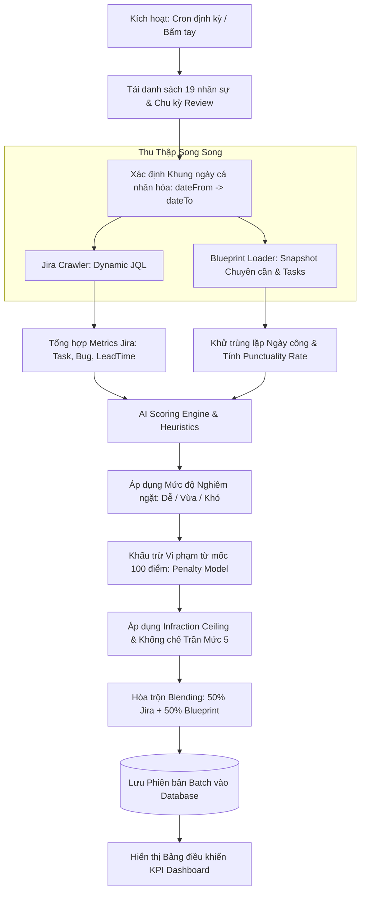

# HƯỚNG DẪN TOÀN DIỆN: CƠ CHẾ THU THẬP DỮ LIỆU JIRA & BLUEPRINT CLV VÀ THUẬT TOÁN TÍNH ĐIỂM KPI

> **Tài liệu Kỹ thuật & Đặc tả Vận hành Hệ thống Đánh giá Hiệu suất Nhân sự (KPI System)**  
> **Phiên bản:** 2.0 (Cập nhật Kiến trúc Khấu trừ Vi phạm & Phân cấp Nghiêm ngặt)  
> **Áp dụng cho:** Team Lead, Manager, HR Admin, Ban Giám Đốc và Đội ngũ Phát triển.

---

## MỤC LỤC
1. [Tổng quan Kiến trúc Thu thập & Chấm điểm Tự động](#1-tổng-quan-kiến-trúc-thu-thập--chấm-điểm-tự-động)
2. [Cơ chế Thu thập Dữ liệu từ Jira (Jira Crawler)](#2-cơ-chế-thu-thập-dữ-liệu-từ-jira-jira-crawler)
   - 2.1. Xác định Khung thời gian Thu thập Cá nhân hóa
   - 2.2. Phân giải Đa tài khoản Định danh (Multi-Identifier Resolution)
   - 2.3. Cấu trúc Truy vấn JQL Động
   - 2.4. Tổng hợp Chỉ số Hiệu suất (Metrics Aggregation)
3. [Cơ chế Thu thập Dữ liệu từ Blueprint CLV](#3-cơ-chế-thu-thập-dữ-liệu-từ-blueprint-clv)
   - 3.1. Dữ liệu Chuyên cần (UI_TAT_028) & Quản lý Đa Bộ phận (Multi-Part)
   - 3.2. Thuật toán Khử trùng lặp Ngày công In-Memory
   - 3.3. Dữ liệu Nhiệm vụ Hoàn thành (UI_PIM_001)
   - 3.4. Quy đổi Điểm Chuyên cần Chuẩn hệ 10 & Khống chế Trần Vi phạm
4. [Thuật toán & Cơ chế Tính điểm KPI (Scoring Engine)](#4-thuật-toán--cơ-chế-tính-điểm-kpi-scoring-engine)
   - 4.1. Hệ thống 5 Tiêu chí Rubric Chuẩn
   - 4.2. Mô hình Khấu trừ Vi phạm từ Mốc 100 điểm (Penalty-based Model)
   - 4.3. Phân cấp 3 Mức độ Nghiêm ngặt AI (EASY, MEDIUM, HARD)
   - 4.4. Nguyên tắc Trần Điểm Vi Phạm (Infraction Ceiling)
   - 4.5. Điều kiện Bắt buộc Đạt Mức 5 (Xuất sắc)
   - 4.6. Công thức Hòa trộn Dữ liệu (50% Jira + 50% Blueprint Blending)
5. [Bảng Đối chiếu Tham số & Các Case Điển hình Thực tế](#5-bảng-đối-chiếu-tham-số--các-case-điển-hình-thực-tế)

---

## 1. TỔNG QUAN KIẾN TRÚC THU THẬP & CHẤM ĐIỂM TỰ ĐỘNG

Hệ thống KPI tích hợp dữ liệu đa nguồn từ hai nền tảng tác nghiệp cốt lõi tại CyberLogitec:
1. **Jira PIM (`pim.cyberlogitec.com`)**: Thu thập lịch sử công việc, tiến độ bàn giao, số lượng lỗi phát sinh, và thời gian log work thực tế.
2. **Blueprint CLV (SSO Portal)**: Thu thập dữ liệu chuyên cần chấm công (từ Cổng `UI_TAT_028`) và khối lượng hoàn thành nhiệm vụ quản trị dự án (từ Cổng `UI_PIM_001`).

Toàn bộ quy trình diễn ra theo đường ống (Pipeline) tự động khép kín:



---

## 2. CƠ CHẾ THU THẬP DỮ LIỆU TỪ JIRA (JIRA CRAWLER)

Mã nguồn triển khai: [`backend/src/modules/jira-crawler/jira-client.ts`](file:///c:/KPI%20System/kpi-system/backend/src/modules/jira-crawler/jira-client.ts)

### 2.1. Xác định Khung thời gian Thu thập Cá nhân hóa
Trước đây, hệ thống thường cố định lấy dữ liệu lùi 180 ngày so với ngày hiện tại. Kiến trúc mới đã cá nhân hóa khung thời gian theo **Chu kỳ Review (Review Cadence)** của từng nhân viên cấu hình tại module Tổ chức (Organization):
- **`dateFrom`**: Là ngày hoàn thành đợt review gần nhất (`employee.last_evaluation_completed_at`). Nếu nhân viên mới chưa có review, hệ thống tự động lùi `defaultFromDays` (mặc định 180 ngày).
- **`dateTo`**: Là hạn đến đợt review tiếp theo (`employee.next_review_due_date`). Nếu chưa đến hạn, hệ thống lấy ngày hiện tại (`today`).
- **Mục đích**: Đảm bảo đánh giá đúng phạm vi công việc trong chu kỳ đánh giá (3 tháng, 6 tháng hoặc 1 năm), không bị sót và không bị cộng dồn trùng lặp công việc của chu kỳ trước.

### 2.2. Phân giải Đa tài khoản Định danh (Multi-Identifier Resolution)
Một vấn đề thực tế: Tên đăng nhập Jira của nhân sự thường không trùng khớp với mã nhân viên (Ví dụ: Nguyễn Quang Đức có mã `173232` nhưng username Jira là `duc.nguyen`). Để khắc phục triệt để lỗi "nhân viên có làm việc nhưng hệ thống trả về 0 task", hàm `fetchMemberIssues` tự động phân giải danh sách định danh gồm:
1. `employeeCode`: Mã nhân viên (ví dụ: `173232`, `203701`).
2. `jiraUsername`: Tên người dùng Jira (ví dụ: `duc.nguyen`, `khoa.dang`).
3. `blueprintUsername`: Tên tài khoản Blueprint (ví dụ: `ducnguyen`, `khoadang`).
4. `emailPrefix`: Tên tiền tố từ email công ty (ví dụ: `duc.nguyen` từ `duc.nguyen@cyberlogitec.com`).

### 2.3. Cấu trúc Truy vấn JQL Động
Hệ thống kết hợp các định danh thành danh sách duy nhất và xây dựng câu truy vấn JQL chuẩn:
```sql
project in (PROJECT_LIST) 
AND (
    assignee in ("173232", "duc.nguyen", "ducnguyen") 
    OR cf[11902] in ("173232", "duc.nguyen", "ducnguyen") 
    OR worklogAuthor in ("173232", "duc.nguyen", "ducnguyen")
)
AND updated >= "2026-07-01" AND updated <= "2026-09-30 23:59"
```
- **`assignee`**: Người được phân công thực hiện issue.
- **`cf[11902]`**: Custom field *PIC (Person in Charge)* trên hệ thống Jira PIM CyberLogitec.
- **`worklogAuthor`**: Bắt được cả các task mà nhân sự tham gia phối hợp xử lý và ghi nhận log work (dù không đứng tên assignee chính).

### 2.4. Tổng hợp Chỉ số Hiệu suất (Metrics Aggregation)
Sau khi tải toàn bộ Issues qua Jira REST API, hàm `aggregateMemberMetrics` phân loại và tính toán:
- **`totalTasks`**: Tổng số nhiệm vụ được giao.
- **`completedTasks`**: Nhiệm vụ đã chuyển sang trạng thái hoàn thành (`Closed`, `Resolved`, `Done`, `Delivered`).
- **`inProgressTasks`**: Nhiệm vụ đang triển khai trong kỳ.
- **`delayedTasks`**: Nhiệm vụ bị trễ hạn (có `duedate < updated/resolvedDate` hoặc trễ hạn tại thời điểm hiện tại).
- **`bugs` / `criticalBugs`**: Số lượng lỗi phát sinh, tách riêng các bug nghiêm trọng có priority `Critical`, `Blocker`, `High`.
- **`leadTimeDays`**: Thời gian trung bình hoàn thành một task (từ ngày tạo/bắt đầu đến khi bàn giao).

---

## 3. CƠ CHẾ THU THẬP DỮ LIỆU TỪ BLUEPRINT CLV

Mã nguồn triển khai: [`backend/src/modules/jira-crawler/batch-job.scheduler.ts`](file:///c:/KPI%20System/kpi-system/backend/src/modules/jira-crawler/batch-job.scheduler.ts#L120-L260)

### 3.1. Dữ liệu Chuyên cần (UI_TAT_028) & Quản lý Đa Bộ phận (Multi-Part)
Dữ liệu chấm công được đồng bộ định kỳ từ cổng SSO Blueprint `UI_TAT_028` và lưu trong bảng `collector_monthly_snapshot` với `source_type = 'TEAM_ATTENDANCE'`.

**Điểm lưu ý cốt lõi:** Dữ liệu nhân viên trong một Part thường được xuất và lưu thành nhiều snapshot theo từng bộ phận con (ví dụ: `Maritime Solutions Part` chứa 9 người và `ALLEGRO NX Part` chứa 12 người).
- Để không làm mất dữ liệu của bất kỳ bộ phận nào, câu query bắt buộc phải gom nhóm theo cả tháng và tên bộ phận:
```sql
SELECT DISTINCT ON (year_month, target_member) year_month, target_member, data_json
FROM collector_monthly_snapshot
WHERE source_type = 'TEAM_ATTENDANCE'
  AND year_month IN ('2026-07', '2026-08', '2026-09')
ORDER BY year_month, target_member, created_at DESC
```

### 3.2. Thuật toán Khử trùng lặp Ngày công In-Memory
Khi tổng hợp dữ liệu từ nhiều snapshot hoặc do import lặp lại qua các lần chạy, một nhân viên có thể có nhiều bản ghi cho cùng một ngày làm việc.
- Hệ thống áp dụng cơ chế băm khóa `seenEmpDates = new Set<string>()`:
```typescript
const dedupKey = `${empCode}#${dateStr}`;
if (dateStr && seenEmpDates.has(dedupKey)) {
  continue; // Bỏ qua bản ghi trùng lặp
}
seenEmpDates.add(dedupKey);
```
- **Kết quả:** Đảm bảo mỗi ngày làm việc chỉ được đếm duy nhất 1 lần. Khắc phục triệt để tình trạng nhân đôi số ngày làm việc (ví dụ 90 ngày xuống đúng 76 ngày thực tế) và loại bỏ các bản ghi đi trễ bị duplicate.

### 3.3. Dữ liệu Nhiệm vụ Hoàn thành (UI_PIM_001)
Dữ liệu khối lượng công việc quản trị từ Cổng `UI_PIM_001` được lưu với `source_type = 'TASKS'`:
- Hệ thống lấy điểm đánh giá task theo thang điểm 10 (`score10`) và tổng số bản ghi hoàn thành (`total_records`).
- Liên kết với nhân viên dựa trên `blueprintUsername` (hoặc tiền tố email chuẩn hóa).

### 3.4. Quy đổi Điểm Chuyên cần Chuẩn hệ 10 & Khống chế Trần Vi phạm
- **Tỷ lệ đúng giờ (Punctuality Rate)**:
  $$\text{Punctuality Rate (\%)} = \left(\frac{\text{Số ngày đúng giờ}}{\text{Tổng ngày làm việc} - \text{Số ngày nghỉ phép}}\right) \times 100$$
- **Quy đổi điểm hệ 10 (`attScore10`)**:
  - Nếu **không có ngày đi trễ (`lateDays === 0`)**: Đạt tối đa **10.0 / 10 điểm** (Mức 5 - Xuất sắc).
  - Nếu **có ngày đi trễ (`lateDays > 0`)**: Khống chế trần tối đa **9.0 / 10 điểm** (Mức 4 - Tốt).
  $$\text{attScore10} = \min\left(9.0, \max\left(1.0, \frac{\text{Punctuality Rate}}{10} - \text{penalty}\right)\right)$$
  *(Trong đó nếu trễ > 2 ngày, bị trừ thêm 0.5 điểm trực tiếp vào điểm hệ 10)*.

---

## 4. THUẬT TOÁN & CƠ CHẾ TÍNH ĐIỂM KPI (SCORING ENGINE)

Mã nguồn triển khai: [`backend/src/modules/jira-crawler/ai-evaluator.ts`](file:///c:/KPI%20System/kpi-system/backend/src/modules/jira-crawler/ai-evaluator.ts#L400-L550)

### 4.1. Hệ thống 5 Tiêu chí Rubric Chuẩn
Điểm đánh giá được phân bổ trọng số qua 5 tiêu chí năng lực kỹ thuật:
1. **`PERF_01` (25%)**: Tiến độ bàn giao nhiệm vụ (Delivery Timeliness).
2. **`CODE_QUALITY` (20%)**: Chất lượng mã nguồn & Kiểm soát lỗi (Bug prevention).
3. **`TASK_VOLUME` (15%)**: Khối lượng công việc & Năng suất (Task throughput).
4. **`OWNERSHIP_SCOPE` (20%)**: Mức độ làm chủ & Phạm vi trách nhiệm (Ownership).
5. **`INDEPENDENCE` (20%)**: Khả năng làm việc độc lập & Giải quyết vấn đề (Autonomy).

$$\text{Tổng điểm Rubric} = \sum (\text{Điểm tiêu chí}_i \times \text{Trọng số}_i)$$

### 4.2. Mô hình Khấu trừ Vi phạm từ Mốc 100 điểm (Penalty-based Model)
Thay vì chấm điểm cộng dồn dễ gây lạm phát điểm, hệ thống thiết lập mốc khởi điểm **100 điểm chuẩn**:

$$\text{Raw Score} = 100 - \text{Deductions} + \text{Bonuses}$$

Trong đó:
- **`Deductions` (Khấu trừ vi phạm)**:
  $$\text{Deductions} = (\text{criticalBugs} \times P_{\text{critBug}}) + (\text{minorBugs} \times P_{\text{minBug}}) + (\text{delayedTasks} \times P_{\text{delay}}) + (\text{lateDays} \times P_{\text{lateDay}})$$
- **`Bonuses` (Thưởng năng suất)**:
  Cộng thưởng khi hoàn thành khối lượng lớn công việc vượt mức (`volumeBonus`) hoặc giải quyết các task có độ phức tạp cao cấp độ Tech Lead / Architect (`complexityBonus`).

### 4.3. Phân cấp 3 Mức độ Nghiêm ngặt AI (EASY, MEDIUM, HARD)
Hệ thống tự động nhận diện chế độ đánh giá từ Prompt AI Preset được cấu hình:
- **`EASY` (Mức 1: Dễ / Nhanh gọn)**: Thẩm định thông thoáng, khuyến khích năng suất, chế tài nhẹ.
- **`MEDIUM` (Mức 2: Vừa / Chuẩn Tech Lead - Mặc định)**: Cân bằng giữa chất lượng và tiến độ.
- **`HARD` (Mức 3: Khó / Khắt khe cấp Architect)**: Đòi hỏi tính chuẩn mực kỹ thuật cao, trừ nặng các lỗi vi phạm và trễ hạn.

### 4.4. Nguyên tắc Trần Điểm Vi Phạm (Infraction Ceiling)
> **Nguyên tắc cốt lõi:** *"Điểm thưởng năng suất KHÔNG BAO GIỜ được phép xóa sạch các vi phạm kỷ luật chuyên cần hoặc lỗi nghiêm trọng."*

Nếu nhân viên có vi phạm chuyên cần (ví dụ đi trễ) hoặc tạo ra Critical Bug, hệ thống áp trần điểm tối đa (`Infraction Ceiling`):

$$\text{disciplinePenalty} = \text{lateDays} \times P_{\text{lateDay}}$$
$$\text{Ceiling} = 100 - \text{disciplinePenalty}$$
$$\text{Final Score} = \min(\text{Ceiling}, \max(0, \text{Raw Score}))$$

*Ví dụ:* Ở chế độ MEDIUM ($P_{\text{lateDay}} = 2$), nhân viên đi trễ 1 ngày thì $\text{disciplinePenalty} = 2$. Trần điểm tối đa của nhân viên đó là **98.0 điểm**. Dù nhân viên có hoàn thành xuất sắc 100 task và nhận bao nhiêu điểm thưởng, điểm số cuối cùng cũng không thể vượt quá 98.0 điểm.

### 4.5. Điều kiện Bắt buộc Đạt Mức 5 (Xuất sắc)
Quy định xếp loại hiệu suất chung:
- **Mức 5 (Xuất sắc)**: Yêu cầu **`Final Score >= 95.0` VÀ `disciplinePenalty === 0`**.
- **Mức 4 (Tốt)**: Điểm từ `80.0` đến `< 95.0` (Hoặc $\ge 95.0$ nhưng có vi phạm kỷ luật).
- **Mức 3 (Khá / Đạt)**: Điểm từ `65.0` đến `< 80.0`.
- **Mức 2 (Cần cải thiện)**: Điểm từ `50.0` đến `< 65.0`.
- **Mức 1 (Không đạt)**: Điểm `< 50.0`.

> Nhân sự có bất kỳ ngày đi trễ nào (`lateDays > 0`) sẽ **chỉ đạt tối đa Mức 4 (Tốt)**, không thể đạt Mức 5.

### 4.6. Công thức Hòa trộn Dữ liệu (50% Jira + 50% Blueprint Blending)
Khi thu thập thành công cả Jira và Blueprint, hệ thống tích hợp đa nguồn:
1. **Tiêu chí Tiến độ (`PERF_01`)**:
   $$\text{PERF\_01}_{\text{blended}} = \text{round}\left(\frac{\text{Điểm Jira Task (\%)} + (\text{Blueprint Task score10} \times 10)}{2}\right)$$
2. **Cột hiển thị trạng thái Blueprint CLV trên giao diện**:
   - Nếu có ít nhất dữ liệu chấm công hoặc task từ Blueprint: Hiển thị badge xanh **`🚢 Tích hợp`**.
   - Nếu hoàn toàn không có dữ liệu Blueprint (do không tìm thấy bản ghi): Hiển thị **`Chỉ Jira`**.

---

## 5. BẢNG ĐỐI CHIẾU THAM SỐ & CÁC CASE ĐIỂN HÌNH THỰC TẾ

### 5.1. Bảng Tham số Cấu hình Theo 3 Cấp độ

| Tham số Đánh giá | Dễ (EASY) | Vừa (MEDIUM) | Khó (HARD) |
|---|:---:|:---:|:---:|
| **Trừ Critical Bug** ($P_{\text{critBug}}$) | -5 điểm / bug | -15 điểm / bug | -20 điểm / bug |
| **Trừ Minor Bug** ($P_{\text{minBug}}$) | -1 điểm / bug | -3 điểm / bug | -5 điểm / bug |
| **Trừ Task Trễ Hạn** ($P_{\text{delay}}$) | -1 điểm / task | -2 điểm / task | -3 điểm / task |
| **Phạt Kỷ luật Đi Trễ** ($P_{\text{lateDay}}$) | -1 điểm / ngày | -2 điểm / ngày | -3 điểm / ngày |
| **Thưởng Khối lượng Task** (`volumeBonus`) | +7 điểm (khi $\ge 12$ task) | +5 điểm (khi $\ge 15$ task) | +3 điểm (khi $\ge 20$ task) |
| **Thưởng Task Phức tạp** (`complexityBonus`) | +5 điểm (khi $\ge 3$ task L4+) | +5 điểm (khi $\ge 5$ task L4+) | +4 điểm (khi $\ge 6$ task L4+) |
| **Yêu cầu Task Phức tạp L4/L5** | > 4 giờ | > 8 giờ | > 12 giờ / Kiến trúc |

---

### 5.2. Các Case Tính điểm Điển hình Thực tế

#### Case A: Nhân sự Chuẩn mực, Năng suất cao, Không lỗi
- **Dữ liệu**: 16 task hoàn thành đúng hạn, 0 bug, 0 ngày trễ, chấm công 100%.
- **Chế độ**: `MEDIUM`
- **Tính toán**:
  - Gốc: $100$ điểm.
  - Khấu trừ: $0$.
  - Thưởng: $+5$ (volume) $+ 5$ (complexity) $= +10$ điểm.
  - Raw Score: $100 + 10 = 110 \to$ clamp về $100.0$.
  - Discipline Penalty: $0 \to$ Ceiling: $100.0$.
- **Kết quả**: **100.0 điểm — Xếp loại: Mức 5 (Xuất sắc)**.

#### Case B: Năng suất rất cao nhưng có Vi phạm Chuyên cần
- **Dữ liệu**: 20 task hoàn thành đúng hạn, 0 bug, **1 ngày đi trễ (6 phút)**.
- **Chế độ**: `MEDIUM`
- **Tính toán**:
  - Gốc: $100$ điểm.
  - Phạt kỷ luật đi trễ: $1 \times (-2) = -2$ điểm.
  - Thưởng năng suất: $+5$ (volume) $+ 5$ (complexity) $= +10$ điểm.
  - Raw Score: $100 - 2 + 10 = 108 \to 100.0$.
  - **Infraction Ceiling**: $100 - 2 = \mathbf{98.0}$ điểm.
  - Final Score: $\min(98.0, 100.0) = \mathbf{98.0}$ điểm.
  - Điều kiện Level 5: Có `disciplinePenalty > 0` nên không được xếp Level 5.
- **Kết quả**: **98.0 điểm — Xếp loại: Mức 4 (Tốt)**.

#### Case C: Phát sinh Critical Bug và Trễ hạn Bàn giao
- **Dữ liệu**: 8 task hoàn thành, 2 task trễ hạn, 1 critical bug, 0 ngày trễ.
- **Chế độ**: `HARD`
- **Tính toán**:
  - Gốc: $100$ điểm.
  - Khấu trừ:
    - 1 Critical Bug: $-20$ điểm.
    - 2 Task trễ hạn: $2 \times (-3) = -6$ điểm.
  - Thưởng năng suất: Không đạt ngưỡng ($< 20$ task).
  - Raw Score: $100 - 20 - 6 = 74.0$ điểm.
  - Final Score: $74.0$ điểm.
- **Kết quả**: **74.0 điểm — Xếp loại: Mức 3 (Khá)**.

---
*Tài liệu được ban hành chính thức cho toàn bộ dự án KPI System.*
