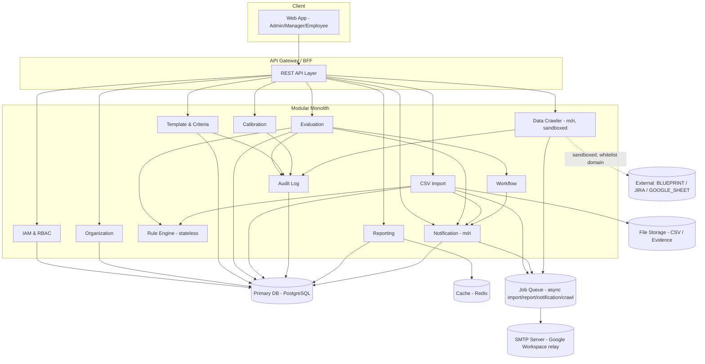
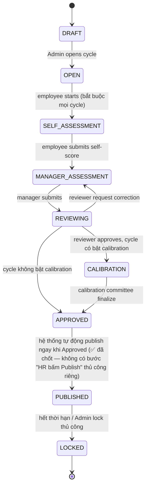
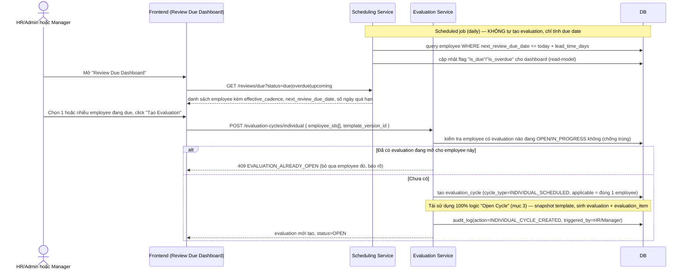
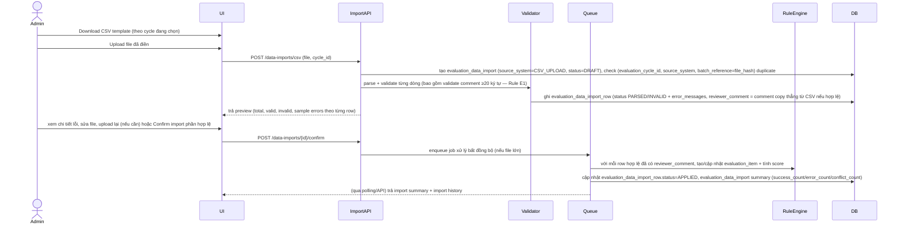
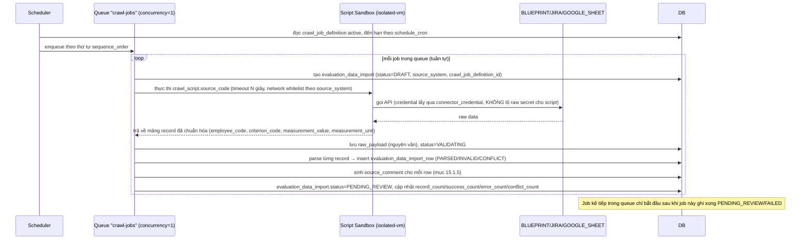
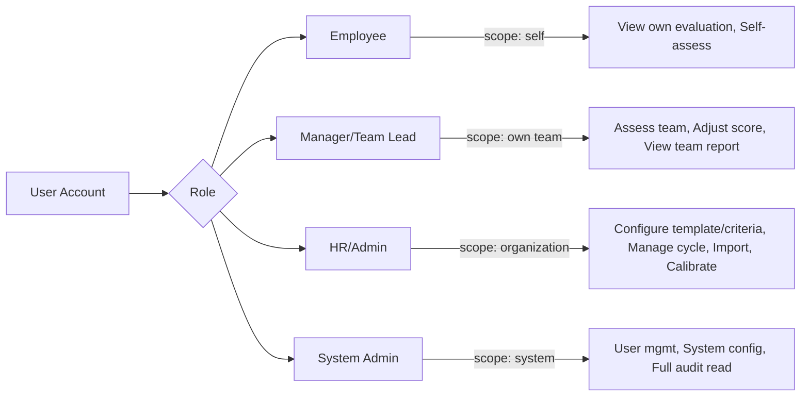
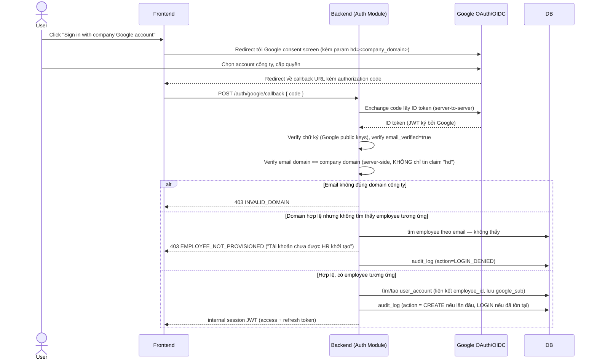
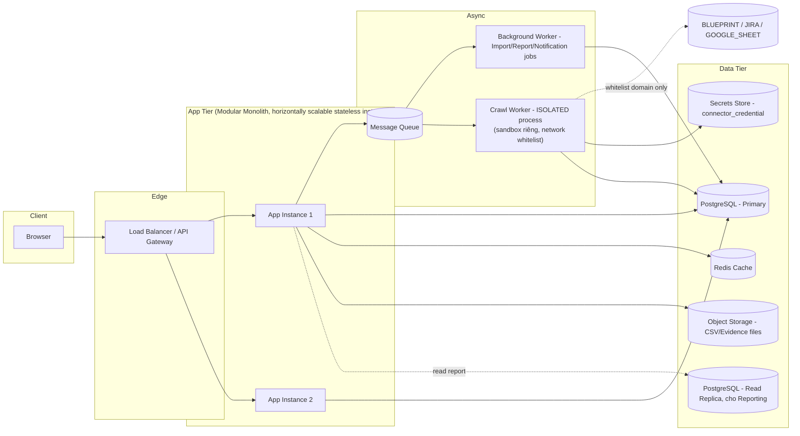

# LLD — Employee Performance Evaluation Management System

> **Trạng thái tài liệu:** v1.9 — hợp nhất `evaluation_data_import` làm bảng staging duy nhất cho cả CSV Import và Automated Data Crawling; chốt permission Crawl Script chỉ System Admin, không auto-apply. Xem changelog cuối tài liệu.
> **18 tiêu chí hiện tại (Performance / Capability / Contribution) chỉ được coi là *seed data / sample configuration*.** Toàn bộ hệ thống được thiết kế theo hướng **Configurable, Rule-driven Evaluation Framework** — không hard-code criterion, weight, level, hay tool phụ thuộc vào application code.

---

## 1. Executive Summary

Hệ thống quản lý đánh giá hiệu suất/năng lực nhân viên, cho phép HR/Admin **tự cấu hình** toàn bộ khung đánh giá (criteria, weight, level, scoring rule, evidence, applicability) **mà không cần developer can thiệp code hay deploy lại backend**. Hệ thống hỗ trợ nhiều evaluation cycle, nhiều team/role với rule khác nhau, nhập liệu thủ công hoặc CSV import hàng loạt, workflow phê duyệt nhiều bước, calibration, và bảo toàn dữ liệu lịch sử tuyệt đối (immutability) khi cycle đã bị khóa (locked).

Kiến trúc đề xuất: **Modular Monolith**, tách rõ các bounded context (Employee, Template/Criteria, Evaluation, Rule Engine, Import, Audit, Reporting) để dễ maintain và có đường tách thành microservices sau này nếu cần scale.

---

## 2. Goals / Non-goals

### Goals
- Configurable evaluation framework: thêm/sửa/xóa/disable criterion, weight, level, rule mà không cần code.
- Hỗ trợ đa team, đa role với rule khác nhau trên cùng criterion (role-specific, team-specific override).
- Generic measurement model — không tạo cột riêng cho từng criterion.
- CSV import có validate/preview/partial-import với báo lỗi rõ theo từng dòng.
- Workflow đánh giá nhiều bước, configurable ở mức hợp lý (không full workflow engine).
- Snapshot hóa criterion/template vào evaluation đã submit để đảm bảo lịch sử không đổi khi template gốc thay đổi.
- Audit log đầy đủ, immutable cho mọi thay đổi có ảnh hưởng đến điểm số.
- RBAC rõ ràng theo 4 nhóm role: Employee, Team Lead/Manager, HR/Admin, System Admin.
- **Đa ngôn ngữ (EN/VI)** — dữ liệu master (Criterion, Level, Department, Team, Role, Job Level, Review Cadence...) và UI hiển thị được cả tiếng Anh lẫn tiếng Việt, mặc định EN (✅ mới, xem mục 21.1).
- **Email Notification (SMTP)** — thông báo tự động qua email cho các thay đổi/kết quả quan trọng trong kỳ đánh giá (mở cycle, submit, publish kết quả, review due reminder...) (✅ mới, xem mục 21.2).
- **Automated Data Crawling** — quản lý script JavaScript (sandboxed), đăng ký job chạy tuần tự theo từng Criterion để tự động lấy dữ liệu từ BLUEPRINT/JIRA/GOOGLE_SHEET, luôn qua bước con người xác nhận giải thích trước khi áp dụng điểm (✅ mới, xem mục 15.1).

### Non-goals (giai đoạn MVP)
- Không xây dựng full BPMN workflow engine (dùng state machine cấu hình đơn giản).
- ~~Không tích hợp tự động với Jira/Git/QA tool ở MVP~~ **✅ Đã đổi phạm vi:** tích hợp tự động với JIRA/GOOGLE_SHEET/BLUEPRINT **có** trong MVP qua tính năng Automated Data Crawling (mục 15.1) — nhưng **luôn dừng ở bước "candidate data", bắt buộc con người review + giải thích trước khi áp dụng điểm** (không tự động ghi thẳng vào điểm chính thức). Git integration vẫn ngoài phạm vi MVP (chưa có connector).
- Không làm multi-tenant (multi-organization) ở MVP — giả định 1 organization.
- Không làm real-time collaborative editing.
- Không làm ranking/stack-ranking tự động (chỉ hỗ trợ xem distribution aggregate theo team/org — **không** xem xếp hạng cá nhân dưới bất kỳ hình thức nào, kể cả ẩn danh; ✅ đã chốt, xem mục 19).
- **Không tự động dịch nội dung do người dùng nhập** (comment, evidence, full_name...) — đa ngôn ngữ chỉ áp dụng cho dữ liệu master/UI (mục 21.1), không dịch máy nội dung tự do.
- Không đa ngôn ngữ cho report export PDF/Excel ở MVP (Phase 2).
- **Không cho phép HR/Manager tự viết/sửa JavaScript** — chỉ System Admin được quyền này (mục 15.1.6); HR/Admin chỉ được đăng ký job dùng script đã có sẵn.
- **Không tự động Apply dữ liệu crawl vào điểm chính thức** — luôn cần con người xác nhận giải thích trước (mục 15.1.5).

### Scope
In-scope: employee management, evaluation cycle/template/criteria configuration, manual entry, CSV import, scoring engine, workflow, calibration (cơ bản), reporting, audit, RBAC.
Out-of-scope: payroll, compensation review, recruitment, LMS.

---

## 3. Requirements Summary

Xem chi tiết ở mục 24 (Feature Breakdown). Yêu cầu cốt lõi nhất — được nhấn 3 lần trong prompt gốc — là: **evaluation criteria không cố định**, phải configure được ở cấp Global → Team → Role → Template, có precedence rõ ràng, và **evaluation lịch sử immutable** sau khi lock.

---

## 4. Business Domain

18 KPI mẫu (đính kèm trong file CSV gốc) minh họa 3 category: **Performance, Capability, Contribution**, mỗi criterion có 5 level, weight khác nhau theo role (SI/SM), một số phụ thuộc tool (Jira, Git/PR, QA report, CR log) nhưng **tool đó chỉ là "evidence source label"** — một enum mở, không phải integration bắt buộc.

Insight quan trọng rút ra từ dữ liệu mẫu để đưa vào rule engine:
| Kiểu criterion | Ví dụ | Kiểu rule |
|---|---|---|
| Threshold theo % (range) | On-time Completion | Range/threshold table |
| Threshold theo số đếm nghịch (càng thấp càng tốt) | Production Incident, Bug & Rework | Inverse threshold table |
| Ordinal / mô tả định tính theo level | Independence, Ownership Scope, Attitude | Level-description mapping (điểm nhập tay theo mô tả) |
| Số lượng tích lũy | Knowledge Sharing, Mentoring, Proposing Improvements | Count threshold table |
| Composite theo role (SI khác SM) | Testing & Documentation | Role-conditional rule |

→ Đây chính là lý do rule engine phải hỗ trợ **nhiều "rule type"** dùng chung 1 data model, không phải if/else theo tên criterion.

---

## 5. Feature Breakdown (MVP vs Phase 2)

### MVP
- Employee / Team / Role / Department management (CRUD, import cơ bản)
- Evaluation Cycle management
- Evaluation Template Builder (configurable, low-code UI)
- Criterion Management với Global/Team/Role override + precedence
- Level & Scoring rule configuration (threshold table, count table, ordinal mapping)
- Manual evaluation entry (Draft → Submit → Review → Approve)
- CSV Import (template versioned, validate, preview, partial import, import history)
- Scoring Engine (raw score → weighted score → overall score)
- Basic evaluation workflow (configurable steps, tối thiểu: Self-assessment **bắt buộc** → Manager Assessment → Approval → Publish **tự động** → Lock — ✅ đã chốt, xem mục 14)
- **Review Cadence & Scheduling** *(mới)* — chu kỳ đánh giá riêng theo từng nhân viên (2 tháng/6 tháng/1 năm...), Review Due Dashboard, tạo evaluation riêng bán tự động (xem mục 14.1)
- **Đa ngôn ngữ EN/VI** *(mới)* — master data + UI đa ngôn ngữ qua bảng `i18n_translation` (xem mục 21.1)
- **Email Notification (SMTP)** *(mới, chuyển từ Phase 2 lên MVP theo yêu cầu)* — thông báo tự động cho các sự kiện chính trong kỳ đánh giá (mở cycle, submit, publish, review due reminder...), template configurable, gửi bất đồng bộ qua queue (xem mục 21.2)
- **Automated Data Crawling** *(mới, chuyển 1 phần từ Phase 2 lên MVP theo yêu cầu)* — quản lý JavaScript sandboxed (System Admin only), đăng ký job tuần tự theo Criterion để crawl BLUEPRINT/JIRA/GOOGLE_SHEET, luôn qua review + giải thích của con người trước khi Apply (xem mục 15.1)
- Immutable historical evaluation (snapshot)
- Audit log (mọi thay đổi weight/score/level/cadence/crawl script)
- RBAC (4 role nhóm)
- Basic dashboard: employee score, team average, completion rate

### Phase 2 (lý do loại khỏi MVP: giá trị cao nhưng phụ thuộc tích hợp ngoài / độ phức tạp cao / cần dữ liệu MVP chạy ổn định trước)
- Calibration nâng cao (auto-suggest adjustment, bell-curve normalization)
- Peer review
- Advanced reporting/BI, trend analysis nhiều cycle
- Score normalization giữa các team
- **Notification nâng cao** — digest email tổng hợp hàng tuần, push notification mobile/app, SMS, rich HTML branding tùy chỉnh theo tổ chức (MVP chỉ gửi plain/simple HTML email theo sự kiện, xem mục 21.2)
- **Auto-tạo evaluation hoàn toàn tự động khi đến due date** (MVP vẫn cần HR/Manager bấm xác nhận, xem mục 14.1)
- **Crawl nâng cao** — thêm nguồn mới ngoài 3 loại ban đầu, UI kéo-thả xây script thay vì code tay (xem mục 15.1). **Không** bao gồm auto-apply bỏ qua review — đã chốt vĩnh viễn giữ nguyên tắc review thủ công (mục 29 #19), không nằm trong roadmap kể cả Phase 2.
- Git integration (chưa có connector ở MVP)
- Goal tracking, performance trend, promotion recommendation

**Lý do không làm ở MVP:** các integration (Jira/Git) đòi hỏi mapping riêng cho từng team/tool — vi phạm nguyên tắc "tool không hard-code"; nên để MVP ổn định với manual + CSV trước, sau đó xây **Evidence Provider Plugin interface** ở Phase 2.

---

## 6. User Roles & Employee Model

### Employee entity (tối thiểu)
`employee_code (business code), full_name, email, department_id, team_id, role_id, job_level_id, manager_id, employment_status (enum: ACTIVE/INACTIVE/ON_LEAVE/TERMINATED), join_date`

`role` và `job_level` **không hard-code enum cứng** trong code — thiết kế thành bảng reference (`role`, `job_level`) để mở rộng (SI, SM, BA, QA, DevOps... ; Junior/Middle/Senior/Lead/Principal...).

### RBAC — 4 nhóm
1. **Employee** — xem evaluation của mình, nhập self-assessment (**bắt buộc mọi cycle** — ✅ đã chốt), submit self-assessment, xem lịch sử.
2. **Team Lead / Manager** — đánh giá nhân viên trong team quản lý, review evidence, submit/reject, request correction.
3. **HR / Admin** — quản lý employee/team/cycle/template/criteria, import CSV, xem report toàn org, thực hiện calibration.
4. **System Admin** — user/permission management, cấu hình hệ thống, xem audit log toàn bộ (read-only với business data).

Permission matrix chi tiết ở mục 17.

---

## 7. System Architecture

### Lựa chọn: Modular Monolith

| Option | Đánh giá |
|---|---|
| A. Monolith (không module hóa) | Nhanh ban đầu nhưng rule engine + workflow + reporting sẽ nhanh chóng đan xen, khó maintain khi criteria thay đổi liên tục |
| **B. Modular Monolith (chọn)** | Ranh giới module rõ theo bounded context, deploy đơn giản, transaction dễ (1 DB), team nhỏ dễ vận hành, vẫn tách được thành service sau này theo module boundary có sẵn |
| C. Microservices | Over-engineering ở quy mô hiện tại (chưa multi-org, chưa cần scale độc lập từng phần), tăng chi phí vận hành (distributed transaction cho scoring + audit) |

**Quyết định:** Modular Monolith. **Lý do:** ưu tiên dễ maintain, configurable, auditable, tránh over-engineering theo đúng yêu cầu đề bài. **Trade-off:** khi tổ chức scale rất lớn (multi-org, triệu record), cần tách Reporting/Import ra service riêng — thiết kế module boundary ngay từ đầu để việc này không phải viết lại.

### Module boundaries
```
1. IAM & RBAC Module          — user, role, permission, session
2. Organization Module        — department, team, employee, job_level
3. Template & Criteria Module — evaluation_template, criterion, criterion_version, rule config
4. Evaluation Module          — evaluation_cycle, evaluation, evaluation_item, score, evidence
5. Rule Engine Module         — pure calculation engine (stateless), input = measurement + rule config
6. Import Module              — csv_template, evaluation_data_import, evaluation_data_import_row (hợp nhất CSV + Crawl, mục 15.1.1)
7. Workflow Module            — state machine config, transition, approval
8. Calibration Module         — comparison, adjustment, adjustment_reason
9. Audit Module                — audit_log (write-once)
10. Reporting Module          — read-model / materialized views
```

### Mermaid — System Architecture


---

## 8. Module Architecture (chi tiết trách nhiệm)

| Module | Trách nhiệm chính | Không làm |
|---|---|---|
| Template & Criteria | CRUD criterion, version, override theo team/role, precedence resolution | Không tính score |
| Rule Engine | Nhận measurement + rule config → trả level + raw score | Không biết criterion là gì (stateless, generic) |
| Evaluation | Quản lý vòng đời evaluation/evaluation_item, gọi Rule Engine, snapshot | Không tự định nghĩa rule |
| Import | Parse, validate, preview, ghi evaluation_data_import_row, gọi Evaluation để tạo/cập nhật evaluation_item | Không tự ý thay đổi template |
| Workflow | Quản lý state transition + permission theo state | Không tính điểm |
| Calibration | So sánh, ghi adjustment, không tự động sửa score gốc mà tạo `final_score` riêng | — |
| Audit | Ghi log bất biến cho mọi thay đổi có ý nghĩa nghiệp vụ | Không cho update/delete |
| **Notification** *(mới)* | Nhận sự kiện từ Evaluation/Workflow/Import, ghi `notification_log` (outbox), render template theo locale, enqueue gửi SMTP bất đồng bộ | **Không** quyết định business logic (không tự ý thay đổi state); **không** chặn/rollback transaction chính nếu gửi email thất bại |
| **Data Crawler** *(mới)* | Chạy `crawl_script` trong sandbox theo `crawl_job_definition`, ghi `evaluation_data_import`/`_row` (dùng chung bảng với CSV Import, mục 15.1.1), sinh `source_comment` | **Không** tự động Apply vào `evaluation_criterion` — luôn cần con người xác nhận `reviewer_comment` trước (mục 15.1.5); **không** cấp quyền filesystem/env cho script |

---

## 9. Domain Model (ERD)

```mermaid
erDiagram
    ORGANIZATION ||--o{ DEPARTMENT : has
    DEPARTMENT ||--o{ TEAM : has
    TEAM ||--o{ EMPLOYEE : contains
    ROLE ||--o{ EMPLOYEE : "assigned to"
    JOB_LEVEL ||--o{ EMPLOYEE : "assigned to"
    EMPLOYEE ||--o{ EMPLOYEE : "manages (manager_id)"
    EMPLOYEE ||--o| USER_ACCOUNT : "login qua Google (mục 10.8)"
    REVIEW_CADENCE ||--o{ JOB_LEVEL : "default cadence cho job level"
    REVIEW_CADENCE ||--o{ EMPLOYEE : "override cá nhân (mục 14.1)"
    I18N_TRANSLATION }o--|| CRITERION : "polymorphic — name/description (mục 21.1)"
    I18N_TRANSLATION }o--|| CRITERION_LEVEL : "polymorphic — label"
    I18N_TRANSLATION }o--|| EVALUATION_TEMPLATE : "polymorphic — name/description"
    I18N_TRANSLATION }o--|| DEPARTMENT : "polymorphic — name"
    I18N_TRANSLATION }o--|| TEAM : "polymorphic — name"
    I18N_TRANSLATION }o--|| ROLE : "polymorphic — name"
    I18N_TRANSLATION }o--|| JOB_LEVEL : "polymorphic — name"
    I18N_TRANSLATION }o--|| REVIEW_CADENCE : "polymorphic — name"
    CRITERION ||--o{ CRAWL_JOB_DEFINITION : "đăng ký job crawl theo criterion (mục 15.1)"
    CRAWL_SCRIPT ||--o{ CRAWL_JOB_DEFINITION : "script đã publish"
    CONNECTOR_CREDENTIAL ||--o{ CRAWL_JOB_DEFINITION : "credential nguồn ngoài"
    CRAWL_JOB_DEFINITION ||--o{ EVALUATION_DATA_IMPORT : "mỗi lần chạy tạo 1 batch"
    EVALUATION_DATA_IMPORT ||--o{ EVALUATION_DATA_IMPORT_ROW : contains

    EVALUATION_CYCLE ||--o{ EVALUATION_TEMPLATE_VERSION : uses
    EVALUATION_TEMPLATE ||--o{ EVALUATION_TEMPLATE_VERSION : "versioned by"
    EVALUATION_TEMPLATE_VERSION ||--o{ TEMPLATE_CRITERION : includes

    CRITERION ||--o{ CRITERION_VERSION : "versioned by"
    CRITERION_VERSION ||--o{ TEMPLATE_CRITERION : "referenced in"
    CRITERION_VERSION ||--o{ CRITERION_OVERRIDE : "overridden by"
    CRITERION_VERSION ||--o{ CRITERION_LEVEL : defines
    CRITERION_VERSION ||--|| SCORING_RULE : uses

    EVALUATION_CYCLE ||--o{ EVALUATION : has
    EMPLOYEE ||--o{ EVALUATION : "evaluated in"
    EVALUATION ||--o{ EVALUATION_ITEM : contains
    TEMPLATE_CRITERION ||--o{ EVALUATION_ITEM : "snapshot of"
    EVALUATION_ITEM ||--o| MEASUREMENT : has
    EVALUATION_ITEM ||--o{ EVIDENCE : has
    EVALUATION_ITEM ||--o{ SCORE_ADJUSTMENT : "may have"

    EVALUATION ||--o{ APPROVAL : "goes through"
    EVALUATION ||--o{ REVIEW : "reviewed by"
    EVALUATION_CYCLE ||--o{ CALIBRATION_SESSION : has
    CALIBRATION_SESSION ||--o{ CALIBRATION_ADJUSTMENT : produces

    CSV_TEMPLATE ||--o{ CSV_TEMPLATE_COLUMN : defines
    CSV_TEMPLATE ||--o{ IMPORT_JOB : "used by"
    IMPORT_JOB ||--o{ IMPORT_ROW : contains
    IMPORT_ROW }o--o| EVALUATION_ITEM : "creates/updates"

    AUDIT_LOG }o--|| EMPLOYEE : "performed by"
```



**Giải thích cardinality quan trọng:**
- `EVALUATION_TEMPLATE_VERSION` 1—N `TEMPLATE_CRITERION`: mỗi lần publish template version mới sẽ snapshot danh sách criterion + weight tại thời điểm đó.
- `EVALUATION_ITEM` **không** trỏ trực tiếp tới `CRITERION` mà trỏ tới `TEMPLATE_CRITERION` (đã snapshot weight/level/rule) → đảm bảo immutability khi criterion gốc đổi sau này (xem mục 16, 21.8).
- `CRITERION_OVERRIDE` cho phép Team/Role override weight/level của 1 `CRITERION_VERSION` mà không tạo bản criterion mới hoàn toàn — giải quyết bài toán precedence (mục 17).

---

## 10. Database Design

> Quy ước đặt tên: `snake_case`, PK = `<table_name>_id UUID` (ví dụ: `employee_id`, `evaluation_id`), business key riêng (`code`), mọi bảng có `created_at, updated_at, created_by, updated_by`; bảng finalized có thêm `is_locked BOOLEAN`.

### 10.1 Organization

**department**
| Column | Type | Null | Default | Key | Note |
|---|---|---|---|---|---|
| department_id | uuid | N | gen_random_uuid() | PK | |
| code | varchar(50) | N | | UNIQUE | |
| active | boolean | N | true | | |

> Tên hiển thị (`name`) **không còn là cột trực tiếp** — resolve qua bảng `i18n_translation` (mục 10.9, `entity_type='DEPARTMENT'`). Áp dụng tương tự cho `team`, `role`, `job_level`, `review_cadence`, `criterion`, `criterion_level`, `evaluation_template` bên dưới.

**team**
| team_id uuid PK | code varchar UNIQUE | department_id FK→department | active boolean |

**role** *(SI, SM, BA... — mở rộng được)*
| role_id uuid PK | code varchar UNIQUE | active boolean |

**job_level**
| job_level_id uuid PK | code varchar UNIQUE (JUNIOR, MIDDLE...) | rank int (thứ tự sắp xếp) | default_review_cadence_id uuid FK → review_cadence, null | active boolean |

> `default_review_cadence_id` — **mới**: chu kỳ đánh giá mặc định theo job level (vd Junior/Probation mặc định 2 tháng, Senior mặc định 12 tháng). Xem mục 14.1.

**review_cadence** *(mới — danh mục chu kỳ đánh giá, configurable, không hard-code)*
| Column | Type | Null | Note |
|---|---|---|---|
| review_cadence_id | uuid | N | PK |
| code | varchar(30) | N | UNIQUE, vd `EVERY_2_MONTHS`, `EVERY_6_MONTHS`, `ANNUALLY` |
| interval_months | int | N | số tháng giữa 2 lần đánh giá |
| is_system_default | boolean | N | default true cho đúng 1 dòng — dùng khi employee không có override và job_level không có default riêng |
| active | boolean | N | |

> HR tự thêm/sửa cadence mới qua UI (vd "3 tháng/lần" cho 1 nhóm đặc thù) — **không hard-code danh sách cố định**, đúng nguyên tắc configurable xuyên suốt hệ thống. Tên hiển thị (vd "2 tháng/lần" / "Every 2 months") resolve qua `i18n_translation`.

**employee**
| Column | Type | Null | Note |
|---|---|---|---|
| employee_id | uuid | N | PK |
| employee_code | varchar(50) | N | UNIQUE |
| full_name | varchar(200) | N | *(không đa ngôn ngữ — đây là tên riêng, không phải nội dung dịch được, mục 21.1)* |
| email | varchar(200) | N | UNIQUE |
| department_id | uuid | Y | FK |
| team_id | uuid | Y | FK |
| role_id | uuid | N | FK |
| job_level_id | uuid | N | FK |
| manager_id | uuid | Y | FK → employee.employee_id (self) |
| employment_status | varchar(20) | N | ENUM ACTIVE/INACTIVE/ON_LEAVE/TERMINATED |
| join_date | date | N | |
| review_cadence_override_id | uuid | Y | **Mới** — FK → review_cadence; override cấp cá nhân, cao nhất trong precedence (mục 14.1) |
| last_evaluation_completed_at | timestamptz | Y | **Mới** — cập nhật tự động khi 1 evaluation của employee này đạt PUBLISHED (= `published_at`); **không** cập nhật lại khi PUBLISHED → LOCKED |
| next_review_due_date | date *(cột vật lý hiện là `timestamptz`, lưu business date lúc 00:00 UTC)* | Y | **Mới** — tính tự động = business date (`BUSINESS_TIMEZONE`) của `last_evaluation_completed_at` + `effective_cadence.interval_months` tháng dương lịch; null nếu chưa từng được đánh giá lần nào (coi như due ngay) |

Index: `(team_id)`, `(manager_id)`, `(employment_status)`, `(next_review_due_date)` — **mới**, phục vụ query "Review Due Dashboard" (mục 14.1).

**employee_team_history** *(giải quyết Q5 mục 23 — chuyển team giữa cycle)*
| employee_team_history_id uuid PK | employee_id FK | team_id FK | role_id FK | effective_from date | effective_to date null |

> Khi tạo evaluation, hệ thống chốt team/role của employee **tại thời điểm cycle bắt đầu** (snapshot vào `evaluation.team_id_snapshot`, `evaluation.role_id_snapshot`) — không dùng `employee.team_id` hiện tại để tránh sai lệch nếu employee đổi team sau đó.

### 10.2 Template & Criteria

**criterion** *(định danh logic, không version-specific)*
| criterion_id uuid PK | code varchar(50) UNIQUE | category varchar(30) — ENUM PERFORMANCE/CAPABILITY/CONTRIBUTION (mở rộng qua bảng `criterion_category` nếu cần) | active boolean |

> `name`/`description` resolve qua `i18n_translation` (`entity_type='CRITERION'`).


**criterion_version** *(mỗi lần sửa weight/level/rule → version mới, immutable)*
| Column | Type | Note |
|---|---|---|
| criterion_version_id | uuid PK | |
| criterion_id | uuid FK | |
| version_no | int | tăng dần theo criterion |
| default_weight | numeric(5,2) | % mặc định (global) |
| measurement_unit | varchar(30) | %, count, incident, mentees, score... (generic, không enum cứng) |
| measurement_source_label | varchar(100) | free-text label: "Jira", "Git/PR", "QA report"... KHÔNG phải FK tới hệ thống tích hợp thật |
| scoring_rule_id | uuid FK → scoring_rule | |
| effective_from | timestamptz | |
| effective_to | timestamptz | null nếu đang hiệu lực |
| status | varchar(20) | DRAFT / PUBLISHED / DEPRECATED |

Unique: `(criterion_id, version_no)`.

**criterion_level** *(mô tả 5 level, gắn với criterion_version)*
| criterion_level_id uuid PK | criterion_version_id FK | level_no int (1-5) | score_value numeric(5,2) — điểm số ứng với level (mặc định 1..5, nhưng configurable) |

> `label` (mô tả level) resolve qua `i18n_translation` (`entity_type='CRITERION_LEVEL'`, `entity_id=criterion_level_id`).

**scoring_rule** *(generic rule container — xem mục 18 chi tiết)*
| scoring_rule_id uuid PK | rule_type varchar(30) — ENUM: RANGE_THRESHOLD / INVERSE_THRESHOLD / COUNT_THRESHOLD / ORDINAL_MANUAL / ROLE_CONDITIONAL | rule_config jsonb | description text |

**criterion_override** *(Team-specific / Role-specific / Template-specific override)*
| Column | Type | Note |
|---|---|---|
| criterion_override_id | uuid PK | |
| criterion_version_id | uuid FK | criterion gốc bị override |
| scope_type | varchar(20) | ENUM: TEAM / ROLE / TEMPLATE |
| scope_id | uuid | team_id hoặc role_id hoặc template_version_id tùy scope_type |
| override_weight | numeric(5,2) | nullable — null nghĩa là không override weight |
| override_scoring_rule_id | uuid FK | nullable |
| active | boolean | |

**evaluation_template**
| evaluation_template_id uuid PK | code varchar UNIQUE | active boolean |

> `name`/`description` resolve qua `i18n_translation` (`entity_type='EVALUATION_TEMPLATE'`).

**evaluation_template_version** *(publish-immutable snapshot)*
| evaluation_template_version_id uuid PK | evaluation_template_id FK | version_no int | status ENUM DRAFT/PUBLISHED/ARCHIVED | published_at timestamptz | published_by uuid |

Unique: `(evaluation_template_id, version_no)`.

**template_criterion** *(danh sách criterion trong 1 template version — đây là bản "chốt" cuối cùng dùng để tạo evaluation_item)*
| template_criterion_id uuid PK | evaluation_template_version_id FK | criterion_version_id FK | effective_weight numeric(5,2) — weight đã resolve sau precedence tại thời điểm publish | applicable_role_ids uuid[] | applicable_team_ids uuid[] | is_disabled boolean | display_order int |

> `effective_weight` được **tính và chốt (denormalize) tại thời điểm publish template**, dựa trên precedence resolver (mục 17), để tránh phải resolve lại mỗi lần tính score và đảm bảo tính bất biến.

### 10.3 Evaluation Cycle & Evaluation

**evaluation_cycle**
| evaluation_cycle_id uuid PK | code varchar UNIQUE | name varchar | cycle_type varchar(20) — **mới**, ENUM `BATCH` (cycle đặt tên, mở hàng loạt như "2026 H2") / `INDIVIDUAL_SCHEDULED` (tự sinh cho đúng 1 employee theo review cadence, mục 14.1) | start_date date | end_date date | status varchar(20) — DRAFT/OPEN/IN_PROGRESS/SUBMITTED/REVIEWING/CALIBRATION/APPROVED/PUBLISHED/LOCKED | evaluation_template_version_id FK | applicable_team_ids uuid[] (null nếu `cycle_type=INDIVIDUAL_SCHEDULED`) | applicable_role_ids uuid[] (null nếu `cycle_type=INDIVIDUAL_SCHEDULED`) | triggered_by_employee_id uuid FK null — **mới**, chỉ set khi `cycle_type=INDIVIDUAL_SCHEDULED` | created_by uuid | approved_by uuid | locked_at timestamptz null |

> **Triển khai (task individual-evaluation-cycle-creation):** migration `1791000000004` thêm `cycle_type varchar(20) NOT NULL DEFAULT 'BATCH'` (CHECK `BATCH`/`INDIVIDUAL_SCHEDULED`; dữ liệu cũ = `BATCH`) và `triggered_by_employee_id uuid NULL` FK → `employee`, CHECK: khác null **khi và chỉ khi** `cycle_type = INDIVIDUAL_SCHEDULED`. `triggered_by_employee_id` = **employee được đánh giá** (người thao tác nằm ở `created_by` + audit). Code map `applicable_team_ids`/`applicable_role_ids` null ↔ `[]`, nên cycle `INDIVIDUAL_SCHEDULED` lưu `applicable_team_ids = applicable_role_ids = []` và `applicable_employee_ids = [employee_id]` (đúng 1 employee).

**evaluation** *(1 employee × 1 cycle)*
| Column | Type | Note |
|---|---|---|
| evaluation_id | uuid PK | |
| evaluation_cycle_id | uuid FK | |
| employee_id | uuid FK | |
| team_id_snapshot | uuid | chốt tại thời điểm tạo |
| role_id_snapshot | uuid | chốt tại thời điểm tạo |
| job_level_snapshot | uuid | |
| manager_id_snapshot | uuid | |
| status | varchar(20) | theo state machine mục 21.7 |
| self_score | numeric(6,3) null | |
| manager_score | numeric(6,3) null | |
| final_score | numeric(6,3) null | sau calibration/override |
| submitted_at | timestamptz null | |
| approved_at | timestamptz null | |
| is_locked | boolean | default false |

Unique: `(evaluation_cycle_id, employee_id)`.

> **Mới:** khi `evaluation.status` chuyển sang `PUBLISHED` (mục 14, auto-publish), hệ thống **đồng thời** cập nhật `employee.last_evaluation_completed_at = now()` và tính lại `employee.next_review_due_date` theo effective cadence (mục 14.1) — cùng transaction, cùng audit_log entry.

**evaluation_item** *(1 dòng / 1 criterion, snapshot toàn bộ config cần thiết để tính điểm)*
| Column | Type | Note |
|---|---|---|
| evaluation_item_id | uuid PK | |
| evaluation_id | uuid FK | |
| template_criterion_id | uuid FK | |
| criterion_code_snapshot | varchar | denormalize để hiển thị nhanh & phòng khi criterion bị xóa |
| criterion_name_snapshot | jsonb | **Đa ngôn ngữ (cập nhật)** — map toàn bộ bản dịch tại thời điểm tạo, vd `{"en": "On-time Completion", "vi": "Hoàn thành đúng hạn"}`; dùng jsonb thay vì cột cố định `_en`/`_vi` để tự động support ngôn ngữ mới thêm sau này mà không cần đổi schema (mục 21.1, Rule 13) |
| weight_snapshot | numeric(5,2) | copy từ `template_criterion.effective_weight` tại thời điểm evaluation được tạo |
| scoring_rule_snapshot | jsonb | copy toàn bộ rule_config tại thời điểm tạo |
| level_definition_snapshot | jsonb | copy toàn bộ criterion_level |
| resolved_level | int null | kết quả Rule Engine |
| raw_score | numeric(6,3) null | score_value theo level |
| weighted_score | numeric(6,3) null | raw/max * weight |
| is_disabled_for_employee | boolean | nếu criterion không applicable |
| is_missing_score | boolean | |
| comment | text null | |
| reviewer_id | uuid null | |
| review_date | timestamptz null | |

**measurement** *(generic — 1-1 với evaluation_item, hoặc 1-N nếu criterion cần nhiều measurement point — thiết kế 1-N để mở rộng)*
| measurement_id uuid PK | evaluation_item_id FK | measurement_key varchar(50) — vd "primary" | measurement_value numeric(12,4) | measurement_unit varchar(30) | source_label varchar(100) | recorded_at timestamptz | recorded_by uuid |

**evidence**
| evidence_id uuid PK | evaluation_item_id FK | evidence_type varchar(20) — ENUM URL/TEXT/FILE | evidence_value text | uploaded_by uuid | uploaded_at timestamptz |

**score_adjustment** *(manual override có audit)*
| score_adjustment_id uuid PK | evaluation_item_id FK | old_score numeric | new_score numeric | reason text NOT NULL | adjusted_by uuid | adjusted_at timestamptz |

### 10.4 Workflow / Review / Approval

**review**
| review_id uuid PK | evaluation_id FK | reviewer_id FK | review_type varchar(20) — SELF/MANAGER/PEER | status varchar(20) — PENDING/DONE/REJECTED | comment text | reviewed_at timestamptz |

**approval**
| approval_id uuid PK | evaluation_id FK | approver_id FK | decision varchar(20) — APPROVED/REJECTED | comment text | decided_at timestamptz |

**workflow_definition** *(configurable state machine — xem 21.7)*
| workflow_definition_id uuid PK | code varchar UNIQUE | applicable_evaluation_template_id FK null | steps jsonb — mảng {state, allowed_roles[], next_states[]} |

### 10.5 Calibration

**calibration_session**
| calibration_session_id uuid PK | evaluation_cycle_id FK | scope_type ENUM TEAM/DEPARTMENT/ORG | scope_id uuid null | status varchar | created_by uuid |

**calibration_adjustment**
| calibration_adjustment_id uuid PK | calibration_session_id FK | evaluation_id FK | old_final_score numeric | new_final_score numeric | reason text NOT NULL | adjusted_by uuid | adjusted_at timestamptz |

### 10.6 CSV Import

**csv_template**
| csv_template_id uuid PK | code varchar UNIQUE | version_no int | status ENUM DRAFT/ACTIVE/DEPRECATED | effective_from timestamptz |

**csv_template_column**
| csv_template_column_id uuid PK | csv_template_id FK | column_name varchar | data_type varchar(20) | required boolean | validation_rule jsonb | display_order int |

> **✅ Đã hợp nhất (v1.9):** `import_job`/`import_row` **không còn tồn tại riêng** — mọi nguồn dữ liệu (CSV upload thủ công **và** crawl tự động BLUEPRINT/JIRA/GOOGLE_SHEET) giờ dùng chung 1 cặp bảng **`evaluation_data_import` / `evaluation_data_import_row`**, phân biệt bằng `source_system` (thêm giá trị `'CSV_UPLOAD'`). Schema đầy đủ xem mục 15.1.1 — đặt ở đó vì đó là nơi tính năng crawl được thiết kế đầy đủ nhất, nhưng bảng này phục vụ **cả 2 luồng**, không riêng crawl.

### 10.7 Audit

**audit_log** *(write-once, không update/delete — enforced bằng DB trigger/permission, không qua application logic)*
| audit_log_id uuid PK | entity_type varchar(50) | entity_id uuid | action varchar(20) — CREATE/UPDATE/DELETE/APPROVE/REJECT/ADJUST | field_name varchar(100) null | old_value text null | new_value text null | reason text null | performed_by uuid FK employee | performed_at timestamptz | source varchar(20) — UI/CSV_IMPORT/API |

Index: `(entity_type, entity_id)`, `(performed_at)`.

### 10.8 IAM / Authentication (mới — Google Workspace SSO)

> Bổ sung schema còn thiếu ở bản draft trước: mục 7 đã liệt kê "IAM & RBAC Module" nhưng chưa có bảng cụ thể. Thêm ở đây để nhất quán với tính năng Google login (mục 21).

**user_account** *(tách biệt với `employee` — 1 employee có thể chưa từng login lần nào, nên chưa có `user_account`)*
| Column | Type | Null | Note |
|---|---|---|---|
| user_account_id | uuid | N | PK |
| employee_id | uuid | N | FK → employee, UNIQUE (1-1) |
| google_sub | varchar(255) | N | UNIQUE — Google's stable subject ID (không dùng email làm định danh chính vì email có thể đổi) |
| email_at_login | varchar(200) | N | email lấy từ Google ID token tại lần login gần nhất (đối chiếu với `employee.email`) |
| access_role | varchar(20) | N | ENUM: `EMPLOYEE` / `MANAGER` / `HR_ADMIN` / `SYSTEM_ADMIN` — nhóm quyền RBAC (mục 17), **khác** với `employee.role_id` (job title SI/SM/BA) |
| status | varchar(20) | N | ENUM `ACTIVE` / `DISABLED` |
| locale | varchar(5) | N | **Mới** — ENUM `en` / `vi`, default `en` (mục 21.1) — preference hiển thị UI/dữ liệu master của user này |
| last_login_at | timestamptz | Y | |

Unique: `(employee_id)`, `(google_sub)`.

> **`access_role` mặc định = `EMPLOYEE`** khi tự động tạo account ở lần login đầu. `MANAGER` được **suy ra tự động** (nếu `employee_id` xuất hiện trong cột `manager_id` của bảng `employee` khác) — không cần gán tay. `HR_ADMIN`/`SYSTEM_ADMIN` **không bao giờ tự động gán** — chỉ System Admin hiện tại mới gán được qua IAM Admin UI, kể cả khi user đó login bằng email công ty hợp lệ (tránh privilege escalation qua Google login).

---

## 11. Configurable Criteria Model — Precedence

### Thứ tự ưu tiên khi resolve weight/rule (từ thấp → cao, cái sau override cái trước)
```
1. CRITERION_VERSION.default_weight / default rule      (Global)
2. CRITERION_OVERRIDE where scope_type = ROLE            (Role-specific)
3. CRITERION_OVERRIDE where scope_type = TEAM             (Team-specific)
4. CRITERION_OVERRIDE where scope_type = TEMPLATE          (Template-specific — cao nhất)
```

**Ví dụ theo đúng prompt:**
```
Global: On-time Completion = 10%
Role SI override: 12%
Team A override: 15%
Template 2026 override: 20%
→ Kết quả resolve = 20% (Template thắng, vì cụ thể nhất & là quyết định cuối cùng của người tạo cycle)
```

**Lý do chọn Template làm cấp cao nhất:** Template là artifact người dùng cuối (HR/Admin tạo cycle) trực tiếp thấy và chỉnh trên UI Template Builder — đúng nguyên tắc "WYSIWYG": cái Admin nhìn thấy trên màn hình phải là cái được áp dụng, không có override ẩn nào cao hơn.

**Rule resolve chạy 1 lần duy nhất tại thời điểm publish template version**, kết quả ghi vào `template_criterion.effective_weight` (denormalized) — không resolve runtime mỗi lần tính score, để:
- Đảm bảo hiệu năng khi tính score hàng loạt (CSV import 1000+ rows).
- Đảm bảo evaluation đã tạo không bị ảnh hưởng nếu override thay đổi sau đó (vì evaluation_item đã snapshot).

### Xử lý weight không đủ/vượt 100%
- Khi publish template version, hệ thống **validate tổng effective_weight của các criterion không bị disabled**:
  - Nếu tổng ≠ 100%: **chặn publish**, hiển thị cảnh báo chính xác (vd "Tổng weight = 96%, thiếu 4%").
  - Cho phép Admin **normalize tự động** (tùy chọn nút "Auto-normalize" chia lại tỷ lệ theo tổng hiện có) hoặc tự sửa tay.
- **Quyết định:** Strict validation (chặn publish nếu ≠ 100%), không cho phép tổng ≠ 100% đi vào production, vì sai lệch tổng sẽ làm overall score toàn bộ cycle sai lệch một cách âm thầm — hậu quả lớn hơn nhiều so với cost validate thêm 1 bước.
- **Alternative đã cân nhắc:** Cho phép ≠ 100% và scale tự động khi tính overall score (`overall = Σ weighted / Σ weight_of_active_criteria`). **Trade-off:** linh hoạt hơn nhưng dễ gây hiểu lầm khi so sánh điểm giữa 2 employee có set criterion khác nhau active/disabled khác nhau. → Chọn Strict để đơn giản & minh bạch, nhưng vẫn implement công thức scale này cho **case criterion bị disable riêng cho 1 employee cụ thể** (xem bên dưới).

### Criterion bị disable / không applicable cho 1 employee cụ thể
- Khi 1 `template_criterion` có `applicable_role_ids`/`applicable_team_ids` không khớp employee → `evaluation_item.is_disabled_for_employee = true`, **không tính vào tổng weight của evaluation đó**.
- Overall score employee đó = `Σ(weighted_score của criterion active) / Σ(weight_snapshot của criterion active) × 100`. Đây chính là công thức "scale lại" nói trên, áp dụng ở **mức 1 evaluation**, không phải mức template.

### Missing score / Missing evidence
- `evaluation_item.is_missing_score = true` nếu chưa nhập score khi đến hạn submit.
- Business rule: **không cho Manager submit evaluation nếu còn item required chưa có score** (trừ khi criterion được đánh dấu optional ở template — field `template_criterion.is_optional`).
- Missing evidence: cấu hình `scoring_rule.require_evidence boolean` — nếu true mà không có evidence, hệ thống cảnh báo nhưng **không chặn submit** (đánh dấu `evaluation_item.evidence_incomplete = true` để Reviewer chú ý) — vì evidence có thể phát sinh ngoài hệ thống (vd verbal feedback).

### Manual override / adjustment / rounding
- **Quyền override (✅ đã chốt):** Manager (team mình) và HR/Admin — **System Admin không có quyền này** (giữ đúng nguyên tắc read-only với business data, mục 6). Mọi thay đổi score sau khi Rule Engine đã tính (kể cả bởi Manager) đi qua `score_adjustment` với `reason` bắt buộc, ghi `audit_log` tự động (trigger ở Evaluation module, không phải tự nguyện từ UI).
- Rounding: chuẩn hóa **2 chữ số thập phân**, làm tròn theo `ROUND_HALF_UP`, áp dụng nhất quán ở tầng Rule Engine (không làm tròn ở DB, không làm tròn ở UI riêng lẻ) để tránh sai lệch cộng dồn.

---

## 12. Rule Engine

### Lựa chọn thiết kế: **Hybrid — Decision Table (JSON) + Strategy Pattern**, không dùng full Expression Engine (vd Drools) ở MVP.

| Option | Đánh giá |
|---|---|
| JSON rule thuần (chỉ range table) | Đơn giản nhưng không đủ cho case ORDINAL_MANUAL (Independence, Attitude — không có công thức, cần người chấm mô tả) |
| Expression Engine (MVEL/Drools/JS sandbox) | Quá mạnh so với nhu cầu, rủi ro bảo mật khi cho phép chạy expression tùy ý do người dùng nhập, tăng chi phí vận hành |
| **Decision Table (JSON) + Strategy Pattern (chọn)** | Mỗi `rule_type` là 1 strategy cố định (code), nhưng **data-driven qua `rule_config jsonb`** — đáp ứng đúng yêu cầu "criterion mới không cần deploy code" vì thêm criterion mới chỉ cần chọn `rule_type` có sẵn + nhập config JSON qua UI, không cần thêm rule_type mới cho hầu hết trường hợp thực tế |
| Rule table quan hệ (mỗi row 1 điều kiện) | Tương đương JSON nhưng khó thể hiện range/composite gọn — JSON linh hoạt hơn với cùng mức an toàn |

**Quyết định cuối:** Hybrid. 5 strategy cố định trong code (đủ bao phủ 18 KPI mẫu + phần lớn nhu cầu tương lai), config hoàn toàn qua `rule_config jsonb`:

```
RuleType.RANGE_THRESHOLD     → cho % / số liên tục, ví dụ On-time Completion
RuleType.INVERSE_THRESHOLD   → càng thấp càng tốt, ví dụ Bug, Production Incident
RuleType.COUNT_THRESHOLD     → đếm sự kiện, ví dụ Knowledge Sharing, Mentoring
RuleType.ORDINAL_MANUAL      → không tính tự động, Reviewer chọn trực tiếp level 1-5 theo mô tả
RuleType.ROLE_CONDITIONAL    → wrapper: chọn 1 trong các rule trên tùy theo role của employee (ví dụ Testing & Documentation: SI dùng RANGE_THRESHOLD theo % unit test coverage, SM dùng ORDINAL_MANUAL)
```

### Ví dụ `rule_config` cho từng type

**RANGE_THRESHOLD** (On-time Completion):
```json
{
  "type": "RANGE_THRESHOLD",
  "ranges": [
    { "min": 0,  "max": 69.99,  "level": 1 },
    { "min": 70, "max": 89.99,  "level": 2 },
    { "min": 90, "max": 99.99,  "level": 3 },
    { "min": 100, "max": 100,   "level": 4 }
  ],
  "level_5_requires_manual": true
}
```

**INVERSE_THRESHOLD** (Production Incident):
```json
{
  "type": "INVERSE_THRESHOLD",
  "ranges": [
    { "min": 0, "max": 0, "level": 5 },
    { "min": 1, "max": 1, "level": 3 },
    { "min": 2, "max": 2, "level": 2 },
    { "min": 3, "max": null, "level": 1 }
  ]
}
```

**COUNT_THRESHOLD** (Knowledge Sharing):
```json
{
  "type": "COUNT_THRESHOLD",
  "thresholds": [1, 2, 3, 4],
  "level_5_note": "Org-wide — requires manual confirmation"
}
```

**ORDINAL_MANUAL** (Independence):
```json
{
  "type": "ORDINAL_MANUAL",
  "require_reviewer_selection": true,
  "level_labels": {
    "1": "Cần hỗ trợ thường xuyên",
    "2": "Thỉnh thoảng",
    "3": "Độc lập",
    "4": "Độc lập",
    "5": "Tự chủ hoàn toàn"
  }
}
```

**ROLE_CONDITIONAL** (Testing & Documentation):
```json
{
  "type": "ROLE_CONDITIONAL",
  "branches": [
    { "role_code": "SI", "rule": { "type": "ORDINAL_MANUAL" } },
    { "role_code": "SM", "rule": { "type": "ORDINAL_MANUAL" } }
  ]
}
```

### Pseudocode
```
function resolveLevel(evaluationItem, measurement):
    rule = evaluationItem.scoring_rule_snapshot
    switch rule.type:
        case RANGE_THRESHOLD, INVERSE_THRESHOLD:
            for r in rule.ranges:
                if measurement.value >= r.min and (r.max is null or measurement.value <= r.max):
                    return r.level
            return null   // out of range -> flag for manual review
        case COUNT_THRESHOLD:
            for i, threshold in enumerate(rule.thresholds):
                if measurement.value < threshold: return i + 1
            return len(rule.thresholds) + 1
        case ORDINAL_MANUAL:
            return evaluationItem.manual_level   // nhập tay, không tự tính
        case ROLE_CONDITIONAL:
            branch = find(rule.branches, b => b.role_code == evaluation.role_id_snapshot)
            return resolveLevel_withRule(branch.rule, measurement)
```

### Testing strategy cho Rule Engine (data-driven)
- Mỗi `rule_type` có bộ test case dạng bảng: `(rule_config, input_value, expected_level)`.
- Test riêng cho boundary value (vd 69.99 vs 70, 99.99 vs 100).
- Test cho case `null`/out-of-range → phải trả về trạng thái "cần review thủ công", không được throw exception hay tính sai.

---

## 13. Scoring Engine

### Pipeline
```
Measurement → Rule Engine (resolveLevel) → CriterionLevel.score_value (raw_score)
→ weighted_score = (raw_score / max_score_of_criterion) × weight_snapshot
→ overall_score = Σ(weighted_score of active items) / Σ(weight_snapshot of active items) × 100
```

### Pseudocode tổng thể
```
function calculateEvaluation(evaluation):
    activeItems = evaluation.items.filter(i => not i.is_disabled_for_employee)
    totalWeight = 0
    totalWeightedScore = 0

    for item in activeItems:
        if item.scoring_rule_snapshot.type == ORDINAL_MANUAL and item.manual_level is null:
            item.is_missing_score = true
            continue   // không tính, nhưng vẫn liệt kê là pending

        level = RuleEngine.resolveLevel(item, item.measurements)
        item.resolved_level = level
        maxScore = max(item.level_definition_snapshot.map(l => l.score_value))
        levelScore = item.level_definition_snapshot.find(l => l.level_no == level).score_value
        item.raw_score = levelScore
        item.weighted_score = round((levelScore / maxScore) * item.weight_snapshot, 2)

        totalWeight += item.weight_snapshot
        totalWeightedScore += item.weighted_score

    evaluation.manager_score = round((totalWeightedScore / totalWeight) * 100, 2) if totalWeight > 0 else null
    evaluation.final_score = evaluation.manager_score  // trước calibration
    persist(evaluation, activeItems)
    AuditLog.record("SCORE_CALCULATED", evaluation.evaluation_id, ...)
```

**Quyết định quan trọng — có lưu score hay chỉ lưu measurement rồi tính realtime?**
→ **Lưu cả hai.** Lưu `measurement` (nguồn) **và** `resolved_level/raw_score/weighted_score` (kết quả đã tính, persisted) tại thời điểm tính. **Lý do:** (1) Report/dashboard cần query nhanh, không thể tính lại hàng nghìn record mỗi lần xem; (2) Evaluation sau khi lock phải immutable tuyệt đối kể cả khi rule engine code có bug-fix sau này — nếu chỉ lưu measurement và tính lại, một bug-fix trong code sẽ vô tình "sửa" cả lịch sử. **Trade-off:** tốn thêm storage và phải có cơ chế "recalculate" tường minh (action riêng, có audit) khi Manager muốn tính lại trong lúc còn Draft/In Progress.

---

## 14. Evaluation Workflow

### State machine (default, configurable qua `workflow_definition.steps`)


**✅ Đã chốt — Auto-publish:** ngay khi evaluation đạt trạng thái `APPROVED` (tức điểm đã được tính xong và final_score đã chốt — dù có qua CALIBRATION hay không), hệ thống **tự động chuyển sang `PUBLISHED`** trong cùng transaction, nhân viên xem được kết quả **ngay lập tức**, không cần HR thực hiện thêm thao tác "Publish" riêng. `POST /evaluations/{id}/approve` giờ đây thực hiện luôn cả 2 việc: approve + publish (atomic, cùng 1 audit_log ghi rõ 2 sự kiện `APPROVE` và `PUBLISH` hoặc gộp thành 1 sự kiện `APPROVE_AND_PUBLISH`).

### Có nên configurable workflow không?
**Có, nhưng ở mức giới hạn (configurable step toggling, không phải build BPMN engine tự do).** `workflow_definition.steps` là JSON mảng các state cố định trong hệ thống (danh sách state là fixed enum), Admin chỉ được **bật/tắt** step tùy chọn còn lại (**CALIBRATION**) và cấu hình `allowed_roles` cho mỗi transition. **SELF_ASSESSMENT không còn là step tùy chọn** (✅ đã chốt bắt buộc mọi cycle, mục 29 Q3) — luôn có mặt trong mọi workflow, không cấu hình tắt được. **Lý do không cho tự do định nghĩa state mới:** state gắn chặt với business logic khác (báo cáo, lock, audit) — cho phép state tùy ý sẽ phá vỡ tính nhất quán của Reporting/Approval module. **Trade-off:** kém linh hoạt hơn full workflow engine, nhưng đúng tinh thần "tránh over-engineering" của đề bài.

### Permission theo transition (tóm tắt, chi tiết ở mục 17)
| Transition | Role được phép |
|---|---|
| DRAFT → OPEN | HR/Admin |
| → SELF_ASSESSMENT submit | Employee (chính chủ) |
| → MANAGER_ASSESSMENT submit | Team Lead/Manager (của employee đó) |
| → REVIEWING approve/reject | Manager cấp trên hoặc HR (theo config) |
| → CALIBRATION adjust | HR/Admin (calibration committee) |
| → APPROVED | HR/Admin (hoặc reviewer cấp trên theo config) |
| → PUBLISHED | **System (auto, ngay khi vào APPROVED)** — ✅ đã chốt, không còn thao tác thủ công riêng cho HR |
| → LOCKED | System (auto theo `end_date` + grace period) hoặc HR/Admin thủ công |

### Nếu Manager thay đổi score sau khi Employee đã submit self-assessment?
- Self-score và Manager-score là 2 field **riêng biệt** (`evaluation.self_score`, `evaluation.manager_score`) — Manager không ghi đè self-score, chỉ tạo `manager_score` độc lập. Overall/final tính dựa trên `manager_score` (self-assessment chỉ mang tính tham khảo/input, trừ khi template cấu hình `self_weight_percentage` để blend — Phase 2).

---

## 14.1 Review Cadence & Scheduling (✅ tính năng mới)

> **Vấn đề đang giải quyết:** trước đây, hệ thống chỉ có 1 cách tạo evaluation — HR tạo 1 `evaluation_cycle` đặt tên (vd "2026 H2"), áp dụng hàng loạt cho 1 nhóm team/role, **cùng 1 nhịp độ cho tất cả mọi người**. Thực tế nhiều công ty cần đánh giá **tần suất khác nhau theo từng nhân viên** — vd nhân viên thử việc/mới vào cần review mỗi **2 tháng**, nhân viên thường **6 tháng**, nhân viên senior ổn định **1 năm**. Mục này bổ sung cơ chế đó **mà không phá vỡ** kiến trúc batch-cycle đã có.

### Nguyên tắc thiết kế
- **Không tạo luồng tạo-evaluation hoàn toàn mới.** Review Cadence chỉ quyết định **KHI NÀO** 1 employee cần được đánh giá; việc **tạo evaluation instance thực tế vẫn tái sử dụng 100%** logic "Open Cycle" đã có (mục 3 trong Sequence Diagrams, mục 10.3) — chỉ khác ở **cách chọn danh sách employee đưa vào cycle**.
- **Cadence là configurable**, không hard-code danh sách "2/6/12 tháng" — HR tự thêm cadence mới qua bảng `review_cadence` (mục 10.1).
- **MVP: bán tự động** (system tính due date + hiển thị dashboard, HR/Manager bấm nút để tạo evaluation) — **chưa** tự động tạo evaluation không cần con người xác nhận, để tránh review "từ trên trời rơi xuống" gây bất ngờ cho nhân viên/manager. Full-auto (system tự tạo, tự thông báo) để Phase 2.

### Precedence xác định cadence hiệu lực cho 1 employee (3 tầng — đơn giản hơn precedence Criterion vì đây là thuộc tính lịch, không phải công thức tính điểm)
```
1. employee.review_cadence_override_id       (cao nhất — HR set riêng cho 1 người, vd đang performance-improvement-plan cần review sát hơn)
2. job_level.default_review_cadence_id        (theo job level, vd Junior mặc định 2 tháng)
3. review_cadence.is_system_default = true    (fallback toàn hệ thống, vd 12 tháng)
```
`effective_cadence = employee.review_cadence_override_id ?? job_level.default_review_cadence_id ?? system_default`. Resolve **runtime** (không denormalize như weight Criterion) vì đây chỉ là tính toán ngày, chi phí rẻ, và cần phản ánh thay đổi job_level/override ngay lập tức — khác với weight vốn phải bất biến sau publish.

### Tính `next_review_due_date`
```
next_review_due_date = last_evaluation_completed_at + effective_cadence.interval_months
```
- Nếu `last_evaluation_completed_at IS NULL` (nhân viên mới, chưa từng được đánh giá) → coi như **due ngay** (hiển thị ở dashboard từ ngày đầu join, hoặc `join_date + probation_grace_period` tùy cấu hình — xem Open Question).
- Cập nhật **tự động** ngay khi 1 evaluation của employee đó đạt `PUBLISHED` (mục 14) — không đợi HR tính tay.
- Nếu employee đổi `job_level` hoặc HR đổi `review_cadence_override_id` → `next_review_due_date` **tính lại ngay** theo cadence mới, dựa trên `last_evaluation_completed_at` cũ (không reset về hôm nay) — xem Open Question về "grandfathering".

### Triển khai (task next-review-due-date-auto-update) — đã chốt
- **Owner duy nhất:** `ReviewScheduleService` (module `employee`) là nơi DUY NHẤT ghi `last_evaluation_completed_at` / `next_review_due_date` (qua `EmployeeScheduleRepository.saveSchedules`, 1 câu `UPDATE … FROM unnest(...)`). Công thức nằm duy nhất ở `employee/domain/review-schedule.ts`.
- **Ngày nghiệp vụ:** `next_review_due_date = toBusinessDate(last_evaluation_completed_at, BUSINESS_TIMEZONE) + interval_months` tháng dương lịch, kẹp về ngày cuối tháng (31/01 + 1 → 28/29/02). Không dùng 30 ngày, không dùng timezone server/client. Cột vật lý là `timestamptz` → lưu business date lúc 00:00 UTC.
- **Publish (EVAL-06):** mọi đường dẫn đạt `PUBLISHED` (`POST /evaluations/{id}/publish`, calibration finalize auto-publish) gọi port `EvaluationPublishedHandler` trong **cùng transaction**; lỗi ở bước schedule/audit → rollback cả publish. `PUBLISHED → LOCKED` không cập nhật. *(Ghi nhận: `approve` hiện chưa tự publish như mục 14 — nợ có sẵn, ngoài phạm vi task.)*
- **Đổi cadence hiệu lực:** đổi override (`PATCH /employees/{id}/review-cadence-override`), đổi `job_level_id` (`PATCH /employees/{id}`, HR/Admin), đổi `default_review_cadence_id` (`PATCH /org/job-levels/{id}`, HR/Admin — chỉ employee không có override active), sửa `interval_months` / `active` / `is_system_default` hoặc xóa cadence system default (`/review-cadences`) → khóa employee bị ảnh hưởng (`FOR UPDATE`, `ORDER BY employee_id`) **trước** khi ghi, tính lại từ `last_evaluation_completed_at` hiện có **sau** khi ghi, cùng transaction. Review-cadence/organization gọi qua port `ReviewCadenceChangeHandler` / `JobLevelCadenceChangeHandler` (không query bảng `employee`).
- **Cadence inactive** bị bỏ qua và rơi xuống tầng precedence tiếp theo; deactivate không bị chặn; xóa cadence đang được tham chiếu vẫn bị chặn (`CADENCE_IN_USE`).
- **Audit:** `SCHEDULE_UPDATED` (publish, có `evaluation_id`) và `SCHEDULE_RECALC` (chỉ khi due date thực sự đổi); `old_value`/`new_value` JSON gồm `employee_id`, `trigger`, `last_evaluation_completed_at` (base), `next_review_due_date`, `effective_cadence {id, code, interval_months, source}`; kèm audit `EMPLOYEE/UPDATE` (`review_cadence_override_id`, `job_level_id`), `JOB_LEVEL/UPDATE` (`default_review_cadence_id`), `REVIEW_CADENCE/UPDATE`.
- **API:** `effective_cadence.source` (`EMPLOYEE_OVERRIDE | JOB_LEVEL_DEFAULT | SYSTEM_DEFAULT`) có ở `GET /employees`, `GET /employees/{id}`, `PATCH …/review-cadence-override`, `GET /reviews/due`. `POST/PATCH /employees` **bỏ qua** `review_cadence`, `review_cadence_months`, `last_evaluation_completed_at`, `next_review_due_date` do client gửi; `PATCH /collector/jira/members/{code}/cadence` trả `422 REVIEW_SCHEDULE_READ_ONLY` cho các field lịch; Jira `markReviewed` không còn đổi lịch. Không có endpoint "recalculate".




### Chống trùng lặp (dedup) với Batch Cycle
- Trước khi tạo `INDIVIDUAL_SCHEDULED` cycle cho 1 employee, hệ thống kiểm tra: **có Batch Cycle nào sắp mở (trong vòng N tuần tới, N configurable) đã bao gồm employee này không?** Nếu có → cảnh báo HR "Nhân viên này sẽ được đánh giá trong cycle {code} vào {ngày}, có chắc muốn tạo review riêng không?" thay vì tự động chặn — quyết định cuối vẫn thuộc HR.
- Ràng buộc DB: `evaluation` unique theo `(evaluation_cycle_id, employee_id)` (đã có) — nhưng **không** ràng buộc unique toàn cục "1 employee chỉ có 1 evaluation đang mở tại 1 thời điểm" ở mức DB, vì có thể có nhu cầu hợp lệ hiếm gặp (vd vừa có review định kỳ vừa có review đột xuất do sự kiện đặc biệt) — validate ở service layer (soft warning), không chặn cứng bằng DB constraint.
- **Triển khai (task individual-evaluation-cycle-creation) — đã chốt:**
  - Contract: `POST /evaluation-cycles/individual` body `{ name?, evaluation_template_version_id? (alias template_version_id; mặc định = phiên bản PUBLISHED mới nhất), employee_ids[1..100], start_date, end_date }` (trùng `employee_ids` được dedup). Mỗi employee hợp lệ → 1 cycle `INDIVIDUAL_SCHEDULED` (status `OPEN`, `code` tự sinh `IND-{employee_code}-{yyyymmdd}-{6 hex}`, name `"{name|Individual Review} - {employee_code}"`) + 1 evaluation + evaluation_items, sinh bởi `EvaluationGenerationService` — **cùng** code với `POST /evaluation-cycles/{id}/open`. Review Due Dashboard (modal "Tạo đánh giá cá nhân") và trang `/admin/individual-cycles` dùng chung endpoint này. Toàn bộ request trong 1 transaction; audit `INDIVIDUAL_CYCLE_CREATED` mỗi cycle cùng transaction.
  - "Evaluation đang active" = `status NOT IN (APPROVED, PUBLISHED, LOCKED, REJECTED)` AND `is_locked = false` AND cycle chứa nó ≠ `LOCKED`. Employee đang active → **bỏ qua** (trả trong `data.skipped`, reason `EVALUATION_ALREADY_OPEN`), các employee khác vẫn tạo (201). Nếu **tất cả** bị bỏ qua → `409 EVALUATION_ALREADY_OPEN` (`meta.error.details` liệt kê employee). Chặn cứng ở service layer, **không** thêm DB constraint; chống race bằng `SELECT … FROM employee … ORDER BY employee_id FOR UPDATE` trước khi kiểm tra.
  - Employee không tồn tại → 404; không `ACTIVE` hoặc thiếu team/role → 422 `EMPLOYEE_NOT_ELIGIBLE`; Manager chỉ cho employee thuộc `managedTeamIds` (ngoài scope → 403 cả request).
  - Cảnh báo dedup: "Batch Cycle sắp mở" = `cycle_type = BATCH`, `status = DRAFT`, `start_date ∈ [hôm nay, hôm nay + N tuần]` (theo `BUSINESS_TIMEZONE`), employee khớp cùng bộ lọc applicable như Open Cycle; **N = env `BATCH_CYCLE_LEAD_TIME_WEEKS`, mặc định 4**. Trả `data.warnings[]` (code `UPCOMING_BATCH_CYCLE`), 1 warning / (employee, batch cycle), không chặn.
  - Rủi ro đã chấp nhận: Open batch cycle **không** khoá employee, nên batch open chạy đồng thời với individual create vẫn có thể sinh 2 evaluation active (Risk #11).

### API bổ sung (mục 16)
| Method | Endpoint | Auth | Note |
|---|---|---|---|
| GET/POST | `/review-cadences` | HR/Admin | quản lý danh mục cadence |
| PATCH | `/job-levels/{id}/default-review-cadence` | HR/Admin | set cadence mặc định theo job level |
| PATCH | `/employees/{id}/review-cadence-override` | HR/Admin | override cá nhân, reason khuyến nghị (audit) |
| GET | `/reviews/due` | HR/Admin, Manager (scope team) | dashboard: due / overdue / upcoming, filter theo team/cadence |
| POST | `/evaluation-cycles/individual` | HR/Admin, Manager (team mình) | tạo evaluation riêng cho 1+ employee đang due, tái sử dụng logic Open Cycle |

### Business rules bổ sung
- **Rule 9:** `next_review_due_date` **luôn** tính lại từ `last_evaluation_completed_at` thực tế (không phải ngày dự kiến ban đầu) — tránh trôi lịch (schedule drift) nếu 1 kỳ review bị trễ hoặc làm sớm hơn dự kiến.
- **Rule 10:** Đổi `review_cadence_override_id` hoặc `job_level` của 1 employee **phải ghi audit_log** (old/new cadence, reason nếu có) — cùng cơ chế audit đã có (mục 18).
- **Rule 11:** Employee với `employment_status ∈ {INACTIVE, TERMINATED}` **loại khỏi** Review Due Dashboard — không tính due date cho nhân viên đã nghỉ.

---

## 15. CSV Import Design

> **✅ Đã hợp nhất (v1.9):** bảng lưu trữ của luồng này giờ là **`evaluation_data_import`/`evaluation_data_import_row`** (định nghĩa đầy đủ ở mục 15.1.1, dùng chung với Automated Data Crawling), thay cho `import_job`/`import_row` ở bản trước. CSV upload dùng `source_system='CSV_UPLOAD'`, `crawl_job_definition_id=NULL` (vì không gắn với job đăng ký nào — người dùng chủ động upload).

### Đánh giá CSV template đề xuất trong prompt gốc
Format gốc (`employee_id, employee_name, team, role, evaluation_cycle, criterion_code, measurement_value, measurement_unit, score, comment, evidence`) — đánh giá:
- **Vấn đề:** mỗi dòng = 1 (employee × criterion), nghĩa là 1 employee với 18 criteria = 18 dòng lặp lại `employee_id/name/team/role/cycle` → dư thừa, dễ nhập sai lệch giữa các dòng của cùng 1 employee (vd đổi team ở dòng 5 nhưng quên đổi ở dòng 6).
- **Đề xuất cải tiến:** giữ nguyên format "long/tidy" (1 dòng = 1 measurement) vì **dễ validate & dễ partial-import theo dòng**, nhưng **bỏ `team`, `role`, `employee_name` khỏi input** — hệ thống tự resolve từ `employee_id` + `evaluation_cycle` (tránh dữ liệu thừa gây mâu thuẫn), chỉ giữ:

```csv
employee_id,evaluation_cycle_code,criterion_code,measurement_value,measurement_unit,score_override,comment,evidence_url
```
- `score_override`: optional — nếu HR muốn nhập thẳng score đã biết (bỏ qua Rule Engine), phải có `comment` giải thích lý do (validate ở bước import).
- **Lý do giữ format long thay vì wide (1 dòng/employee, mỗi criterion 1 cột):** wide format dễ đọc bằng mắt nhưng cực khó validate & versioning (mỗi khi thêm criterion phải đổi schema CSV), vi phạm chính nguyên tắc "criteria không cố định" của toàn bộ hệ thống.
- **Khác biệt với luồng crawl (mục 15.1.5):** CSV do con người trực tiếp điền `comment` tại thời điểm upload — Rule E1 (comment bắt buộc ≥20 ký tự) validate **ngay ở bước Validate**, nên **không cần** bước `PENDING_REVIEW` riêng như dữ liệu crawl. Nếu `comment` hợp lệ, hệ thống copy thẳng vào `reviewer_comment` (người upload chính là người xác nhận giải thích, không cần thêm 1 bước review riêng).

### CSV Template Versioning
- `csv_template` + `csv_template_column` (mục 10.6) — version tăng dần, có `effective_from`.
- Backward compatibility: `evaluation_data_import` ghi nhận `csv_template_id` được dùng; nếu HR upload file theo V1 (thiếu cột `evidence_url` — optional ở V1), hệ thống vẫn chấp nhận nếu cột đó `required=false` trong version đó. **Không cho phép** dùng V1 nếu cột bị đổi kiểu dữ liệu không tương thích ở V2 (semantic breaking change) — trường hợp này bắt buộc dùng V2.

### Sequence


### Partial import vs All-or-nothing
**Quyết định: Partial import theo mặc định, có tùy chọn All-or-nothing.**
- Mặc định: dòng nào valid thì import, dòng lỗi thì skip + báo cáo chi tiết `row_no + error_message` — vì với 1000 dòng, chặn toàn bộ chỉ vì 30 dòng lỗi gây tốn thời gian sửa & re-upload không cần thiết, trong khi 970 dòng đúng đã có thể đưa vào ngay.
- **Trade-off:** dữ liệu có thể "không đồng bộ" tạm thời (1 số employee có data, 1 số chưa) — giảm thiểu bằng cách **không cho evaluation chuyển sang REVIEWING** nếu còn `is_missing_score = true`, nên rủi ro này được chặn ở bước workflow, không phải ở bước import.
- Tùy chọn All-or-nothing: cờ `strict_mode=true` khi confirm import — nếu có bất kỳ dòng invalid nào, không import gì cả (dùng cho các batch quan trọng như batch cuối trước khi lock cycle).

### Chống duplicate import
- `evaluation_data_import` unique theo `(evaluation_cycle_id, source_system, batch_reference)` — với CSV, `batch_reference` = file_hash; file giống hệt bị từ chối với thông báo rõ.
- Ở mức row: nếu `(employee_id, criterion_code)` đã có `evaluation_item` với `status != DRAFT` (đã submit) → **row đó là UPDATE có điều kiện**, chỉ cho phép nếu evaluation đang ở state cho phép sửa (`DRAFT`/`IN_PROGRESS`/`MANAGER_ASSESSMENT`), ngược lại → `INVALID: "Evaluation đã submit, không thể import đè"`.

---

## 15.1 Automated Data Crawling (Script-based Connectors) — ✅ tính năng mới

> **Yêu cầu:** quản lý các script JavaScript, đăng ký **job chạy tuần tự theo từng Criterion/KPI** để tự động crawl dữ liệu từ `BLUEPRINT` / `JIRA` / `GOOGLE_SHEET` vào bảng `evaluation_data_import`.
>
> ⚠️ **Đây là tính năng rủi ro bảo mật cao nhất trong toàn bộ hệ thống** — quản lý JavaScript nghĩa là **thực thi code tùy ý (arbitrary code execution)**. Toàn bộ thiết kế dưới đây xoay quanh việc giảm thiểu rủi ro này (sandbox, whitelist mạng, giới hạn permission), không phải chỉ làm cho chạy được.

### 15.1.1 Bảng hợp nhất `evaluation_data_import` — ✅ dùng chung cho CSV thủ công VÀ crawl tự động (v1.9)

> **Quyết định (đã chốt):** `evaluation_data_import` là **bảng staging DUY NHẤT** cho mọi nguồn dữ liệu đưa vào evaluation — CSV upload thủ công (mục 15) **và** crawl tự động (mục này). `import_job`/`import_row` cũ (mục 10.6 bản trước) **đã bị loại bỏ hoàn toàn**, không còn song song 2 bảng.
>
> **Why hợp nhất:** 1 nguồn sự thật duy nhất cho "Import History" (Admin không phải tra 2 màn hình khác nhau tùy nguồn dữ liệu); tái dùng chung logic validate/partial-import/audit; dễ mở rộng thêm nguồn mới sau này (chỉ thêm giá trị `source_system`, không tạo bảng mới).
> **Trade-off đã chấp nhận:** bảng này giờ phải cõng 2 luồng có semantics hơi khác nhau (CSV có comment sẵn từ con người; crawl cần thêm bước review) — giải quyết bằng cách tách rõ 2 cột `source_comment` (được cung cấp/tự sinh tại nguồn) và `reviewer_comment` (xác nhận cuối, bắt buộc trước Apply) áp dụng thống nhất cho cả 2 luồng, chỉ khác **ai/khi nào** điền `reviewer_comment` (xem 15.1.5).

```sql
ALTER TABLE evaluation_data_import
  ADD COLUMN evaluation_cycle_id UUID NOT NULL REFERENCES evaluation_cycle(evaluation_cycle_id),
  ADD COLUMN crawl_job_definition_id UUID NULL REFERENCES crawl_job_definition(crawl_job_definition_id),
  -- NULL khi source_system='CSV_UPLOAD' (không gắn job đăng ký nào); NOT NULL bắt buộc khi là 1 trong 3 nguồn crawl
  ADD COLUMN csv_template_id UUID NULL REFERENCES csv_template(csv_template_id),
  -- chỉ set khi source_system='CSV_UPLOAD'
  ADD CONSTRAINT chk_source_reference CHECK (
    (source_system = 'CSV_UPLOAD' AND csv_template_id IS NOT NULL AND crawl_job_definition_id IS NULL)
    OR (source_system IN ('BLUEPRINT','JIRA','GOOGLE_SHEET') AND crawl_job_definition_id IS NOT NULL AND csv_template_id IS NULL)
  );

-- source_system giờ có 4 giá trị: 'CSV_UPLOAD' | 'BLUEPRINT' | 'JIRA' | 'GOOGLE_SHEET'
-- batch_reference (cột đã có) dùng lại làm khóa chống trùng:
--   = file_hash khi CSV_UPLOAD, = execution timestamp/uuid khi crawl tự động
ALTER TABLE evaluation_data_import
  ADD CONSTRAINT uq_import_dedup UNIQUE (evaluation_cycle_id, source_system, batch_reference);

-- status mở rộng đủ cho cả 2 luồng
-- ENUM: DRAFT / VALIDATING / PREVIEW / PENDING_REVIEW / IMPORTING / APPLIED / PARTIALLY_APPLIED / FAILED
```

**evaluation_data_import_row** *(mới — thay thế `import_row` cũ, dùng chung cho cả 2 luồng)*
| Column | Type | Null | Note |
|---|---|---|---|
| evaluation_data_import_row_id | uuid | N | PK |
| import_id | uuid | N | FK → evaluation_data_import |
| row_no | int | N | vị trí trong `raw_payload` |
| parsed_employee_code | varchar | Y | resolve được từ payload hay không |
| parsed_criterion_code | varchar | Y | |
| parsed_measurement_value | numeric | Y | |
| parsed_measurement_unit | varchar | Y | |
| **source_comment** | text | Y | **Đổi tên từ `auto_generated_comment`** — với CSV: chính là `comment` con người gõ trong file; với crawl: ghi chú script tự sinh (mục 15.1.5) |
| reviewer_comment | text | Y | comment xác nhận cuối — **bắt buộc ≥20 ký tự trước khi APPLIED** (Rule E1). Với CSV hợp lệ: hệ thống **copy thẳng** từ `source_comment` lúc Validate (người upload = người xác nhận, không cần thêm thao tác). Với crawl: để trống tới khi Manager/HR tự nhập ở bước Review. |
| status | varchar(20) | N | ENUM `PARSED` / `INVALID` / `CONFLICT` / `PENDING_REVIEW` / `APPLIED` / `SKIPPED` |
| error_message | text | Y | |
| reviewed_by | uuid | Y | FK employee — ai xác nhận `reviewer_comment` (với CSV = chính `created_by` của batch, tự động điền) |
| reviewed_at | timestamptz | Y | |

Index: `(import_id, status)`.

**Phân biệt hành vi theo `source_system`** (cùng 1 schema, khác luồng xử lý ở tầng Service):

| | CSV_UPLOAD | BLUEPRINT / JIRA / GOOGLE_SHEET |
|---|---|---|
| Ai tạo batch | HR/Admin chủ động upload | Scheduler (cron) hoặc HR/Admin trigger thủ công |
| `reviewer_comment` điền lúc nào | Ngay lúc Validate (copy từ `source_comment` nếu ≥20 ký tự) | Bắt buộc con người nhập riêng ở bước Review (mục 15.1.5) |
| Có dừng ở `PENDING_REVIEW` không | Không (nếu comment hợp lệ, đi thẳng validate→confirm→apply) | **Luôn luôn có** (Rule 21) |
| `batch_reference` là gì | `file_hash` (SHA-256 nội dung file) | execution identifier (timestamp/uuid của lần chạy job) |

### 15.1.2 Quản lý JavaScript — versioning (tái sử dụng pattern Criterion/Template)

**crawl_script** — dùng lại **nguyên xi** pattern "Draft → Published immutable" đã áp dụng cho `criterion_version`/`evaluation_template_version` (mục 10.2, mục 11) — không phát minh cơ chế version mới.

| Column | Type | Null | Note |
|---|---|---|---|
| crawl_script_id | uuid | N | PK |
| code | varchar(100) | N | UNIQUE, định danh script (vd `JIRA_ONTIME_FETCHER`) |
| version_no | int | N | |
| source_code | text | N | Nội dung JavaScript |
| checksum | varchar(64) | N | SHA-256 của `source_code` — phát hiện sửa ngầm ngoài quy trình |
| status | varchar(20) | N | ENUM `DRAFT` / `PUBLISHED` / `DEPRECATED` — **PUBLISHED bất biến**, sửa phải tạo version mới |
| created_by, published_by, published_at | | | |

**crawl_job_definition** — "đăng ký job" theo đúng yêu cầu, buộc 1 job = 1 criterion + 1 source + 1 script:

| Column | Type | Null | Note |
|---|---|---|---|
| crawl_job_definition_id | uuid | N | PK |
| criterion_id | uuid | N | FK → criterion — **job luôn gắn với đúng 1 Criterion/KPI** |
| source_system | varchar(20) | N | ENUM `BLUEPRINT` / `JIRA` / `GOOGLE_SHEET` |
| crawl_script_id | uuid | N | FK → crawl_script (chỉ được trỏ tới version `PUBLISHED`) |
| connector_credential_id | uuid | N | FK → connector_credential (mục 15.1.6) — **không** lưu token/secret trực tiếp ở đây |
| source_config | jsonb | N | tham số không nhạy cảm (vd JQL query cho Jira, Sheet ID + range cho Google Sheet, endpoint path cho Blueprint) |
| sequence_order | int | N | **thứ tự chạy tuần tự** trong 1 lần scheduler trigger — job có `sequence_order` nhỏ hơn chạy trước |
| schedule_cron | varchar(50) | Y | cron expression (vd `0 2 * * *` = 2h sáng mỗi ngày); null = chỉ chạy thủ công |
| active | boolean | N | |
| created_by, created_at, updated_at | | | |

Unique: `(criterion_id, source_system)` — mỗi Criterion chỉ có tối đa 1 job đăng ký cho mỗi loại nguồn (tránh 2 job cùng ghi đè dữ liệu cho cùng 1 criterion từ cùng 1 nguồn).

### 15.1.3 Thực thi tuần tự — Sequential Execution Queue

**Quyết định:** dùng **cùng hạ tầng Job Queue đã có** (BullMQ — mục 27), nhưng tạo 1 **queue riêng `crawl-jobs` với `concurrency=1`** (chỉ 1 worker xử lý tại 1 thời điểm) — đây chính là cơ chế đảm bảo "chạy tuần tự", không cần tự viết scheduler riêng.

```
Scheduler (cron trigger theo schedule_cron của từng crawl_job_definition)
  → enqueue vào queue "crawl-jobs" theo đúng sequence_order
  → Worker (concurrency=1) lấy job kế tiếp, thực thi trong sandbox (mục 15.1.6)
  → Ghi kết quả vào evaluation_data_import + evaluation_data_import_row
  → Job tiếp theo trong queue chỉ bắt đầu sau khi job hiện tại kết thúc (thành công/timeout/lỗi)
```

**Why tuần tự (Decision → Why → Alternative → Trade-off):**
**Why:** (1) tránh gọi đồng thời nhiều API bên ngoài (Jira/Google Sheets) gây vượt rate-limit của chính các dịch vụ đó; (2) đơn giản hóa mô hình concurrency cho execution sandbox (không cần pool nhiều sandbox instance cùng lúc); (3) nếu 2 job cùng lúc ghi vào `evaluation_data_import` cho cùng 1 employee ở 2 criterion khác nhau, tuần tự tránh race condition không cần thiết ở MVP.
**Alternative:** chạy song song có giới hạn (vd concurrency=3).
**Trade-off:** nếu có nhiều job đăng ký (vd 20 criterion × 3 nguồn = 60 job), tổng thời gian chạy hết 1 vòng sẽ dài hơn chạy song song — chấp nhận được vì đây là job nền ban đêm (theo cron), không ảnh hưởng trải nghiệm người dùng thời gian thực.

### 15.1.4 Data flow & Status lifecycle



Sau đó luồng **review & apply do con người thực hiện** (không tự động), xem mục 15.1.5.

### 15.1.5 Giải quyết mâu thuẫn với yêu cầu "dữ liệu giải thích" (Import Center, Rule E1)

Yêu cầu trước đó (`Import_Center_Feature_Definition.md`, Rule E1) bắt buộc **mọi** điểm số phải có `comment` giải thích ≥20 ký tự do con người viết. Dữ liệu crawl tự động **không có sẵn** giải thích định tính này (Jira/Google Sheet chỉ trả về con số thô).

**Quyết định giải quyết:**
1. Script **được phép** tự sinh `source_comment` theo template (vd `"Tự động crawl từ Jira lúc {timestamp}: {value} {unit} — nguồn: {jql_query}"`) — đây **chưa** được coi là giải thích hợp lệ, chỉ là ghi chú nguồn gốc dữ liệu.
2. `evaluation_data_import_row.status` dừng ở **`PENDING_REVIEW`** — **không** tự động chuyển thành điểm chính thức (`evaluation_criterion`).
3. Manager/HR **bắt buộc** mở màn hình "Review Crawled Data" (mục 15.1.9), xem từng row, và **phải nhập `reviewer_comment`** (áp dụng đúng validate ≥20 ký tự như Rule E1) trước khi bấm "Apply" — lúc này mới ghi vào `evaluation_criterion` thật.
4. Chỉ sau bước 3, `status` mới chuyển `APPLIED`.

→ Kết quả: **tự động hóa việc lấy số liệu, nhưng KHÔNG tự động hóa việc giải thích** — giữ nguyên tinh thần Rule E1 (con số thô không tự giải thích được bối cảnh), chỉ giảm công sức nhập tay con số.

### 15.1.6 Bảo mật — Sandbox & Credential Management (⚠️ bắt buộc, không tùy chọn)

**a) Execution Sandbox**
- Chạy `crawl_script.source_code` trong **isolated-vm** (Node.js) — không dùng `vm2` (đã có nhiều CVE sandbox escape đã biết công khai).
- **Whitelist mạng theo `source_system`**: script chỉ được gọi HTTP tới domain đã whitelist tương ứng (vd `*.atlassian.net` cho JIRA, `sheets.googleapis.com` cho GOOGLE_SHEET, domain nội bộ cho BLUEPRINT) — enforce ở **execution harness** (proxy/wrapper `fetch`), không dựa vào script tự giác.
- **Timeout cứng** (vd 30 giây/lần chạy) — kill process nếu vượt.
- **Không** cấp quyền truy cập filesystem, `process.env`, hay bất kỳ module Node.js nào ngoài 1 hàm `fetch` đã bọc sẵn.
- Mọi lần thực thi ghi log đầy đủ (input params, output summary, thời gian chạy) vào `evaluation_data_import` — phục vụ debug và audit.

**b) Credential Management**
- **connector_credential** — token/API key của Jira/Google Sheets/Blueprint **mã hóa at-rest** (hoặc dùng secrets manager ngoài — AWS Secrets Manager/GCP Secret Manager/Vault — chỉ lưu reference ID trong DB, không lưu secret thật).
- Script **không bao giờ** nhận raw secret trực tiếp trong code — execution harness inject credential vào hàm `fetch` đã bọc sẵn (script gọi `fetchJira(jql)`, không tự cầm token).
- Đổi credential không cần sửa script (tách biệt hoàn toàn).

**c) RBAC nghiêm ngặt hơn Import Center thông thường**
- **Chỉ System Admin** được tạo/sửa/publish `crawl_script` (không phải HR/Admin như các config khác) — vì đây là code execution, rủi ro cao hơn hẳn việc chỉnh weight/criterion.
- HR/Admin **chỉ được** tạo `crawl_job_definition` (chọn script đã PUBLISHED có sẵn, gán vào criterion, cấu hình schedule) — **không tự viết code**.
- Xem chi tiết bảng RBAC mục 17.

### 15.1.7 API bổ sung (mục 16)

| Method | Endpoint | Auth | Note |
|---|---|---|---|
| GET/POST | `/crawl-scripts` | **System Admin only** | quản lý script (source_code, version) |
| POST | `/crawl-scripts/{id}/versions/{v}/publish` | **System Admin only** | publish version, chốt checksum, immutable |
| GET/POST | `/crawl-job-definitions` | HR/Admin | đăng ký job (chọn script đã publish + criterion + source + schedule) |
| PATCH | `/crawl-job-definitions/{id}` | HR/Admin | sửa schedule/sequence_order/active |
| POST | `/crawl-job-definitions/{id}/trigger` | HR/Admin | chạy thủ công ngay (bỏ qua cron), vẫn vào queue tuần tự |
| GET | `/data-imports?source_system=` | HR/Admin | xem danh sách `evaluation_data_import`, filter theo status/source/criterion |
| GET | `/data-imports/{id}/rows` | HR/Admin, Manager (scope team liên quan) | xem chi tiết từng row để review |
| PATCH | `/data-imports/{id}/rows/{rowId}` | HR/Admin, Manager | nhập `reviewer_comment`, resolve CONFLICT |
| POST | `/data-imports/{id}/apply` | HR/Admin, Manager | apply các row đã `PENDING_REVIEW` có `reviewer_comment` → ghi vào `evaluation_criterion` |
| GET/POST | `/connector-credentials` | **System Admin only** | quản lý credential (không trả raw secret qua API, chỉ trả metadata) |

### 15.1.8 UI (bổ sung mục 20)

| Screen | Purpose | Permission |
|---|---|---|
| **Crawl Script Management** *(mới)* | Viết/sửa/publish JavaScript, xem version history, checksum | **System Admin only** |
| **Crawl Job Registration** *(mới)* | Đăng ký job: chọn Criterion, source_system, script (dropdown script đã publish), config, schedule, sequence_order | HR/Admin |
| **Review Crawled Data** *(mới)* | Xem từng batch `evaluation_data_import`, duyệt từng row, nhập reviewer_comment, resolve conflict, bấm Apply | HR/Admin, Manager (team liên quan) |
| **Connector Credentials** *(mới)* | Quản lý API token/key (nhập mới, xoay vòng, không hiển thị lại giá trị cũ) | **System Admin only** |

### 15.1.9 Audit
- Mọi thay đổi `crawl_script` (tạo/sửa/publish) ghi `audit_log` với **toàn bộ diff source_code** — đây là hạng mục cần audit chi tiết nhất hệ thống vì liên quan code execution.
- Mọi lần thực thi job (`evaluation_data_import` được tạo) ghi `audit_log` action=`CRAWL_EXECUTED`.
- Mọi lần Apply (row PENDING_REVIEW → APPLIED) ghi `audit_log` như 1 dạng `score_adjustment`/import thông thường (tái dùng cơ chế đã có, mục 18).

### 15.1.10 Business rules bổ sung
- **Rule 20:** `crawl_job_definition.crawl_script_id` chỉ được trỏ tới script ở trạng thái `PUBLISHED` — không cho gán script `DRAFT` vào job thật (tránh chạy code chưa review xong).
- **Rule 21:** Row ở `evaluation_data_import_row` **không được** Apply nếu thiếu `reviewer_comment` (validate ≥20 ký tự, đồng nhất Rule E1 của Import Center) — kể cả khi `source_comment` đã có sẵn. **Ngoại lệ duy nhất:** CSV_UPLOAD với `source_comment` đã đạt chuẩn Rule E1 được tự động copy sang `reviewer_comment` lúc Validate (mục 15.1.1) — đây không phải bỏ qua rule, mà là người upload đã đóng vai trò reviewer ngay từ đầu.
- **Rule 22:** Nếu criterion_code parse được từ payload **khác** với `crawl_job_definition.criterion_id` đã đăng ký → đánh dấu `INVALID`, không cho Apply — chặn trường hợp script lỗi/bị sửa sai vô tình ghi nhầm dữ liệu sang criterion khác.
- **Rule 23:** Timeout hoặc lỗi runtime trong sandbox → `evaluation_data_import.status=FAILED`, ghi `error_message`, **không** làm crash worker/queue — job tiếp theo trong hàng đợi vẫn chạy bình thường.
- **Rule 24:** Xóa/deactivate 1 `connector_credential` đang được `crawl_job_definition` active sử dụng → cảnh báo trước, không cho xóa cứng (soft-delete + chặn job liên quan tự động `active=false`).

---


> Chuẩn chung: JWT Bearer auth, mọi response lỗi theo format thống nhất (mục 21.12), idempotency-key header cho POST tạo mới quan trọng (`/data-imports/csv`, `/evaluations`).

### Employee & Organization
| Method | Endpoint | Auth | Note |
|---|---|---|---|
| GET | `/employees` | All (scoped) | filter team/role/status, pagination |
| POST | `/employees` | HR/Admin | |
| GET | `/employees/{id}` | Self/Manager/HR | |
| PATCH | `/employees/{id}` | HR/Admin | |
| GET | `/teams`, `/departments`, `/roles`, `/job-levels` | All | reference data |
| POST | `/teams`, `/departments`, `/roles`, `/job-levels` | HR/Admin | |

### Criteria & Template
| Method | Endpoint | Auth | Note |
|---|---|---|---|
| GET | `/criteria` | HR/Admin, Manager (read) | |
| POST | `/criteria` | HR/Admin | tạo criterion mới (definition) |
| POST | `/criteria/{id}/versions` | HR/Admin | tạo criterion_version mới (weight/level/rule) |
| POST | `/criteria/{versionId}/overrides` | HR/Admin | tạo override theo TEAM/ROLE/TEMPLATE |
| GET | `/evaluation-templates` | HR/Admin | |
| POST | `/evaluation-templates` | HR/Admin | |
| POST | `/evaluation-templates/{id}/versions` | HR/Admin | tạo version DRAFT |
| PUT | `/evaluation-templates/{id}/versions/{v}/criteria` | HR/Admin | cấu hình danh sách criterion + weight |
| POST | `/evaluation-templates/{id}/versions/{v}/validate` | HR/Admin | validate tổng weight = 100% trước publish |
| POST | `/evaluation-templates/{id}/versions/{v}/publish` | HR/Admin | publish, chốt effective_weight |

### Evaluation Cycle & Evaluation
| Method | Endpoint | Auth | Note |
|---|---|---|---|
| POST | `/evaluation-cycles` | HR/Admin | |
| GET | `/evaluation-cycles/{id}` | scoped | |
| POST | `/evaluation-cycles/{id}/open` | HR/Admin | sinh `evaluation` cho toàn bộ employee applicable |
| GET | `/evaluations` | scoped | filter cycle/employee/team/status |
| GET | `/evaluations/{id}` | Self/Manager/HR | |
| PUT | `/evaluations/{id}/items/{itemId}` | Employee(self item)/Manager | nhập measurement/score/comment/evidence |
| POST | `/evaluations/{id}/self-submit` | Employee | |
| POST | `/evaluations/{id}/submit` | Manager | validate no missing required score |
| POST | `/evaluations/{id}/request-correction` | Reviewer/HR | |
| POST | `/evaluations/{id}/approve` | HR/Admin/Reviewer (config) | ✅ đã chốt: approve xong tự động publish luôn (atomic), không có endpoint `/publish` riêng cho evaluation |
| POST | `/evaluations/{id}/recalculate` | Manager/HR | trước khi lock, ghi audit |
| POST | `/evaluations/{id}/items/{itemId}/adjust-score` | Manager/HR | tạo `score_adjustment`, reason bắt buộc (400 nếu thiếu); ✅ đã chốt: Manager + HR/Admin, **không** cấp System Admin |
| POST | `/evaluation-cycles/{id}/lock` | HR/Admin | idempotent, chặn mọi write sau đó (409 nếu đã locked) |

### Calibration
| Method | Endpoint | Auth |
|---|---|---|
| POST | `/calibration-sessions` | HR/Admin |
| GET | `/calibration-sessions/{id}/distribution` | HR/Admin |
| POST | `/calibration-sessions/{id}/adjustments` | HR/Admin (reason bắt buộc) |
| POST | `/calibration-sessions/{id}/finalize` | HR/Admin |

### Review Cadence & Scheduling (✅ mới — chi tiết ở mục 14.1)
| Method | Endpoint | Auth | Note |
|---|---|---|---|
| GET/POST | `/review-cadences` | HR/Admin | quản lý danh mục cadence (2 tháng/6 tháng/1 năm...) |
| PATCH | `/job-levels/{id}/default-review-cadence` | HR/Admin | cadence mặc định theo job level |
| PATCH | `/employees/{id}/review-cadence-override` | HR/Admin | override cá nhân |
| GET | `/reviews/due` | HR/Admin, Manager (scope team) | dashboard due/overdue/upcoming |
| POST | `/evaluation-cycles/individual` | HR/Admin, Manager (team mình) | tạo evaluation riêng cho 1+ employee đang due |

### Data Import (✅ hợp nhất v1.9 — dùng chung cho CSV thủ công và Crawl tự động, xem mục 15.1.1)
| Method | Endpoint | Auth | Note |
|---|---|---|---|
| GET | `/csv-templates/{cycleId}/download` | HR/Admin | |
| POST | `/data-imports/csv` | HR/Admin | multipart upload, tạo `evaluation_data_import` (source_system=CSV_UPLOAD), trả `import_id` |
| GET | `/data-imports/{id}/preview` | HR/Admin | danh sách row + lỗi |
| POST | `/data-imports/{id}/confirm` | HR/Admin | body: `{ strict_mode: boolean }` |
| GET | `/data-imports/{id}` | HR/Admin | status/summary |
| GET | `/data-imports` | HR/Admin | import history **hợp nhất**, filter theo `source_system` (CSV_UPLOAD/BLUEPRINT/JIRA/GOOGLE_SHEET) và cycle |

### Reporting & Audit
| Method | Endpoint | Auth |
|---|---|---|
| GET | `/reports/employees/{id}` | Self/Manager/HR |
| GET | `/reports/teams/{teamId}` | Manager(own team)/HR |
| GET | `/reports/organization` | HR/Admin |
| GET | `/audit-logs` | System Admin/HR (read-only) |

### Ví dụ chi tiết 1 API
**POST `/evaluations/{id}/items/{itemId}/adjust-score`**
- Auth: Bearer JWT, role ∈ {MANAGER (own team), HR_ADMIN} — ✅ đã chốt: **không** cấp System Admin (giữ nguyên tắc read-only, mục 6)
- Request:
```json
{ "new_score": 4.2, "reason": "Employee vượt KPI do dự án khẩn cấp Q3, đã xác nhận với PM" }
```
- Validation: `evaluation.is_locked == false`; `reason` bắt buộc ≥ 10 ký tự; `new_score` trong range hợp lệ của criterion.
- Response 200:
```json
{ "evaluation_item_id": "...", "old_score": 3.6, "new_score": 4.2, "audit_log_id": "..." }
```
- Error: `409 EVALUATION_LOCKED`, `400 REASON_REQUIRED`, `403 FORBIDDEN_NOT_TEAM_MANAGER`.
- Idempotency: không cần (mỗi lần gọi tạo 1 adjustment mới có ý nghĩa riêng, không phải tạo tài nguyên trùng).

---

## 17. RBAC — Permission Matrix

| Chức năng | Employee | Manager | HR/Admin | System Admin |
|---|:---:|:---:|:---:|:---:|
| Xem evaluation của chính mình | ✅ | ✅ (team mình) | ✅ (toàn org) | ✅ (read-only) |
| Nhập self-assessment | ✅ (chính chủ) | ❌ | ❌ | ❌ |
| Nhập manager score | ❌ | ✅ (team mình) | ✅ | ❌ |
| Submit evaluation | ✅ (self step) | ✅ | ✅ | ❌ |
| Approve/Reject | ❌ | tùy config | ✅ | ❌ |
| Quản lý Employee/Team | ❌ | ❌ | ✅ | ✅ |
| Quản lý Criteria/Template | ❌ | ❌ (read) | ✅ | ❌ |
| Quản lý Evaluation Cycle | ❌ | ❌ | ✅ | ❌ |
| CSV Import | ❌ | ❌ | ✅ | ❌ |
| Calibration | ❌ | ❌ | ✅ | ❌ |
| Adjust score (override) | ❌ | ✅ (team mình, có reason) | ✅ | ❌ |
| Cấu hình Review Cadence (danh mục, job level default) | ❌ | ❌ | ✅ | ❌ |
| Override cadence cá nhân 1 nhân viên | ❌ | ❌ | ✅ | ❌ |
| Xem Review Due Dashboard | ❌ | ✅ (team mình) | ✅ (toàn org) | ❌ |
| Tạo Individual Evaluation (từ dashboard) | ❌ | ✅ (team mình) | ✅ | ❌ |
| **Viết/sửa/publish Crawl Script** *(mới)* | ❌ | ❌ | ❌ | ✅ **duy nhất** — rủi ro code execution cao (mục 15.1.6) |
| **Đăng ký Crawl Job** (gán script có sẵn vào criterion) | ❌ | ❌ | ✅ | ❌ |
| **Quản lý Connector Credential** *(mới)* | ❌ | ❌ | ❌ | ✅ **duy nhất** |
| **Review & Apply dữ liệu crawl** *(mới)* | ❌ | ✅ (team mình) | ✅ | ❌ |
| Xem report team | ❌ | ✅ (team mình) | ✅ | ✅ |
| Xem report toàn org | ❌ | ❌ | ✅ | ✅ |
| Xem audit log | ❌ | ❌ | ✅ (business scope) | ✅ (toàn bộ) |
| User/permission management | ❌ | ❌ | ❌ | ✅ |
| Lock cycle | ❌ | ❌ | ✅ | ❌ |

### Mermaid — RBAC model


**Data isolation:** thực hiện ở tầng service (query luôn kèm `team_id`/`manager_id` filter theo JWT claims), không dựa vào UI để ẩn dữ liệu — đảm bảo API cũng không leak dữ liệu ngoài scope.

---

## 18. Audit & Versioning

### Audit event model
Mọi hành động **thay đổi weight, score, level, rule, review cadence, hoặc quyết định approve/reject/adjust** đều ghi vào `audit_log` (mục 10.7), **được trigger tự động từ application layer (transactional cùng với write nghiệp vụ)**, không phụ thuộc client gọi API audit riêng — tránh trường hợp quên ghi log.

`audit_log` **không có API update/delete** — chỉ có `POST` (nội bộ) và `GET` (System Admin/HR). Ở DB, revoke quyền `UPDATE`/`DELETE` trên bảng này khỏi application role, chỉ cấp `INSERT`/`SELECT`.

### Retention Policy (✅ đã chốt)
- **Audit log & evaluation lịch sử: lưu trữ 2 năm** ở hot storage (query được ngay qua UI). Sau 2 năm → archive job chuyển sang cold storage (vd S3 Glacier/export file nén), **không xóa hẳn** (phòng trường hợp cần tra cứu tuân thủ/khiếu nại sau này).
- Archive job chạy định kỳ (vd hàng tháng), có audit riêng cho chính hành động archive (`entity_type = ARCHIVE_JOB`).
- Đề xuất partition bảng `audit_log` theo tháng để archive/query hiệu quả hơn khi dữ liệu lớn dần.

### Versioning strategy (trả lời trực tiếp câu hỏi mục 23, Q1-Q4)

| Đối tượng | Chiến lược |
|---|---|
| **Criterion** | `criterion_version` — mỗi thay đổi weight/level/rule tạo version mới, version cũ chuyển `status=DEPRECATED`, giữ nguyên `effective_to` |
| **Template** | `evaluation_template_version` — publish-immutable, không sửa được sau khi PUBLISHED, chỉ tạo version mới |
| **Evaluation** | Không versioning riêng — **snapshot toàn bộ vào `evaluation_item`** tại thời điểm evaluation được tạo (mục 10.3) |
| **CSV Template** | `csv_template` version_no tăng dần, cũ → DEPRECATED nhưng vẫn đọc được cho import history cũ |

**Trả lời Q2 (có nên snapshot criterion vào EvaluationItem?): Có, bắt buộc.** Đây là quyết định kiến trúc trung tâm của toàn bộ LLD — nếu không snapshot, sửa 1 criterion sẽ vô tình làm sai lệch điểm của evaluation cũ đã lock, vi phạm trực tiếp yêu cầu "dữ liệu lịch sử phải được bảo toàn" (mục 4 prompt gốc).

**Trả lời Q3 (Weight nên nằm ở Criterion hay Template?):** Nằm ở **cả hai với vai trò khác nhau** — `criterion_version.default_weight` là gợi ý mặc định (Global), `template_criterion.effective_weight` là giá trị **thực sự dùng để tính điểm** sau khi resolve precedence. Không đặt weight duy nhất ở Criterion vì sẽ không hỗ trợ được override theo Team/Role/Template.

**Trả lời Q4 (criterion thay đổi giữa 2 cycle):** Cycle N dùng `template_version` đã publish tại thời điểm mở cycle; khi Admin sửa criterion sau đó, chỉ tạo `criterion_version` mới + `template_version` mới, **cycle N vẫn tham chiếu `template_version` cũ nguyên vẹn** — không có migration ngược.

**Trả lời Q17 (weight đổi khi evaluation đang In Progress):** Weight thay đổi chỉ áp dụng cho **template_version mới**; evaluation đang In Progress vẫn dùng snapshot đã tạo từ đầu, **không tự động áp dụng** thay đổi. Nếu Admin thực sự muốn áp dụng ngay, phải dùng action `recalculate` tường minh (có audit, có cảnh báo "sẽ ảnh hưởng N evaluation đang mở").

**Trả lời Q16 (criterion bị disable, evaluation cũ có ảnh hưởng không?):** Không — vì evaluation cũ chỉ tham chiếu snapshot, `criterion.active=false` chỉ ảnh hưởng đến việc criterion đó **không xuất hiện trong template_version mới**, không đụng tới evaluation_item đã tồn tại.

---

## 19. Reporting

### Query strategy
- Dùng **read-model/materialized view** riêng cho Reporting module (không query trực tiếp bảng OLTP `evaluation_item` cho dashboard tổng hợp), refresh theo batch (sau mỗi lần cycle chuyển state quan trọng, hoặc theo lịch mỗi giờ) — tránh ảnh hưởng hiệu năng ghi của Evaluation module.
- Index chính: `evaluation(evaluation_cycle_id, team_id_snapshot)`, `evaluation_item(evaluation_id, template_criterion_id)`, composite index cho report theo category: `(evaluation_cycle_id, criterion_code_snapshot)`.

### Nội dung report
- **Employee:** overall score, score theo category/criterion, so sánh cycle trước (join theo `employee_id` qua các cycle), strength/weakness (criterion có score cao/thấp nhất).
- **Team:** average, distribution (histogram theo score range), criterion average, completion rate (`Σ evaluation status=DONE / Σ evaluation total`).
- **Organization:** distribution toàn org, so sánh department/team, trend theo cycle.

### Privacy & permission khi xem ranking (✅ đã chốt — siết chặt hơn bản draft)
- **Không ai được xem xếp hạng/vị trí của nhân viên khác so với đồng nghiệp, dưới bất kỳ hình thức nào — kể cả ẩn danh.** Bỏ hẳn tùy chọn "top X% team" đã đề xuất ở bản draft trước.
- Employee: chỉ xem điểm/breakdown của **chính mình**, không có bất kỳ chỉ số so sánh tương đối nào với đồng nghiệp.
- Manager: xem được **aggregate** của team mình (average, distribution/histogram theo score range) — đây là số liệu tổng hợp, không phải xếp hạng từng cá nhân, nên vẫn cho phép; **không** được xem "nhân viên A đứng thứ mấy trong team".
- HR/Admin: xem được aggregate toàn org/department/team; muốn xem điểm chi tiết 1 cá nhân cụ thể thì được (đúng vai trò), nhưng **không cung cấp bất kỳ tính năng "so sánh/xếp hạng nhân viên A vs B" nào trên UI hay API** — kể cả HR.
- Export dữ liệu cá nhân vẫn phải ghi `audit_log` (action `EXPORT`) vì là PII nhạy cảm.
- **Lưu ý implementation:** đây là lý do mục 2 (Non-goals) đã loại "ranking/stack-ranking tự động" khỏi MVP — quyết định lần này xác nhận **luôn, kể cả Phase 2 cũng không nên làm** trừ khi có yêu cầu nghiệp vụ rất rõ ràng sau này.

---

## 20. UI/UX Screen List

### Admin
| Screen | Purpose | Actions chính | Permission |
|---|---|---|---|
| Dashboard | Tổng quan completion rate, cycle đang mở | View | HR/Admin |
| Employee Management | CRUD employee | Create/Edit/Deactivate | HR/Admin |
| Criterion Management | List/tạo criterion, xem version history | Create version, view diff | HR/Admin |
| **Evaluation Template Builder** | Kéo-thả criterion vào template, set weight, xem tổng % realtime | Add/remove criterion, configure level/rule, validate, publish | HR/Admin |
| Evaluation Cycle Management | Tạo cycle, chọn template, mở/đóng/lock | Open/Lock cycle | HR/Admin |
| CSV Template Management | Xem/tạo version CSV template | Publish version | HR/Admin |
| Import Center | Upload, xem preview lỗi, confirm import, lịch sử | Upload/Confirm | HR/Admin |
| **Review Cadence Management** *(mới)* | Quản lý danh mục cadence (2/6/12 tháng...), set default theo job level | Create/edit cadence, gán default job level | HR/Admin |
| **Review Due Dashboard** *(mới)* | Danh sách nhân viên due/overdue/upcoming review | Filter, tạo Individual Evaluation hàng loạt | HR/Admin, Manager (team mình) |
| Audit Log | Tìm kiếm log theo entity/user/thời gian | View (read-only) | HR/Admin, System Admin |

### Manager
| Screen | Purpose | Permission |
|---|---|---|
| My Team | Danh sách nhân viên, trạng thái evaluation | Manager |
| Employee Evaluation | Nhập score/measurement/comment theo từng criterion | Manager (team mình) |
| Evidence Review | Xem evidence, link PR/report | Manager |
| Calibration (view) | Xem distribution team mình trong phiên calibration | Manager (read) |
| Submit/Approve | Submit sau khi hoàn tất | Manager |
| **Review Due (team mình)** *(mới)* | Xem nhân viên trong team sắp/đã đến hạn review, tạo review riêng | Manager (team mình) |

### Employee
| Screen | Purpose | Permission |
|---|---|---|
| My Evaluation | Xem điểm, comment, breakdown theo category | Self |
| Self Assessment | Nhập self-score nếu cycle bật | Self |
| Evaluation History | Xem các cycle trước | Self |

### UX Principle — Template Builder (low-code)
- Giao diện dạng: chọn Category → kéo Criterion từ "Criterion Library" vào panel bên phải → nhập % weight → hệ thống hiển thị **tổng % realtime với cảnh báo màu đỏ nếu ≠ 100%** → với mỗi criterion, mở rộng để cấu hình Level (5 ô nhập label + score) và Rule (chọn `rule_type` từ dropdown → form động hiện ra theo type, ví dụ RANGE_THRESHOLD hiện bảng range input).
- Không có bước nào yêu cầu biết SQL/JSON thô — `rule_config jsonb` được UI serialize/deserialize tự động thành form.
- Nút "Validate" gọi `POST /evaluation-templates/{id}/versions/{v}/validate` trước khi cho phép "Publish" active.

---

## 21. Security

### Authentication — Google Workspace SSO (✅ tính năng mới, thay thế "OAuth2/OIDC generic" ở bản draft trước)

**Quyết định:** dùng **Google OAuth 2.0 / OpenID Connect** làm phương thức đăng nhập **duy nhất** cho MVP (không làm email+password riêng), giới hạn theo domain công ty (vd `@cyberlogitec.com`).

**Login/Register flow:**


**Nguyên tắc bảo mật quan trọng:**
- **Không được chỉ tin tham số `hd` (hosted domain)** trong request/response — đây chỉ là gợi ý UX (lọc danh sách account hiển thị), **có thể bị giả mạo**. Backend **luôn** verify domain bằng cách so khớp phần sau `@` của `email` trong ID token đã verify chữ ký, với domain công ty đã cấu hình (`cyberlogitec.com`), server-side, mỗi lần login.
- Cũng verify `email_verified: true` trong ID token — Google có thể trả về email chưa xác thực trong 1 số edge case (tài khoản G Suite legacy).
- **"Register" không phải self-serve form** — nghĩa là: user **không tự tạo employee record mới** qua màn hình login. Lần đầu login bằng Google chỉ **kích hoạt** (activate) `user_account` cho **employee đã tồn tại sẵn** trong hệ thống (do HR tạo qua `POST /employees`, mục 16). Nếu email Google không khớp bất kỳ `employee.email` nào → từ chối login, hướng dẫn liên hệ HR. **Lý do:** employee là business entity do HR quản lý (nguồn sự thật cho org chart, RBAC scope) — cho phép tự đăng ký sẽ phá vỡ tính toàn vẹn dữ liệu tổ chức.
- Google `sub` (subject ID) là định danh chính lưu trong `user_account.google_sub` — **không dùng email làm khóa chính** vì email có thể đổi (đổi tên, đổi phòng ban dùng email khác) trong khi `sub` không đổi.
- Session: access token (JWT) thời hạn ngắn (vd 15-30 phút) + refresh token (vd 7 ngày, rotate mỗi lần dùng). Refresh token lưu ở HttpOnly cookie, không lưu localStorage (chống XSS đánh cắp token).

**API bổ sung (mục 16):**
| Method | Endpoint | Auth | Note |
|---|---|---|---|
| GET | `/auth/google/login` | Public | redirect tới Google consent screen, kèm `hd=<company_domain>` |
| POST | `/auth/google/callback` | Public | nhận `code`, verify, tạo/liên kết `user_account`, trả session token |
| POST | `/auth/refresh` | Refresh token | cấp access token mới |
| POST | `/auth/logout` | Bearer JWT | revoke refresh token hiện tại |
| GET | `/auth/me` | Bearer JWT | trả thông tin actor hiện tại (employee_id, access_role, team scope) — dùng cho FE init state |

**Cấu hình cần chuẩn bị trước khi implement:**
- Google Cloud Console: tạo OAuth 2.0 Client (Web application), khai báo Authorized redirect URI.
- Biến môi trường: `GOOGLE_CLIENT_ID`, `GOOGLE_CLIENT_SECRET`, `COMPANY_EMAIL_DOMAIN=cyberlogitec.com`.
- Nếu công ty dùng Google Workspace (không phải Gmail cá nhân), có thể cân nhắc thêm bước xác nhận qua **Google Workspace Admin SDK** để kiểm tra user đang active trong tổ chức Workspace (Phase 2 — không bắt buộc MVP, domain-check đã đủ an toàn cho hầu hết trường hợp).

- **Authorization:** RBAC + resource-scoping (team/self) enforce ở service layer, không chỉ ở UI — dùng `user_account.access_role` (mục 10.8) làm nguồn RBAC group, kết hợp `employee.manager_id`/`team_id` cho scope filter.
- **Data isolation:** mọi query có scope filter bắt buộc theo JWT claims (`employee_id`, `managed_team_ids`).
- **Encryption:** at-rest (DB-level encryption), in-transit (TLS 1.2+).
- **PII protection:** email/full_name là PII — mask trong log ngoài audit_log chính thức; export report cá nhân ghi audit.
- **Rate limiting** cho `/data-imports/*`, `/reports/*`, và `/auth/google/callback` (chống brute-force/abuse endpoint auth) để tránh abuse.

---

## 21.1 Localization (i18n) — ✅ tính năng mới (cập nhật — kiến trúc mở rộng nhiều ngôn ngữ)

> **Yêu cầu:** hệ thống hỗ trợ đa ngôn ngữ, khởi điểm **EN / VI**, **mặc định EN**. **✅ Đã xác nhận với Product Owner: có kế hoạch mở rộng thêm ngôn ngữ khác (JA/KO/...) trong 1-2 năm tới** — quyết định kiến trúc dưới đây đã đổi để phù hợp việc mở rộng này (khác bản v1.4 dùng inline column, xem Changelog).

### Phân loại nội dung — chỉ 1 trong 3 loại cần thiết kế đa ngôn ngữ

| Loại nội dung | Ví dụ | Cách xử lý |
|---|---|---|
| **1. Master/reference data** | Tên Criterion, mô tả Level, tên Department/Team/Role/Job Level/Review Cadence, tên Template | ✅ **Đa ngôn ngữ qua bảng `i18n_translation` generic** (xem mục 10.9) |
| **2. UI static strings** | Nhãn nút, menu, thông báo lỗi, validation message | Xử lý ở **frontend i18n resource bundle** (JSON theo locale, vd `en.json`/`vi.json`/`ja.json`) — **không lưu trong DB** |
| **3. User-generated content** | `comment`, `evidence`, `full_name`, email | ❌ **Không đa ngôn ngữ hóa** — lưu nguyên văn theo ngôn ngữ người dùng gõ, không dịch máy (mục 2, Non-goals) |

### Quyết định thiết kế cột DB — Decision → Why → Alternative → Trade-off

**Decision:** dùng **bảng `i18n_translation` generic** (polymorphic: entity_type, entity_id, field_name, locale, value) cho mọi master data cần dịch — **không** dùng cột inline `_en`/`_vi` trên từng bảng (đã đổi so với bản v1.4).

**Why:** Product Owner **xác nhận có kế hoạch mở rộng >2 ngôn ngữ** trong 1-2 năm tới (JA/KO hoặc ngôn ngữ khác tùy thị trường mở rộng). Với inline column, mỗi lần thêm 1 ngôn ngữ mới phải `ALTER TABLE` thêm cột `_ja`/`_ko` trên **7 bảng khác nhau** (department, team, role, job_level, review_cadence, criterion, criterion_level, evaluation_template) — vừa tốn migration, vừa dễ sót bảng. Bảng generic chỉ cần **insert thêm dòng dữ liệu**, không đổi schema, không downtime deploy.

**Alternative:** cột inline `_en`/`_vi`/`_ja`... (phương án đã chọn ở bản v1.4, nay revert).

**Trade-off:** bảng generic cần **JOIN thêm** (hoặc 1 query riêng + resolve ở application layer) cho mọi lần đọc master data — tốn hơn 1 chút so với inline column đọc thẳng trong cùng 1 dòng. Giảm thiểu bằng **cache Redis** cho bộ translation (thay đổi không thường xuyên, cache TTL dài vd 1 giờ, invalidate khi HR sửa) — chi phí JOIN không đáng kể trong thực tế ở quy mô ~1,000 employee.

### 10.9 Bảng `i18n_translation` (mới — bổ sung vào mục 10 Database Design)

| Column | Type | Null | Note |
|---|---|---|---|
| translation_id | uuid | N | PK |
| entity_type | varchar(50) | N | ENUM mở rộng được: `CRITERION`, `CRITERION_LEVEL`, `DEPARTMENT`, `TEAM`, `ROLE`, `JOB_LEVEL`, `REVIEW_CADENCE`, `EVALUATION_TEMPLATE`... |
| entity_id | uuid | N | ID của record gốc (không FK cứng vì polymorphic — validate ở application layer) |
| field_name | varchar(50) | N | vd `name`, `description`, `label` |
| locale | varchar(10) | N | `en`, `vi`, mở rộng thêm `ja`/`ko`... không cần đổi schema |
| value | text | N | nội dung đã dịch |
| created_at, updated_at, created_by, updated_by | | | chuẩn chung |

Unique: `(entity_type, entity_id, field_name, locale)`. Index: `(entity_type, entity_id)` — phục vụ load toàn bộ bản dịch của 1 record trong 1 query.

> **Bảng gốc (criterion, department, team, role, job_level, review_cadence, evaluation_template) không còn cột `name`/`description`/`label` nữa** — chỉ giữ `code` (định danh nghiệp vụ) + các field không cần dịch (weight, active, rank, interval_months...). Tên hiển thị **luôn resolve qua `i18n_translation`**.

### Quy tắc bắt buộc — EN là baseline

- **Mỗi entity phải có ít nhất 1 dòng `i18n_translation` với `locale='en'`** cho mỗi field cần dịch — validate ở **application layer** (service tạo Criterion/Template/... bắt buộc tạo kèm bản dịch EN trong cùng transaction), không phải DB constraint (vì polymorphic không FK cứng được).
- **Các locale khác (`vi`, và sau này `ja`/`ko`...) là tùy chọn** — ✅ đã xác nhận: **không bắt buộc nhập ngay**, HR có thể bổ sung sau.
- **Fallback rule:** nếu không tìm thấy bản dịch đúng locale đang yêu cầu → **fallback về `en`**, không bao giờ trả rỗng/null. Resolve ở tầng API (service layer), không để Frontend tự xử lý.

### Locale resolution — thứ tự ưu tiên khi trả response

```
1. user_account.locale (nếu user đã đăng nhập và có set — mục 10.8)
2. Query param ?locale=vi (nếu FE truyền tường minh, dùng cho trang login/public chưa có user_account)
3. HTTP header Accept-Language (fallback nếu không có 2 cái trên)
4. Default hệ thống = "en"  (✅ đã chốt theo yêu cầu)
```

### API response shape

Với mọi entity master data, response trả **field đã resolve theo locale hiện tại** (service layer JOIN/lookup `i18n_translation`, Frontend không cần biết cơ chế bên dưới):
```json
{
  "criterion_id": "...",
  "code": "ON_TIME",
  "name": "On-time Completion",        // đã resolve theo locale request, có fallback
  "description": "..."
}
```

Riêng **màn hình Admin chỉnh sửa** (Template Builder, Criterion Management) cần sửa **nhiều ngôn ngữ cùng lúc** bất kể locale hiện tại của Admin đó — API trả **toàn bộ bản dịch hiện có**, dạng map theo locale (mở rộng được, không giới hạn cứng EN/VI):
```json
{
  "criterion_id": "...",
  "code": "ON_TIME",
  "translations": {
    "en": { "name": "On-time Completion", "description": "..." },
    "vi": { "name": "Hoàn thành đúng hạn", "description": "..." }
  }
}
```
Khi thêm ngôn ngữ mới (vd `ja`), response tự động có thêm key `"ja": {...}` khi có dữ liệu — **không đổi contract API**, chỉ thêm dữ liệu.

### API bổ sung (mục 16)
| Method | Endpoint | Auth | Note |
|---|---|---|---|
| PATCH | `/users/me/locale` | Bearer JWT | đổi `user_account.locale`, self-service, không cần permission đặc biệt |
| GET | `/i18n/{entity_type}/{entity_id}` | HR/Admin | trả toàn bộ bản dịch hiện có (mọi locale) của 1 record — dùng cho màn hình Admin edit |
| PUT | `/i18n/{entity_type}/{entity_id}` | HR/Admin | upsert bản dịch cho 1+ locale cùng lúc, body dạng `{ locale: { field_name: value } }` |
| GET | `/i18n/locales` | Public | danh sách locale hệ thống đang hỗ trợ (để FE build language switcher động, không hard-code danh sách EN/VI trong code) |
| Mọi GET trả master data | — | — | hỗ trợ query param `?locale=xx` override tạm thời (không đổi `user_account.locale`, chỉ áp dụng cho request đó) |

### UI
- **Language switcher** ở header/top-nav, đọc danh sách locale động từ `GET /i18n/locales` (không hard-code EN/VI trong Frontend) — đổi ngay lập tức không cần reload trang.
- Màn hình Admin edit (Criterion/Template/...) hiển thị **N tab theo số locale đang có** (khởi điểm 2 tab EN/VI, tự thêm tab khi Admin thêm locale mới), badge cảnh báo nếu locale nào đó (ngoài EN) còn thiếu bản dịch.
- Màn hình mới: **Locale Management** (System Admin) — thêm/bớt locale hệ thống hỗ trợ (vd bật thêm `ja`), không cần deploy code.

### CSV Import (mục 15 / Import Center)
- Format CSV cho Criterion/KPI Catalog Import **giữ nguyên dạng cột theo từng ngôn ngữ** (`criterion_name_en`, `criterion_name_vi`, sau này thêm `criterion_name_ja` khi cần) — đây là lựa chọn có chủ đích: **CSV là định dạng cho con người chỉnh sửa** (Excel-friendly), khác với cách lưu trữ nội bộ (bảng generic). Import Service **decompose** mỗi cột ngôn ngữ thành 1 dòng `i18n_translation` tương ứng. Thêm ngôn ngữ mới = thêm 1 cột vào **version mới** của CSV template (đã có cơ chế versioning, mục 15) — không phá vỡ file cũ.

### Audit
- Thay đổi bản dịch (`i18n_translation`) của bất kỳ master data nào **vẫn ghi audit_log** như mọi thay đổi config khác (mục 18) — `entity_type=I18N_TRANSLATION`, `field_name` ghi rõ `entity_type.field_name.locale` (vd `CRITERION.name.vi`) để phân biệt.

### Business rules bổ sung
- **Rule 12:** Mọi entity phải có bản dịch `locale='en'` tại thời điểm tạo (application-level validate, cùng transaction); các locale khác — ✅ đã chốt: **optional, không bắt buộc nhập ngay**, fallback về EN khi thiếu.
- **Rule 13:** Locale không ảnh hưởng **snapshot đã lưu** trong `evaluation_criterion`/`evaluation_item` (mục 10.5) — snapshot lưu **toàn bộ bản dịch tại thời điểm tạo** dưới dạng `jsonb` (vd `criterion_name_snapshot: {"en": "On-time Completion", "vi": "Hoàn thành đúng hạn"}`) — thiết kế dạng map thay vì cột cố định `_en`/`_vi` để **tự động support thêm ngôn ngữ mới** cho evaluation tạo sau này mà không cần đổi schema snapshot.
- **Rule 14 (mới):** Thêm 1 locale mới vào hệ thống (vd bật `ja`) là thao tác **runtime** (insert vào bảng danh mục locale hệ thống + bắt đầu cho phép `i18n_translation.locale='ja'`), **không yêu cầu deploy lại code hay migration schema** — đúng nguyên tắc configurable xuyên suốt hệ thống.

---

## 21.2 Notification (Email via SMTP) — ✅ tính năng mới

> **Yêu cầu:** gửi email thông báo tự động cho user khi có **thay đổi hoặc kết quả** quan trọng trong kỳ đánh giá. Thiết kế tái sử dụng tối đa hạ tầng đã có: **Job Queue** (đã dùng cho CSV import, mục 15), **i18n** (mục 21.1, nội dung email theo `user_account.locale`), và **transactional outbox pattern** — cùng nguyên tắc "ghi cùng transaction" đã áp dụng cho Audit Log (mục 18).

### 21.2.1 Danh sách sự kiện kích hoạt notification (MVP)

| # | Sự kiện | Người nhận | Nội dung tóm tắt |
|---|---|---|---|
| 1 | Cycle `OPEN` — evaluation vừa được sinh cho employee | Employee | "Kỳ đánh giá {cycle_name} đã bắt đầu, vui lòng hoàn thành self-assessment trước {deadline}" |
| 2 | Employee `self-submit` thành công | Manager | "{employee} đã nộp self-assessment, vui lòng đánh giá" |
| 3 | Manager `submit` thành công (→ REVIEWING) | Reviewer/HR | "Đánh giá của {employee} đã sẵn sàng để review" |
| 4 | `request-correction` | Manager | "Cần chỉnh sửa đánh giá cho {employee} — lý do: {reason}" |
| 5 | **Approve & Auto-Publish** (mục 14) | Employee | "Kết quả đánh giá kỳ {cycle_name} đã có — xem ngay" |
| 6 | Calibration `adjustment` làm thay đổi final_score sau khi đã Published (hiếm, edge case) | Employee | "Điểm đánh giá của bạn vừa được điều chỉnh, xem chi tiết" |
| 7 | **Review Due Reminder** (mục 14.1) — employee sắp/đã đến hạn | HR/Manager (không gửi Employee) | "{N} nhân viên sắp/đã đến hạn đánh giá — xem Review Due Dashboard" |
| 8 | CSV Import hoàn tất (mục 15) | HR/Admin (người thực hiện import) | "Import hoàn tất: {success} thành công, {error} lỗi" |
| 9 | Cycle `LOCKED` | HR/Admin (người tạo cycle) | "Cycle {cycle_name} đã được khóa" |

> Sự kiện #7 chính là phần **"nhắc lịch review due tự động"** — trước đây đánh dấu Phase 2 (chỉ có dashboard), nay **chuyển vào MVP** theo yêu cầu bổ sung notification lần này.

### 21.2.2 Nguyên tắc thiết kế quan trọng

**Nguyên tắc 1 — Notification KHÔNG được làm fail business transaction.** Nếu SMTP server down/lỗi, hành động nghiệp vụ (Approve, Submit, Open Cycle...) **vẫn phải thành công bình thường** — gửi email là "best-effort", tách rời khỏi transaction chính.

**Nguyên tắc 2 — Transactional Outbox Pattern** (nhất quán với Audit Log, mục 18):
```
1. Business action (vd Approve) commit trong 1 transaction, CÙNG LÚC insert 1 dòng vào
   notification_log (status=PENDING) — trong CÙNG transaction đó.
2. Một worker riêng (poll định kỳ, vd mỗi 30s) đọc các dòng PENDING, render nội dung,
   gửi qua SMTP, cập nhật status=SENT/FAILED.
3. Nếu bước 2 lỗi (SMTP down), dòng vẫn ở PENDING/FAILED trong DB — không mất, retry được sau.
```
→ Đảm bảo **không bao giờ mất event cần thông báo** (khác với việc gọi SMTP trực tiếp ngay trong request — nếu lỗi giữa chừng sẽ mất, không retry được), đồng thời **không** cần 2-phase-commit giữa DB và message queue.

**Nguyên tắc 3 — Không gửi dữ liệu nhạy cảm (score/comment chi tiết) qua email.** Email chỉ chứa **thông báo + link dẫn vào hệ thống** (yêu cầu đăng nhập lại qua Google SSO, mục 21) — không nhúng điểm số/nhận xét trực tiếp trong nội dung email, tránh rò rỉ PII qua kênh email không mã hóa đầu-cuối.

**Nguyên tắc 4 — Nội dung email theo `user_account.locale`** (tái sử dụng mục 21.1) — subject/body render theo ngôn ngữ người nhận, fallback EN nếu thiếu bản dịch.

### 21.2.3 Database Design — bổ sung mục 10 (10.10 Notification)

**notification_template** *(configurable, HR/Admin tự sửa nội dung, không hard-code trong code)*
| Column | Type | Null | Note |
|---|---|---|---|
| notification_template_id | uuid | N | PK |
| code | varchar(50) | N | UNIQUE, vd `CYCLE_OPENED`, `RESULT_PUBLISHED`, `REVIEW_DUE_REMINDER` (tương ứng 9 sự kiện mục 21.2.1) |
| active | boolean | N | cho phép tắt hẳn 1 loại notification toàn hệ thống |

> Subject/body của từng `notification_template` resolve qua **`i18n_translation`** (`entity_type='NOTIFICATION_TEMPLATE'`, `field_name='subject'` hoặc `'body_html'`) — tái sử dụng 100% hạ tầng đa ngôn ngữ đã có (mục 21.1), không tạo cơ chế riêng. Body hỗ trợ placeholder dạng `{{employee_name}}`, `{{cycle_name}}`, `{{deadline}}`, `{{link}}`... — render bằng template engine đơn giản (vd Handlebars/Mustache).

**notification_log** *(outbox — nguồn sự thật cho việc gửi/đã gửi)*
| Column | Type | Null | Note |
|---|---|---|---|
| notification_log_id | uuid | N | PK |
| notification_type | varchar(50) | N | = `notification_template.code` |
| related_entity_type | varchar(50) | Y | vd `EVALUATION`, `EVALUATION_CYCLE`, `IMPORT_JOB` |
| related_entity_id | uuid | Y | |
| recipient_user_account_id | uuid | N | FK → user_account |
| recipient_email | varchar(200) | N | snapshot email tại thời điểm gửi (phòng khi user đổi email sau) |
| locale_used | varchar(10) | N | locale đã dùng để render (audit lại được đã gửi bằng ngôn ngữ gì) |
| subject_rendered | text | N | nội dung đã render, lưu lại để tra cứu/debug |
| status | varchar(20) | N | ENUM `PENDING` / `SENT` / `FAILED` / `SKIPPED` (user tắt loại này) |
| retry_count | int | N | default 0 |
| error_message | text | Y | lỗi lần gửi gần nhất nếu FAILED |
| created_at | timestamptz | N | thời điểm business event xảy ra (= thời điểm insert, trong transaction chính) |
| sent_at | timestamptz | Y | thời điểm gửi thành công |

Index: `(status, created_at)` — phục vụ worker poll các dòng PENDING theo thứ tự thời gian.

> **Retention (✅ đã chốt): 1 năm.** Job định kỳ purge các dòng `created_at` cũ hơn 1 năm — **tách riêng** khỏi archive job của `audit_log` (2 năm, mục 18) vì bản chất khác nhau: `notification_log` là log vận hành, có thể xóa hẳn; `audit_log` là bằng chứng nghiệp vụ, phải chuyển cold storage chứ không xóa.

**user_notification_preference**
| Column | Type | Null | Note |
|---|---|---|---|
| user_account_id | uuid | N | FK, PK compound |
| notification_type | varchar(50) | N | = `notification_template.code`, PK compound |
| enabled | boolean | N | default true — user tự tắt loại thông báo không muốn nhận (self-service) |

Unique: `(user_account_id, notification_type)`.

### 21.2.4 SMTP Configuration

- **Khuyến nghị:** dùng **Google Workspace SMTP relay** (`smtp-relay.gmail.com`) — nhất quán với hạ tầng Google Workspace đã dùng cho SSO (mục 21), không cần thêm nhà cung cấp email thứ 3, tận dụng domain uy tín sẵn có (giảm khả năng bị đánh dấu spam so với SMTP server mới toanh).
- Cấu hình qua biến môi trường, **không hard-code**: `SMTP_HOST`, `SMTP_PORT`, `SMTP_USER`, `SMTP_PASSWORD` (hoặc OAuth2 XOAUTH2 token — khuyến nghị hơn app password vì an toàn hơn), `SMTP_FROM_ADDRESS`, `SMTP_FROM_NAME`.
- **Rate limiting gửi email** — Google Workspace SMTP relay có giới hạn số email/ngày; worker gửi theo batch có throttle (vd tối đa N email/phút) để tránh vượt quota hoặc bị tạm khóa.

### 21.2.5 API bổ sung (mục 16)

| Method | Endpoint | Auth | Note |
|---|---|---|---|
| GET | `/users/me/notification-preferences` | Bearer JWT | xem danh sách loại notification + trạng thái bật/tắt của chính mình |
| PATCH | `/users/me/notification-preferences` | Bearer JWT | self-service bật/tắt từng loại |
| GET/PUT | `/notification-templates` | HR/Admin | quản lý nội dung template (subject/body theo từng locale, qua `/i18n/*` đã có) |
| GET | `/admin/notifications` | HR/Admin, System Admin | xem `notification_log`, filter theo status/type/date — giống Import History (mục 20) |
| POST | `/admin/notifications/{id}/resend` | HR/Admin, System Admin | gửi lại thủ công 1 notification bị FAILED |

### 21.2.6 UI

| Screen | Purpose | Permission |
|---|---|---|
| **Notification Preferences** *(mới)* | User tự bật/tắt từng loại thông báo muốn nhận | Mọi user (self) |
| **Notification Templates** *(mới, Admin)* | Sửa nội dung subject/body theo từng locale (tái dùng UI đa-tab i18n, mục 21.1) | HR/Admin |
| **Notification Log** *(mới, Admin)* | Xem lịch sử gửi, trạng thái, resend thủ công | HR/Admin, System Admin |

### 21.2.7 Audit
- Thay đổi `notification_template` (nội dung email) ghi `audit_log` như mọi thay đổi config khác (mục 18).
- `notification_log` **không cần** ghi thêm vào `audit_log` (bản thân nó đã là 1 dạng log outbox riêng, mục đích khác — audit_log ghi *quyết định nghiệp vụ*, notification_log ghi *đã thông báo hay chưa*). Tránh trùng lặp 2 hệ thống log cho cùng 1 mục đích.

### 21.2.8 Business rules bổ sung
- **Rule 15:** Gửi email **không bao giờ** nằm trong cùng transaction DB với business write chính (Approve/Submit/...) — chỉ **ghi outbox** (`notification_log`, status=PENDING) cùng transaction; việc gửi thật sự xảy ra **ngoài** transaction, bất đồng bộ.
- **Rule 16:** Email **không chứa** điểm số/comment/evidence chi tiết trong nội dung — chỉ có thông báo tóm tắt + link yêu cầu đăng nhập lại.
- **Rule 17 (✅ đã chốt):** User có thể tắt **từng loại** notification riêng lẻ (self-service), nhưng **không thể tắt hoàn toàn tất cả** — tối thiểu vẫn phải giữ khả năng nhận notification loại `RESULT_PUBLISHED` liên quan trực tiếp quyền lợi của chính họ. Validate ở **tầng API**: chặn cứng mọi request set `enabled=false` cho `notification_type='RESULT_PUBLISHED'` (trả `422 MANDATORY_NOTIFICATION_TYPE`), và UI hiển thị loại này ở trạng thái toggle bị disable kèm tooltip giải thích lý do.
- **Rule 18:** Retry tối đa 3 lần cho mỗi notification FAILED (exponential backoff), sau đó giữ nguyên `status=FAILED` để Admin thấy và resend thủ công qua UI — không retry vô hạn.
- **Rule 19 (✅ đã chốt):** Retention `notification_log` = **1 năm**, sau đó archive/purge bằng job định kỳ riêng (tách biệt với archive job của `audit_log` vốn giữ 2 năm, mục 18). `notification_log` chỉ là log vận hành (đã gửi/chưa gửi), không phải bằng chứng nghiệp vụ — nên có thể **purge hẳn** sau 1 năm thay vì bắt buộc chuyển cold storage như `audit_log`.

---

## 22. Performance & Scalability

- **Quy mô (✅ đã HR/Product xác nhận):** ~1,000 employees, ~50 concurrent users giờ cao điểm, CSV import tối đa ~5,000 rows/file. Ở quy mô này, materialized view refresh theo batch (mục 19) và cache Redis TTL 15 phút là đủ dùng — **không cần** tối ưu sớm (premature optimization) cho scale >5,000 employee.
- CSV import >500 rows → xử lý **bất đồng bộ qua job queue**, trả `import_id` ngay, client poll status — tránh timeout HTTP.
- Report query dùng materialized view + cache (Redis) TTL ngắn (~15 phút) cho dashboard tổng hợp.
- Batch tính score khi import dùng bulk insert/transaction theo batch 100-200 rows, tránh 1 transaction khổng lồ.

---

## 23. Error Handling

Chuẩn hóa response lỗi:
```json
{
  "error": {
    "code": "EVALUATION_LOCKED",
    "message": "Evaluation đã bị khóa, không thể chỉnh sửa.",
    "field": null,
    "details": []
  }
}
```
- CSV import validation error trả **mảng chi tiết theo dòng**:
```json
{
  "error": { "code": "IMPORT_VALIDATION_FAILED", "message": "30/1000 dòng lỗi" },
  "row_errors": [
    { "row_no": 15, "field": "criterion_code", "message": "Criterion 'XYZ' không tồn tại hoặc không applicable cho role của employee" },
    { "row_no": 42, "field": "measurement_value", "message": "Giá trị phải là số" }
  ]
}
```
- HTTP status convention: 400 validation, 401 unauthenticated, 403 forbidden (sai scope), 404 not found, 409 conflict (vd đã locked/duplicate import), 422 business rule violation (vd tổng weight ≠ 100%), 500 unexpected.

---

## 24. Transaction & Concurrency

| Case | Giải pháp |
|---|---|
| Concurrent evaluation update (2 tab cùng sửa 1 evaluation_item) | **Optimistic locking** — cột `version int` trên `evaluation_item`, so khớp khi UPDATE, trả `409 CONFLICT` nếu mismatch |
| Concurrent approval (2 người cùng approve) | Transition state machine kiểm tra `status` hiện tại trong cùng transaction (SELECT FOR UPDATE) trước khi chuyển state |
| Duplicate CSV import | Unique `(evaluation_cycle_id, source_system, batch_reference)` + check ở `evaluation_data_import_row` level như mục 15 |
| Double submit | Idempotency-key header cho `POST /evaluations/{id}/submit`; hoặc kiểm tra `status` hiện tại (nếu đã SUBMITTED thì trả 409, không tạo hành động trùng) |
| Lock cycle giữa lúc đang có transaction ghi | `evaluation_cycle.status` transition dùng row lock; mọi API ghi evaluation kiểm tra `cycle.status NOT IN (LOCKED)` trong cùng transaction trước khi commit |

---

## 25. Testing Strategy

- **Unit test:** Rule Engine (data-driven theo mục 12), Scoring Engine pipeline, Precedence resolver (mục 11).
- **Integration test:** Import flow end-to-end (upload → validate → confirm → evaluation_item tạo đúng), Workflow transition đúng permission.
- **API test:** contract test cho từng endpoint mục 16, đặc biệt error case (missing reason, locked cycle).
- **Rule engine test:** boundary value, out-of-range, role-conditional branch.
- **CSV validation test:** file lỗi định dạng, thiếu cột required, duplicate row, employee không tồn tại.
- **Permission test:** ma trận RBAC mục 17 — test âm (Employee gọi API Admin phải 403).
- **Workflow test:** đảm bảo không thể skip state (vd submit thẳng LOCKED).
- **Regression test:** snapshot evaluation cũ không đổi sau khi sửa criterion/template mới.
- **Crawl Sandbox test** *(mới)*: script cố gắng truy cập filesystem/`process.env`/domain ngoài whitelist → phải bị chặn; script timeout → job FAILED, không crash worker, job kế tiếp trong queue vẫn chạy.
- **Crawl data integrity test** *(mới)*: row có `criterion_code` không khớp `crawl_job_definition.criterion_id` → `INVALID`, không cho Apply (Rule 22); row thiếu `reviewer_comment` → chặn Apply (Rule 21).

---

## 26. Deployment Architecture



- Deploy: containerized (Docker), CI/CD pipeline chuẩn, DB migration tool (Flyway/Liquibase) chạy tự động, có rollback plan.
- **Crawl Worker chạy trong process/container TÁCH BIỆT** khỏi App instance chính (mục 15.1.6) — nếu sandbox bị exploit hoặc script treo/leak memory, **không ảnh hưởng** tới App phục vụ người dùng. Container này có network policy riêng, chỉ mở outbound tới domain đã whitelist.
- Environment: Dev → Staging → Production, seed data 18 KPI mẫu chỉ load ở Dev/Staging làm demo, **không hard-code vào migration production** (nạp qua Import/UI như dữ liệu thật).

---

## 27. Technology Recommendation

| Layer | Recommended Stack | Alternative | Trade-off |
|---|---|---|---|
| Frontend | React + TypeScript, TanStack Query, shadcn/ui, **react-i18next** (i18n) | Vue 3 + TS | React có ecosystem lớn hơn cho form builder phức tạp (Template Builder); react-i18next là chuẩn phổ biến cho locale switching runtime |
| Backend | Node.js (NestJS, TypeScript) hoặc Java (Spring Boot) | Python (FastAPI) | NestJS/Spring Boot có module system rõ ràng, phù hợp Modular Monolith; FastAPI nhanh để viết nhưng module boundary phải tự kỷ luật hơn |
| Database | PostgreSQL (hỗ trợ JSONB tốt cho `rule_config`) | MySQL 8 | Postgres JSONB + GIN index mạnh hơn cho query rule config |
| Cache | Redis | Memcached | Redis hỗ trợ cấu trúc phức tạp hơn (cần cho report cache/session) |
| File storage | S3-compatible (MinIO on-prem hoặc AWS S3) | Local disk | Cần scale & backup dễ dàng cho CSV/evidence |
| Auth | **Google OAuth2/OIDC** (`accounts.google.com`), domain-restricted (✅ đã chốt — xem mục 21) | Keycloak/Auth0 self-host | Công ty đã dùng Google Workspace cho email nội bộ nên tận dụng làm IdP trực tiếp, không cần thêm hạ tầng identity provider riêng; trade-off: phụ thuộc uptime của Google (chấp nhận được vì công ty vốn đã phụ thuộc Google Workspace cho email) |
| Background job | BullMQ (Node) / Spring Batch (Java) + Redis/RabbitMQ | AWS SQS | Tùy hạ tầng sẵn có; BullMQ đơn giản nếu đã chọn Node; dùng chung queue này cho cả Import job (mục 15) và Notification job (mục 21.2) |
| **Email/SMTP** | **Nodemailer** (Node.js) qua **Google Workspace SMTP relay** | SendGrid/AWS SES (third-party) | Tận dụng Google Workspace đã có sẵn cho SSO (mục 21) — không thêm nhà cung cấp/chi phí thứ 3; trade-off: giới hạn quota gửi/ngày của Workspace SMTP relay so với dịch vụ email transactional chuyên dụng (chấp nhận được ở quy mô ~1,000 employee, mục 22) |
| **Script Sandbox** *(mới)* | **isolated-vm** (Node.js), chạy trong worker process riêng | vm2 (❌ không dùng — nhiều CVE sandbox escape đã công khai); container/Firecracker per-execution | isolated-vm dùng V8 isolate thật, cô lập mạnh hơn vm2; container-per-execution an toàn hơn nữa nhưng phức tạp/tốn tài nguyên hơn nhiều — chấp nhận isolated-vm ở MVP vì script chỉ do System Admin (nội bộ, đã vetted) viết, không phải public untrusted code — vẫn sandbox để phòng vệ theo chiều sâu (defense-in-depth) nếu tài khoản Admin bị compromise |
| **Secrets Management** *(mới)* | Biến môi trường + mã hóa at-rest cho `connector_credential` | AWS Secrets Manager / GCP Secret Manager / HashiCorp Vault | Secrets manager chuyên dụng an toàn hơn (rotation tự động, access log chi tiết) nhưng thêm chi phí hạ tầng — có thể nâng cấp sau khi MVP ổn định, không bắt buộc ngay ở quy mô hiện tại |
| Reporting | Materialized view trong Postgres + Metabase (cho HR tự khám phá data) | Dedicated BI (Looker) | Metabase đủ dùng ở quy mô MVP, chi phí thấp |
| Logging | ELK stack hoặc Loki+Grafana | CloudWatch (nếu AWS) | Tùy hạ tầng |
| Monitoring | Prometheus + Grafana | Datadog | Prometheus mã nguồn mở, không phụ thuộc vendor |

---

## 28. Risks & Trade-offs — Top 10 Technical Risks

1. **Rule engine "cứng" 5 strategy** có thể không đủ nếu tương lai có nhu cầu công thức phức tạp hơn nhiều (đa biến, ngoại lệ chồng chéo) → cần review lại nếu request tăng.
2. **`rule_config`/snapshot JSONB** khó query/report trực tiếp bằng SQL thường — cần chuẩn hóa read-model riêng cho Reporting.
3. **Denormalize `effective_weight` tại publish-time** → nếu resolver logic có bug, phải phát hiện *trước* khi publish (validate kỹ), vì sau publish rất khó "vá ngầm" mà không phá vỡ tính snapshot.
4. **CSV partial-import** có thể để lại dữ liệu tạm thời không đồng bộ nếu Admin không hoàn tất đúng quy trình — cần cảnh báo rõ trên UI.
5. **Optimistic locking** trên `evaluation_item` có thể gây trải nghiệm khó chịu nếu 2 Manager cùng sửa 1 employee (hiếm nhưng cần UX xử lý conflict rõ ràng).
6. **Materialized view lag** cho Reporting → số liệu real-time có thể trễ vài phút, cần truyền đạt rõ cho user ("Data as of ...").
7. **Migration khi thêm `rule_type` mới trong tương lai** vẫn cần deploy code (chấp nhận trade-off đã nêu ở mục 12) — cần quy trình release rõ ràng khi việc này xảy ra.
8. **Employee đổi team/role giữa cycle** — snapshot tại thời điểm tạo evaluation (đầu cycle). **Đã chốt với HR** (xem mục 30, Q1) — rủi ro còn lại chỉ là communication: cần thông báo rõ cho Manager mới biết họ **không** đánh giá nhân viên vừa chuyển đến giữa chừng cycle hiện tại.
9. **Import file lớn (>10,000 rows)** có thể cần streaming parser thay vì load toàn bộ vào memory — cần benchmark thực tế trước khi go-live.
10. **Audit log & evaluation lịch sử — ✅ đã chốt retention = 2 năm.** Cần implement archive job (chuyển dữ liệu >2 năm sang cold storage, không xóa hẳn — vẫn giữ được cho mục đích tuân thủ nếu cần) chạy định kỳ; cân nhắc partition bảng `audit_log` theo tháng/quý để archive job không phải quét full table.
11. **[MỚI] Review Cadence trùng lịch với Batch Cycle** — nếu HR vừa mở batch cycle "2026 H2" vừa có nhiều employee đến hạn individual review cùng lúc, có thể tạo ra 2 evaluation gần nhau cho cùng 1 người gây khó chịu cho nhân viên/manager. Đã có cảnh báo dedup (mục 14.1) nhưng vẫn phụ thuộc HR chủ động xử lý đúng, không tự động ngăn hoàn toàn.
12. **[MỚI] `next_review_due_date` tính sai nếu quên cập nhật `last_evaluation_completed_at`** khi có luồng ghi điểm ngoài quy trình chuẩn (vd import CSV tạo thẳng evaluation đã PUBLISHED cho dữ liệu lịch sử/migration) — cần đảm bảo mọi đường dẫn khiến evaluation đạt PUBLISHED đều chạy qua cùng 1 hàm cập nhật due-date, không rải rác nhiều nơi.
13. **[MỚI] Đa ngôn ngữ tăng chi phí nhập liệu cho HR** — mỗi lần tạo Criterion/Template mới, HR phải cân nhắc nhập thêm bản dịch (dù optional) để tránh hiển thị fallback EN cho user chọn locale khác — cần UX nhắc nhở (badge cảnh báo) nhưng không nên chặn cứng (bắt buộc sẽ làm chậm quá trình tạo mới không cần thiết).
14. ~~Inline column `_en`/`_vi` giới hạn khả năng mở rộng ngôn ngữ~~ **✅ Đã giải quyết** — đổi sang bảng `i18n_translation` generic (mục 21.1, mục 10.9) ngay từ đầu vì đã xác nhận có kế hoạch mở rộng >2 ngôn ngữ. Rủi ro còn lại chỉ là chi phí JOIN nhẹ, đã có phương án cache Redis giảm thiểu.
15. **[MỚI] Google Workspace SMTP relay có giới hạn quota gửi/ngày** — nếu tổ chức mở batch cycle cho toàn bộ ~1,000 employee cùng lúc (mục 21.2, sự kiện #1 Cycle Opened), có thể phát sinh spike gửi email lớn trong thời gian ngắn → cần throttle worker (gửi rải trong vài giờ thay vì đồng loạt) để tránh vượt quota hoặc bị Google tạm khóa relay.
16. ~~Notification outbox (`notification_log`) tăng trưởng theo thời gian~~ **✅ Đã giải quyết** — chốt retention **1 năm**, purge bằng job định kỳ riêng (mục 21.2, Rule 19). Rủi ro còn lại chỉ là vận hành: cần giám sát job purge chạy đúng lịch, tránh bảng phình to âm thầm.
17. **[MỚI] Email đến nhầm người** nếu `employee.email`/`user_account` bị cấu hình sai (vd 2 nhân viên trùng email do lỗi nhập liệu) — rủi ro rò rỉ thông tin đánh giá dù đã áp dụng Nguyên tắc 3 (không nhúng nội dung nhạy cảm), vẫn lộ **việc ai đó đang được đánh giá** — nhấn mạnh lại tầm quan trọng validate email unique ở Employee Bulk Import (mục Import Center).
18. **[MỚI — RỦI RO CAO] Arbitrary code execution qua Crawl Script** — dù giới hạn System Admin viết script và chạy trong sandbox `isolated-vm`, đây vẫn là bề mặt tấn công lớn nhất hệ thống: (a) tài khoản System Admin bị compromise → có thể viết script khai thác lỗ hổng sandbox; (b) whitelist domain cấu hình sai/rộng quá có thể bị lợi dụng để exfiltrate dữ liệu nội bộ ra ngoài. **Khuyến nghị bắt buộc:** bật MFA cho mọi tài khoản System Admin (mục 21), review chéo (4-eyes) trước khi publish script mới, và định kỳ pentest riêng cho module này trước khi go-live.
19. **[MỚI] External API rate-limit/quota** — Jira/Google Sheets có giới hạn request/phút riêng; nếu nhiều `crawl_job_definition` cùng trỏ 1 nguồn, dù đã chạy tuần tự (mục 15.1.3) vẫn có thể cộng dồn vượt hạn mức trong 1 khung giờ ngắn nếu cron trigger cùng lúc — cần theo dõi response `429 Too Many Requests` từ nguồn ngoài và có backoff riêng (khác với retry của Notification).
20. **[MỚI] Schema nguồn ngoài thay đổi âm thầm** — Jira đổi field custom, Google Sheet đổi thứ tự cột, Blueprint đổi response shape → script cũ có thể chạy "thành công" nhưng crawl sai dữ liệu (không phải lỗi rõ ràng để bắt được). Giảm thiểu bằng validate schema output của script (mục 15.1.4, bước parse → INVALID nếu thiếu field bắt buộc) nhưng không loại trừ hoàn toàn trường hợp field vẫn tồn tại nhưng đổi ý nghĩa.

---

## 29. Top 10 Business Decisions cần chốt trước khi Development

1. Precedence Template > Team > Role > Global — HR có đồng ý Template luôn thắng tuyệt đối không?
2. Strict validate tổng weight = 100% khi publish — có chấp nhận chặn cứng, hay cần cho phép ngoại lệ?
3. ~~Self-assessment có bắt buộc mặc định cho mọi cycle không, hay optional per-cycle?~~ **✅ Đã chốt: bắt buộc mọi cycle**, không cấu hình tắt được (khác với CALIBRATION vẫn togglable).
4. Calibration có bắt buộc ở mọi cycle hay chỉ cycle cuối năm?
5. ~~Ranking cá nhân — tổ chức có muốn cho phép xem (dù ẩn danh) hay tuyệt đối không?~~ **✅ Đã chốt: tuyệt đối không**, kể cả ẩn danh (xem mục 19).
6. ~~Nhân viên chuyển team giữa cycle — dùng team tại thời điểm mở cycle hay tại thời điểm submit?~~ **Đã chốt:** dùng team tại thời điểm **mở cycle** (đầu cycle) — đúng theo default đã thiết kế ở mục 10.1.
7. Quy tắc rounding — 2 chữ số thập phân có phù hợp với chính sách lương thưởng liên quan (nếu evaluation ảnh hưởng compensation)?
8. Evidence bắt buộc hay optional — mức độ enforce khác nhau theo criterion nào?
9. Ai có quyền approve cuối cùng — Manager cấp trên hay luôn là HR? (ảnh hưởng trực tiếp `workflow_definition`)
10. Thời gian retention của audit log & evaluation lịch sử (bao nhiêu năm) — ảnh hưởng chiến lược archive (Risk #10).
11. **[MỚI] Review cadence mặc định theo job level cụ thể là gì?** — vd Junior/Probation = 2 tháng, Middle/Senior = 6 tháng, Lead/Principal = 12 tháng? Cần HR xác nhận bảng mapping cụ thể trước khi seed data.
12. **[MỚI] Nhân viên mới join (chưa từng được đánh giá) — due ngay từ ngày join, hay có grace period (vd sau 1 tháng thử việc mới tính due)?**
13. **[MỚI] Khi đổi cadence (vd thăng chức đổi job level), `next_review_due_date` có nên "grandfather" (giữ nguyên lịch cũ đến hết chu kỳ hiện tại) hay tính lại ngay theo cadence mới?**
14. ~~`name_vi` có nên bắt buộc nhập ngay khi tạo Criterion/Template mới, hay cho phép để trống?~~ **✅ Đã chốt: để trống được**, chỉ cảnh báo UI (badge), không chặn.
15. ~~Ngoài EN/VI, tổ chức có kế hoạch mở rộng thêm ngôn ngữ khác trong 1-2 năm tới không?~~ **✅ Đã chốt: Có** — đã đổi kiến trúc sang bảng `i18n_translation` generic (mục 21.1) để sẵn sàng mở rộng mà không cần `ALTER TABLE` mỗi lần thêm ngôn ngữ.
16. ~~User có được phép tắt hoàn toàn tất cả notification (kể cả RESULT_PUBLISHED) không?~~ **✅ Đã chốt: Không** — giữ tối thiểu loại `RESULT_PUBLISHED` bắt buộc, chặn cứng ở tầng API (mục 21.2, Rule 17).
17. ~~Thời gian retention cho `notification_log` là bao lâu?~~ **✅ Đã chốt: 1 năm**, purge hẳn bằng job riêng (mục 21.2, Rule 19).
18. ~~Ai được phép viết/sửa Crawl Script — chỉ System Admin, hay có thể nới cho HR/Admin có kỹ thuật?~~ **✅ Đã chốt: chỉ System Admin**, không nới lỏng (mục 15.1.6).
19. ~~Dữ liệu crawl có bắt buộc luôn qua review thủ công (không auto-apply), hay có thể bật auto-apply cho nguồn đã tin tưởng sau 1 thời gian vận hành ổn định?~~ **✅ Đã chốt: luôn bắt buộc review thủ công**, kể cả về lâu dài — **không có kế hoạch bật auto-apply** (đã loại bỏ khỏi Phase 2, mục 5).
20. ~~`evaluation_data_import` có nên hợp nhất với `import_job` (CSV thủ công) thành 1 bảng chung trong tương lai không?~~ **✅ Đã chốt: Có, hợp nhất ngay ở v1.9** — `import_job`/`import_row` đã bị loại bỏ, dùng chung `evaluation_data_import`/`evaluation_data_import_row` cho cả CSV và Crawl (mục 15.1.1).

---

## 30. Open Questions (tổng hợp từ giả định đã chọn mặc định)

| # | Câu hỏi | Default đã chọn | Cần chốt bởi |
|---|---|---|---|
| 1 | Nhân viên chuyển team giữa cycle xử lý sao? | **✅ Đã chốt:** Snapshot team tại thời điểm tạo evaluation (đầu cycle) | HR |
| 2 | Có multi-organization không? | Không (MVP single-org) | Product Owner |
| 3 | Self-score có blend vào final score không? | Không, chỉ tham khảo (Phase 2 mới blend) | HR |
| 4 | Weight ≠ 100% có được publish không? | Không, strict block | HR/Admin |
| 5 | Evidence bắt buộc mức nào? | Cảnh báo, không chặn submit | HR |
| 6 | Quy mô hệ thống (số employee) thực tế? | **✅ Đã chốt:** ~1,000 employees | Product Owner |
| 7 | ~~Có cần tích hợp Jira/Git ở MVP không?~~ | **✅ Đã đổi: Jira/Google Sheet/Blueprint CÓ ở MVP** (qua Automated Data Crawling, mục 15.1); Git vẫn chưa có connector | Product Owner |
| 8 | Approval cuối cùng do ai? | Configurable theo `workflow_definition`, mặc định HR | HR |
| 9 | Retention audit log bao lâu? | **✅ Đã chốt: 2 năm**, sau đó archive (cold storage, không xóa hẳn) | Compliance/HR |
| 10 | Ranking có hiển thị không? | **✅ Đã chốt: Không**, cho bất kỳ role nào, kể cả ẩn danh | HR |
| 11 | **[MỚI]** Cadence mặc định cụ thể theo từng job level? | Đề xuất tạm: Probation/Junior=2 tháng, Middle/Senior=6 tháng, Lead+=12 tháng — **cần HR xác nhận** | HR |
| 12 | **[MỚI]** Nhân viên mới có grace period trước khi tính due không? | Đề xuất tạm: due ngay từ `join_date`, chưa có grace period riêng | HR |
| 13 | **[MỚI]** Đổi cadence giữa chừng — grandfather hay tính lại ngay? | Đề xuất tạm: tính lại ngay (đơn giản hơn, nhất quán logic snapshot-driven-by-actual-completion) | HR |
| 14 | **[MỚI]** MVP có tự động tạo evaluation khi due, hay bắt buộc HR/Manager bấm xác nhận? | Đề xuất tạm: bán tự động — chỉ dashboard + nút xác nhận, auto-create để Phase 2 | Product Owner |
| 15 | `name_vi` bắt buộc hay optional khi tạo mới? | **✅ Đã chốt: optional**, chỉ cảnh báo UI | HR |
| 16 | Có kế hoạch mở rộng >2 ngôn ngữ trong tương lai gần không? | **✅ Đã chốt: Có** — kiến trúc đã đổi sang `i18n_translation` generic | Product Owner |
| 17 | User có được tắt hoàn toàn mọi notification (kể cả RESULT_PUBLISHED)? | **✅ Đã chốt: Không** — giữ tối thiểu `RESULT_PUBLISHED` bắt buộc | HR |
| 18 | Retention `notification_log` bao lâu? | **✅ Đã chốt: 1 năm**, purge hẳn (không cần cold storage) | Compliance/HR |
| 19 | Ai được viết/sửa Crawl Script? | **✅ Đã chốt: chỉ System Admin** | Tech Lead |
| 20 | Dữ liệu crawl có luôn cần review thủ công không, hay cho auto-apply sau này? | **✅ Đã chốt: luôn cần review thủ công**, không có kế hoạch auto-apply | Product Owner |
| 21 | Hợp nhất `evaluation_data_import` với `import_job` trong tương lai? | **✅ Đã chốt: Có** — đã hợp nhất ngay ở v1.9, `import_job`/`import_row` bị loại bỏ | Tech Lead |

---

## 31. Implementation Roadmap (đề xuất)

**Phase 0 — Foundation (2-3 tuần)**
IAM/RBAC, Organization module (Employee/Team/Role/JobLevel CRUD), audit log infra.

**Phase 1 — Core Configuration (3-4 tuần)**
Criterion/CriterionVersion/Override, Evaluation Template Builder UI, precedence resolver, publish validation.

**Phase 2 — Rule & Scoring Engine (2-3 tuần)**
5 rule strategies, Scoring Engine pipeline, unit test data-driven đầy đủ.

**Phase 3 — Evaluation Core (3-4 tuần)**
Evaluation Cycle, Evaluation/EvaluationItem, Manual entry UI, Workflow state machine cơ bản (không calibration).

**Phase 4 — CSV Import (2-3 tuần)**
CSV Template versioning, parse/validate/preview, partial import, import history.

**Phase 5 — Reporting & Calibration (2-3 tuần)**
Dashboard cơ bản, materialized views, Calibration module.

**Phase 6 — Hardening (2 tuần)**
Security review, performance test (import lớn, concurrent), UAT với 18 KPI mẫu làm seed data thật.

**Tổng ước lượng MVP: ~16-20 tuần** với team 4-6 người (2 BE, 1-2 FE, 1 QA, 1 PM/BA).

---

## Phụ lục A — Mapping 18 KPI mẫu sang mô hình mới (minh họa seed data)

| Criterion mẫu | rule_type đề xuất | Ghi chú |
|---|---|---|
| On-time Completion | RANGE_THRESHOLD | |
| Plan/Milestone Adherence | ORDINAL_MANUAL | mô tả định tính theo level |
| Estimation & Planning Discipline | ORDINAL_MANUAL | |
| Ownership Scope | ORDINAL_MANUAL | |
| Independence | ORDINAL_MANUAL | |
| Task Quality — Bug & Rework | INVERSE_THRESHOLD | |
| Production Incident | INVERSE_THRESHOLD | |
| Core Engineering Skillset | ORDINAL_MANUAL | qua technical interview/PR review |
| SQL & Database | ORDINAL_MANUAL | |
| Code Review & Feedback | ROLE_CONDITIONAL → COUNT_THRESHOLD | số góp ý theo level |
| Testing & Documentation | ROLE_CONDITIONAL | SI/SM khác nhau |
| Business Domain Knowledge | ORDINAL_MANUAL | |
| Mentoring | COUNT_THRESHOLD | số mentee |
| Knowledge Sharing | COUNT_THRESHOLD | số bài chia sẻ |
| Teamwork & Communication | ORDINAL_MANUAL | |
| Customer Communication & English | ORDINAL_MANUAL | kèm CEFR level làm evidence |
| Proposing Improvements | COUNT_THRESHOLD | |
| Attitude & Company Culture | ORDINAL_MANUAL | |

> 18 dòng này sẽ được nạp vào hệ thống **qua chính tính năng CSV Import / Template Builder** (không migration cứng), đóng vai trò demo data đầu tiên cho template "2026 Engineering Evaluation".

---

## Changelog v1.0 → v1.2

| # | Thay đổi | Vị trí |
|---|---|---|
| 1 | Team chuyển giữa cycle: xác nhận dùng team lúc **mở cycle** | Mục 28 (Risk #8), 29 (Q6), 30 (Q1) |
| 2 | Kết quả evaluation: **tự động publish cho nhân viên xem ngay sau khi tính điểm** (ngay khi vào trạng thái APPROVED) — không còn thao tác "HR bấm Publish" thủ công riêng | Mục 5, 14, 16 |
| 3 | Quyền override score: Manager (team mình) + HR/Admin. **System Admin giữ nguyên read-only**, không có quyền override (đúng nguyên tắc gốc, đã xác nhận lại) | Mục 6, 11, 16, 17 |
| 4 | Self-assessment: **bắt buộc mọi cycle**, không còn optional/toggle | Mục 5, 6, 14, 29 (Q3) |
| 5 | Ranking: **tuyệt đối không** cho xem xếp hạng nhân viên khác, kể cả ẩn danh (chỉ giữ aggregate/distribution) | Mục 2, 19, 29 (Q5), 30 (Q10) |
| 6 | Quy mô hệ thống: **~1,000 employees** (đã chốt, không còn là giả định) | Mục 22, 30 (Q6) |
| 7 | Retention audit log & evaluation lịch sử: **2 năm**, sau đó archive | Mục 18 (mới: Retention Policy), 28 (Risk #10), 30 (Q9) |
| 8 | **[MỚI] Google Workspace SSO** — login/register giới hạn theo domain công ty, không còn email+password | Mục 9 (ERD), 10.8 (mới: `user_account`), 16 (auth endpoints), 21 (Security), 27 (Tech stack) |

## Changelog v1.2 → v1.3

| # | Thay đổi | Vị trí |
|---|---|---|
| 9 | **[MỚI] Review Cadence & Scheduling** — chu kỳ đánh giá riêng theo từng nhân viên (vd 2 tháng/6 tháng/1 năm), thay vì chỉ có 1 nhịp batch cycle chung cho tất cả | Mục 5 (Feature Breakdown), 6, 9 (ERD), 10.1 (bảng `review_cadence` + cột mới trên `employee`/`job_level`), 10.3 (`cycle_type` trên `evaluation_cycle`), **14.1 (mới — thiết kế đầy đủ)**, 16 (API), 17 (RBAC), 18 (audit), 20 (2 màn hình mới: Review Cadence Management, Review Due Dashboard), 28 (Risk #11-12), 29 (Decision #11-13), 30 (Open Question #11-14) |

**Thiết kế cốt lõi của tính năng mới (tóm tắt):**
- **Precedence 3 tầng** xác định cadence hiệu lực: `employee override` → `job_level default` → `system default` — resolve runtime (không denormalize như weight Criterion, vì đây là phép tính ngày rẻ và cần phản ánh thay đổi ngay).
- **`next_review_due_date`** tự động tính lại mỗi khi 1 evaluation đạt `PUBLISHED`, dựa trên `last_evaluation_completed_at` thực tế (chống schedule drift).
- **Tái sử dụng 100%** logic "Open Cycle" đã có — chỉ thêm `cycle_type = INDIVIDUAL_SCHEDULED` để phân biệt cycle cá nhân (1 employee) với batch cycle (nhiều employee).
- **MVP = bán tự động:** hệ thống chỉ tính due-date + hiển thị Review Due Dashboard; HR/Manager phải chủ động bấm "Tạo Evaluation". Full-auto (tự tạo, tự gửi thông báo) để Phase 2 — tránh review "từ trên trời rơi xuống" gây bất ngờ cho nhân viên.
- **4 câu hỏi mở quan trọng cần HR chốt trước khi implement:** cadence mặc định cụ thể theo job level, grace period cho nhân viên mới, grandfather hay recalculate khi đổi cadence, và mức độ tự động hóa ở MVP (xem mục 29 #11-13, mục 30 #11-14).

## Changelog v1.3 → v1.4

| # | Thay đổi | Vị trí |
|---|---|---|
| 10 | **[MỚI] Đa ngôn ngữ EN/VI, mặc định EN** — dữ liệu master data (Criterion, Level, Department, Team, Role, Job Level, Review Cadence, Template) đa ngôn ngữ; UI static string qua i18n bundle; user-content KHÔNG dịch | Mục 2, 6, 9, 10.1, 10.2, 10.5 (snapshot), 10.8 (`user_account.locale`), **21.1 (mới — thiết kế đầy đủ)**, 16 (API), 18, 27, 28, 29, 30 |

## Changelog v1.4 → v1.5

| # | Thay đổi | Vị trí |
|---|---|---|
| 11 | **[ĐỔI KIẾN TRÚC] Chuyển từ inline column `_en`/`_vi` sang bảng `i18n_translation` generic** — do Product Owner xác nhận có kế hoạch mở rộng >2 ngôn ngữ (JA/KO...) trong 1-2 năm tới. Xóa cột `name_en`/`name_vi`/`description_en`/`description_vi`/`label_en`/`label_vi` khỏi 7 bảng master data; snapshot đổi từ cột cố định sang `jsonb` map | Mục 9 (ERD), 10.1, 10.2 (bỏ cột song ngữ), 10.5 (snapshot jsonb), **10.9 (mới — bảng `i18n_translation`)**, 21.1 (viết lại Decision), 16 (API `/i18n/*`), 28 (Risk #14 resolved), 29 (Decision #14-15 resolved), 30 (Open Question #15-16 resolved) |
| 12 | `name_vi`/bản dịch phụ **xác nhận: optional**, không bắt buộc nhập ngay khi tạo mới | Mục 21.1, 29, 30 |

**Thiết kế cốt lõi sau khi đổi kiến trúc (tóm tắt):**
- **Bảng `i18n_translation` generic** (entity_type, entity_id, field_name, locale, value) — thêm ngôn ngữ mới chỉ cần insert dữ liệu, **không** cần `ALTER TABLE`/deploy code.
- **Mỗi entity bắt buộc có bản dịch `locale='en'`** (validate application-layer, cùng transaction lúc tạo); các locale khác **optional**, fallback về EN khi thiếu.
- **Locale resolution 4 tầng** giữ nguyên: `user_account.locale` → query param → `Accept-Language` header → default `en`.
- **Snapshot lịch sử dùng `jsonb` map** (`{"en": "...", "vi": "..."}`) thay vì cột cố định — tự động support ngôn ngữ mới cho evaluation tạo sau này mà không cần đổi schema.
- **CSV Import vẫn giữ định dạng cột theo ngôn ngữ** (Excel-friendly cho HR) — Import Service decompose thành các dòng `i18n_translation` nội bộ; thêm ngôn ngữ = thêm cột ở version CSV mới, không phá file cũ.
- **Trade-off chấp nhận:** JOIN thêm khi đọc master data (so với inline column) — giảm thiểu bằng cache Redis TTL dài (translation ít đổi).

---

## Changelog v1.5 → v1.6 / v1.7

| # | Thay đổi | Vị trí |
|---|---|---|
| 13 | **[MỚI] Email Notification qua SMTP** — thông báo tự động cho 9 sự kiện chính trong kỳ đánh giá (mở cycle, submit, publish kết quả, review due reminder, import hoàn tất...); chuyển "nhắc lịch review due" từ Phase 2 lên MVP | Mục 2, 5 (Feature Breakdown), 7-8 (Module Architecture — Notification module mới), **21.2 (mới — thiết kế đầy đủ)**, 10.10 (bảng mới: `notification_template`, `notification_log`, `user_notification_preference`), 16 (API), 26 (Deployment), 27 (Tech Stack — Nodemailer/Google SMTP relay), 28 (Risk #15-17), 29 (Decision #16-17), 30 (Open Question #17-18) |

**Thiết kế cốt lõi của tính năng mới (tóm tắt):**
- **Transactional Outbox Pattern** — ghi `notification_log` (status=PENDING) **cùng transaction** với business write chính, worker riêng poll và gửi bất đồng bộ — nhất quán với cách Audit Log hoạt động (mục 18), đảm bảo không bao giờ mất event cần thông báo và **không** làm fail transaction chính nếu SMTP lỗi.
- **Tái sử dụng 100% hạ tầng đã có:** Job Queue (đã dùng cho CSV import) cho việc gửi bất đồng bộ; bảng `i18n_translation` (mục 21.1) cho nội dung template theo locale — không xây cơ chế riêng.
- **SMTP qua Google Workspace relay** — nhất quán với hạ tầng Google đã dùng cho SSO (mục 21), tránh thêm nhà cung cấp thứ 3.
- **Không gửi dữ liệu nhạy cảm qua email** — chỉ thông báo tóm tắt + link yêu cầu đăng nhập lại, tránh rò rỉ PII qua kênh không mã hóa.
- **User tự quản lý preference** (bật/tắt từng loại), nhưng không được tắt hết hoàn toàn — giữ tối thiểu thông báo liên quan quyền lợi cá nhân (RESULT_PUBLISHED).
- **2 quyết định đã chốt:** user **không** được tắt hoàn toàn mọi notification (giữ tối thiểu `RESULT_PUBLISHED`, Rule 17); retention `notification_log` = **1 năm**, purge hẳn bằng job riêng (Rule 19).

---

## Changelog v1.7 → v1.8

| # | Thay đổi | Vị trí |
|---|---|---|
| 14 | **[MỚI] Automated Data Crawling** — quản lý JavaScript (sandboxed, System Admin only), đăng ký job chạy tuần tự theo Criterion để crawl BLUEPRINT/JIRA/GOOGLE_SHEET vào `evaluation_data_import`, luôn qua review + giải thích thủ công trước khi Apply | Mục 2, 5 (Feature Breakdown + sửa Non-goals mâu thuẫn), 7-8 (Module Architecture — Data Crawler module mới), **15.1 (mới — thiết kế đầy đủ)**, 9 (ERD), 17 (RBAC — permission mới cho System Admin), 25 (Testing), 26 (Deployment — worker cô lập riêng), 27 (Tech Stack — isolated-vm, secrets management), 28 (Risk #18-20 — rủi ro cao), 29 (Decision #18-20), 30 (Open Question #7 sửa mâu thuẫn, #19-21 mới) |

**Thiết kế cốt lõi của tính năng mới (tóm tắt):**
- **Đối chiếu với bảng `evaluation_data_import` đã có sẵn** — giữ nguyên làm batch header, bổ sung `crawl_job_definition_id`/`evaluation_cycle_id`, thêm bảng con `evaluation_data_import_row` cho chi tiết từng dòng (tương tự pattern `import_job`/`import_row` đã có).
- **Quản lý JavaScript tái dùng pattern versioning đã có** (Draft → Published immutable) — không phát minh cơ chế mới, nhất quán với Criterion/Template.
- **Chạy tuần tự bằng Job Queue có sẵn**, chỉ thêm 1 queue riêng `concurrency=1` — không viết scheduler riêng.
- **⚠️ Bảo mật là trọng tâm thiết kế:** sandbox `isolated-vm` (không dùng vm2), whitelist domain theo nguồn, timeout cứng, credential tách biệt khỏi script, và **chỉ System Admin** được viết/sửa/publish script — HR/Admin chỉ đăng ký job dùng script có sẵn. Worker chạy trong process/container tách biệt khỏi App chính.
- **Giải quyết mâu thuẫn với yêu cầu "dữ liệu giải thích" (Rule E1, Import Center):** dữ liệu crawl tự động **không** tự động thành điểm chính thức — luôn dừng ở `PENDING_REVIEW`, bắt buộc con người nhập `reviewer_comment` (≥20 ký tự, đúng chuẩn Rule E1) trước khi Apply. Tự động hóa việc lấy số liệu, không tự động hóa việc giải thích.
- **Sửa 2 mâu thuẫn phát hiện được** trong tài liệu cũ: Non-goals mục 2 từng nói "không tích hợp Jira ở MVP", Open Question #7 cũng nói tương tự — cả 2 đã cập nhật lại vì tính năng lần này đổi phạm vi.
- **3 câu hỏi mở quan trọng cần Tech Lead/Product Owner chốt:** ai được viết script (đề xuất chỉ System Admin), có luôn cần review thủ công không (đề xuất luôn cần ở MVP), và có nên hợp nhất bảng import CSV thủ công với bảng crawl tự động trong tương lai không.

---

## Changelog v1.8 → v1.9

| # | Thay đổi | Vị trí |
|---|---|---|
| 15 | **[HỢP NHẤT] `import_job`/`import_row` bị loại bỏ hoàn toàn** — thay bằng `evaluation_data_import`/`evaluation_data_import_row` dùng chung cho cả CSV Import thủ công **và** Automated Data Crawling, phân biệt bằng `source_system` (thêm `'CSV_UPLOAD'`) | Mục 9 (ERD — không đổi vì đã tham chiếu tên mới từ v1.8), 10.6 (xóa schema cũ, trỏ sang 15.1.1), 15 (CSV Import Design — sequence diagram + dedup logic dùng bảng mới), **15.1.1 (viết lại — schema hợp nhất, bảng so sánh hành vi CSV vs Crawl)**, 16 (API đổi `/imports/csv` → `/data-imports/csv`), 21 (rate limiting), 22 (Performance), 26 (Concurrency) |
| 16 | **✅ Chốt vĩnh viễn: chỉ System Admin được viết/sửa Crawl Script**, không nới lỏng cho HR/Admin | Mục 29 (#18), 30 (#19) |
| 17 | **✅ Chốt vĩnh viễn: không có auto-apply** dữ liệu crawl — luôn bắt buộc con người review + nhập `reviewer_comment` trước Apply, kể cả về lâu dài (loại bỏ khỏi Phase 2 roadmap) | Mục 5 (Phase 2 — xóa mục auto-apply), 29 (#19), 30 (#20) |

**Thiết kế cốt lõi sau khi hợp nhất (tóm tắt):**
- **1 bảng staging duy nhất** cho toàn hệ thống — `evaluation_data_import`/`evaluation_data_import_row`. Phân biệt nguồn bằng `source_system` (CSV_UPLOAD/BLUEPRINT/JIRA/GOOGLE_SHEET), constraint CHECK đảm bảo đúng 1 trong 2 FK (`csv_template_id` hoặc `crawl_job_definition_id`) được set tùy nguồn.
- **`batch_reference` dùng lại cho cả 2 mục đích** (file_hash cho CSV, execution ID cho crawl) — tránh thêm cột dư thừa.
- **Tách `source_comment` (tại nguồn) và `reviewer_comment` (xác nhận cuối)** — áp dụng thống nhất cho cả 2 luồng, chỉ khác *ai/khi nào* điền `reviewer_comment`: CSV được tự động copy từ `source_comment` lúc Validate (người upload = người giải thích), Crawl bắt buộc con người nhập riêng ở bước Review (giữ nguyên tinh thần Rule E1 không bị pha loãng).
- **2 quyết định về Crawl Script giờ là vĩnh viễn, không còn "đề xuất tạm cho MVP"**: chỉ System Admin viết script; không bao giờ auto-apply. Cả 2 đã được loại khỏi danh sách "Open Question" và Phase 2 roadmap.

---

*Hết tài liệu — v1.9.*
