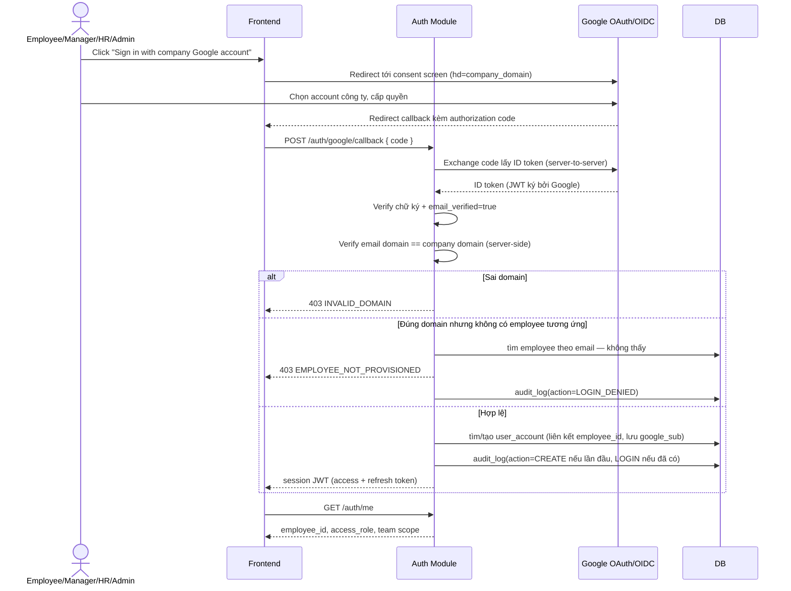
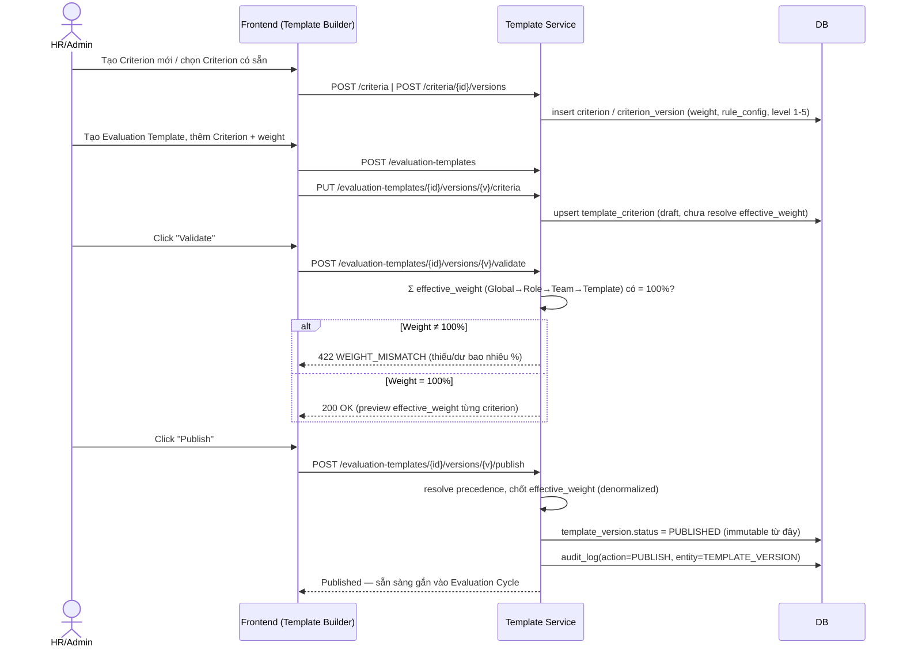
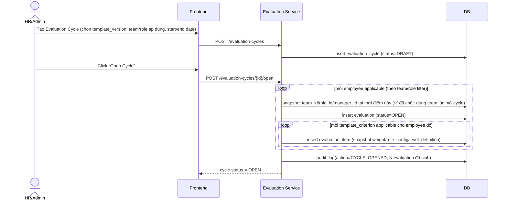
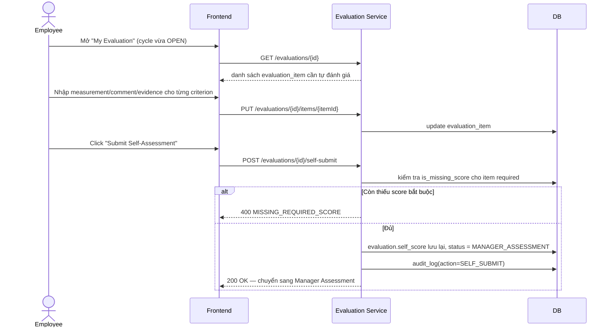
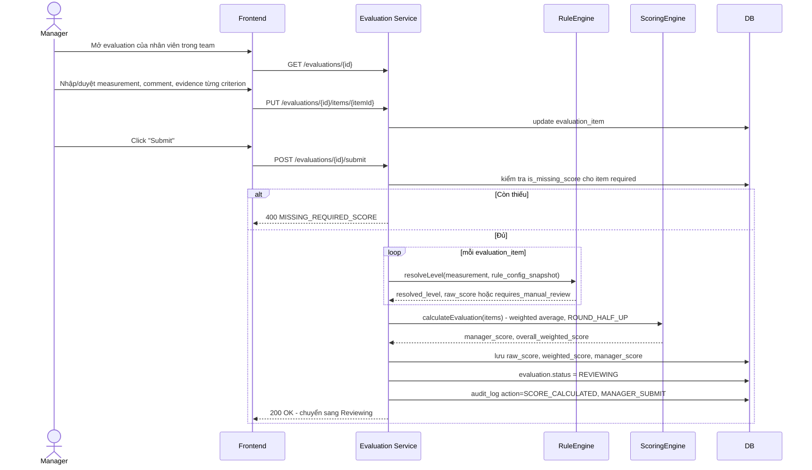
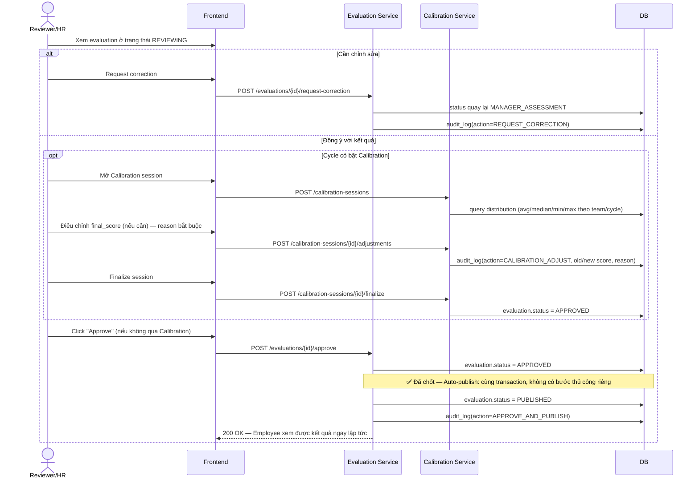
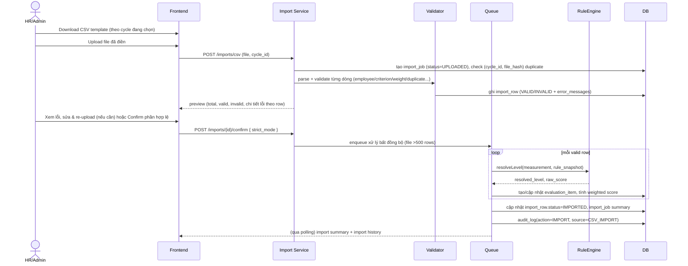
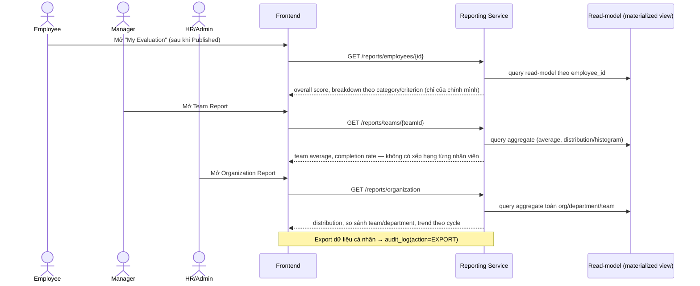
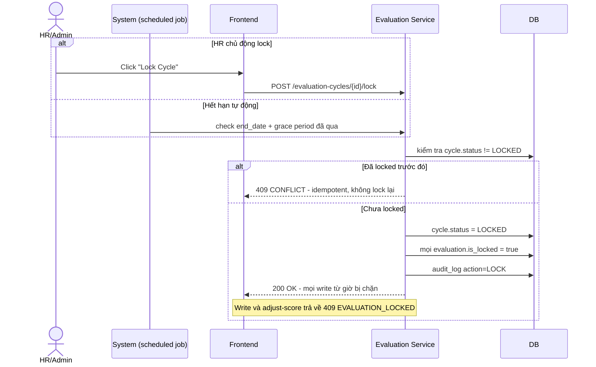
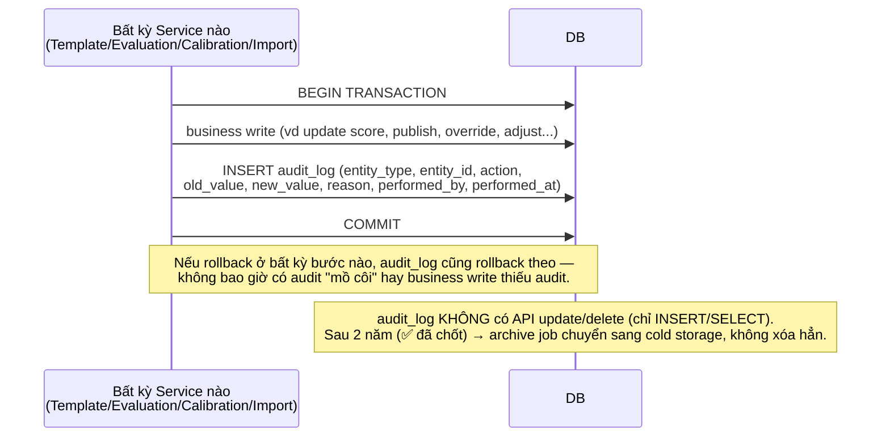

# Sequence Diagrams — Employee Performance Evaluation Management System

> **Nguồn tham chiếu:** `LLD_Employee_Performance_Evaluation_System_v1.2.md`. Tài liệu này minh họa **toàn bộ luồng nghiệp vụ chính** của hệ thống dưới dạng Mermaid sequence diagram, mỗi luồng kèm số mục LLD tương ứng để tra cứu chi tiết (entity, API, business rule).
>
> **Quy ước ký hiệu:**
> - `actor` = con người (Employee/Manager/HR-Admin/System Admin).
> - `participant` = thành phần hệ thống (Frontend, các Service theo module ở LLD mục 8, DB, thành phần ngoài như Google).
> - Mọi diagram đều tuân thủ 2 nguyên tắc xuyên suốt LLD: **(1)** mọi write ảnh hưởng điểm/weight/quyết định đều ghi `audit_log` cùng transaction (xem Diagram 10); **(2)** dữ liệu đã `LOCKED`/`PUBLISHED` không bao giờ bị ghi đè ngầm.

## Mục lục

1. [Đăng nhập — Google Workspace SSO](#1-đăng-nhập--google-workspace-sso)
2. [HR cấu hình Criterion & Evaluation Template](#2-hr-cấu-hình-criterion--evaluation-template)
3. [Mở Evaluation Cycle → sinh Evaluation instance](#3-mở-evaluation-cycle--sinh-evaluation-instance)
4. [Employee Self-Assessment (bắt buộc)](#4-employee-self-assessment-bắt-buộc)
5. [Manager Assessment → Scoring Engine tính điểm](#5-manager-assessment--scoring-engine-tính-điểm)
6. [Review → Calibration (optional) → Approve → Auto-Publish](#6-review--calibration-optional--approve--auto-publish)
7. [CSV Import hàng loạt](#7-csv-import-hàng-loạt)
8. [Xem Report (Employee / Manager / HR)](#8-xem-report-employee--manager--hr)
9. [Lock Cycle](#9-lock-cycle)
10. [Audit Log — cross-cutting pattern](#10-audit-log--cross-cutting-pattern)

---

## 1. Đăng nhập — Google Workspace SSO

> Tham chiếu: LLD mục 21 (Security), mục 10.8 (`user_account`).

---

## 2. HR cấu hình Criterion & Evaluation Template

> Tham chiếu: LLD mục 11 (Precedence & weight validation), mục 16 (API), mục 20 (Template Builder UI).

---

## 3. Mở Evaluation Cycle → sinh Evaluation instance

> Tham chiếu: LLD mục 10.5 (evaluation/evaluation_item), mục 14 (Workflow — trạng thái khởi tạo).

---

## 4. Employee Self-Assessment (bắt buộc)

> Tham chiếu: LLD mục 14 (✅ Self-assessment bắt buộc mọi cycle — không còn optional).

---

## 5. Manager Assessment → Scoring Engine tính điểm

> Tham chiếu: LLD mục 12 (Rule Engine), mục 13 (Scoring Engine), mục 14 (Workflow).

---

## 6. Review → Calibration (optional) → Approve → Auto-Publish

> Tham chiếu: LLD mục 14 (✅ Auto-publish — không còn thao tác "HR bấm Publish" riêng), mục 13 (Calibration).

---

## 7. CSV Import hàng loạt

> Tham chiếu: LLD mục 15 (CSV Import Design) — format long/tidy, partial import mặc định.

---

## 8. Xem Report (Employee / Manager / HR)

> Tham chiếu: LLD mục 19 (Reporting) — ✅ không có tính năng xếp hạng cá nhân dưới bất kỳ hình thức nào.

---

## 9. Lock Cycle

> Tham chiếu: LLD mục 14 (Permission theo transition), mục 18 (Retention Policy — 2 năm trước khi archive).

---

## 10. Audit Log — cross-cutting pattern

> Tham chiếu: LLD mục 18. Đây **không phải 1 flow độc lập** mà là pattern bắt buộc áp dụng cho **mọi write** ở Diagram 2–7, 9 (bất kỳ đâu ảnh hưởng weight/score/quyết định approve/adjust/override/import).

---

*Hết tài liệu. Mọi entity/API/business rule chi tiết tham chiếu `LLD_Employee_Performance_Evaluation_System_v1.2.md`.*
