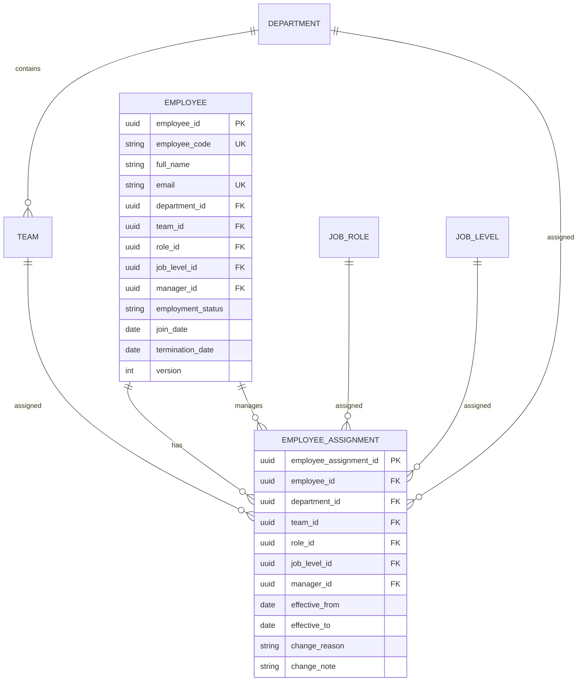

# Organization Module — Low Level Design (LLD)

## 1. Overview & Purpose

The **Organization Module** provides organizational context for performance evaluations and serves as the single source of truth for:
- Employee business identity (`Employee`)
- Organizational structure (`Department`, `Team`)
- Job classification (`JobRole`, `JobLevel`)
- Management hierarchy (`Manager Relationship`)
- Effective point-in-time assignments (`EmployeeAssignment` with temporal semantics)

### Bounded Context Boundaries

```
                    Organization Module
                           │
             ┌─────────────┼─────────────┐
             ▼             ▼             ▼
         Employee        Team/Role    Assignment
             │             │             │
             └─────────────┼─────────────┘
                           ▼
                  Organizational Context
                           │
                           ▼
                  Evaluation Context
                           │
          ┌────────────────┼────────────────┐
          ▼                ▼                ▼
       Template        RBAC Scope      Workflow
       Resolution      Resolution      Validation
          │                │                │
          └────────────────┼────────────────┘
                           ▼
                     Evaluation
```

### Module Responsibilities & Non-Goals

#### Core Responsibilities
1. Manage master data (Employee identity, Department, Team, Job Role, Job Level).
2. Manage temporal employee assignments and assignment history (`EmployeeAssignment`).
3. Resolve historical/effective organizational context (`OrganizationContextResolver` / `getAssignmentAt`).
4. Provide organizational context data for evaluation template applicability, workflow manager authorization, and RBAC scope resolution.

#### Non-Goals (Strict Boundaries)
- Does **NOT** calculate evaluation scores or resolve scoring rules.
- Does **NOT** manage or transition evaluation workflow states (`Draft`, `Submitted`, `Approved`).
- Does **NOT** store or calibrate evaluation ratings.
- Does **NOT** mutate historical evaluation snapshots when current employee assignments change.

---

## 2. Core Domain Concepts & Entities

The module models 7 primary domain concepts:

1. **Employee:** Business identity (`employee_code`, `full_name`, `email`, `employment_status`, `join_date`, `termination_date`, `version`).
2. **Department:** Top-level or hierarchical organizational unit (`code`, `name`, `parent_department_id`, `active`).
3. **Team:** Operational team belonging to a department (`code`, `name`, `department_id`, `active`).
4. **JobRole (Business Role):** Organizational position/title (`code`, `name`, `description`, `active`). Distinct from IAM `AccessRole`.
5. **JobLevel:** Rank/Seniority level (`code`, `name`, `rank`, `active`).
6. **Manager Relationship:** Direct reporting line (`manager_id` -> `Employee`).
7. **EmployeeAssignment:** Central aggregate representing an employee's organizational placement within a date range (`effective_from`, `effective_to`).

### JobRole vs IAM AccessRole Decoupling

| Dimension | Job Role (`JobRole`) | Access Role (`AccessRole`) |
|---|---|---|
| Bounded Context | Organization Module | IAM / Security Module |
| Example Values | `SOFTWARE_ENGINEER`, `ENGINEERING_MANAGER` | `EMPLOYEE`, `MANAGER`, `HR_ADMIN` |
| Primary Purpose | Evaluation Template matching, criteria weight resolution | System authorization & permission enforcement |

---

## 3. Data Model & ERD



---

## 4. Context Resolution & Snapshotting Contract

### Organization Context Resolver

Inputs:
- `employee_id`: UUID
- `effective_at`: Date (`YYYY-MM-DD`)

Processing:
1. Fetch active assignment for `employee_id` matching `effective_from <= effective_at AND (effective_to IS NULL OR effective_to >= effective_at)`.
2. Populate associated Department, Team, JobRole, JobLevel, and Manager records.
3. Construct `EvaluationOrganizationContext` DTO.

### Output Contract DTO (`EvaluationOrganizationContext`)

```json
{
  "employee_id": "e001-uuid",
  "department": {
    "id": "dept-eng-uuid",
    "code": "ENG",
    "name": "Engineering"
  },
  "team": {
    "id": "team-a-uuid",
    "code": "TEAM_A",
    "name": "Backend Team A"
  },
  "job_role": {
    "id": "role-se-uuid",
    "code": "SI",
    "name": "Software Engineer"
  },
  "job_level": {
    "id": "level-snr-uuid",
    "code": "SENIOR",
    "name": "Senior",
    "rank": 3
  },
  "manager": {
    "id": "mgr-m001-uuid",
    "full_name": "Jane Manager"
  },
  "effective_from": "2026-01-01",
  "effective_to": "2026-06-30"
}
```

---

## 5. Key Domain Invariants & Validation Rules

1. **Date Range Constraint:** `effective_from < effective_to` when `effective_to` is non-null.
2. **Temporal Non-Overlapping Invariant:** For a given employee, no two assignments may have overlapping `[effective_from, effective_to]` ranges.
3. **Self-Manager Prohibition:** `employee.manager_id != employee.employee_id`.
4. **Acyclic Manager Hierarchy:** Manager chain must be acyclic (e.g. A -> B -> C -> A is rejected with `CIRCULAR_MANAGER_RELATIONSHIP`).
5. **Code Uniqueness:** `employee_code`, department `code`, team `code`, role `code`, and level `code` must be unique.
6. **Optimistic Locking:** Concurrent updates to employee records enforce `version` checks.

---

## 6. API Boundaries

- `GET /api/v1/employees/:employeeId/context?at=YYYY-MM-DD` — Returns `EvaluationOrganizationContext` snapshot.
- `GET /api/v1/employees/:employeeId/assignments` — Returns full assignment history.
- `POST /api/v1/employees/:employeeId/assignments` — Creates new assignment / initiates employee transfer.
- `GET /api/v1/employees/:employeeId/direct-reports` — Returns subordinates reporting to manager.
- `GET /api/v1/departments`, `POST /api/v1/departments` — Master data CRUD.
- `GET /api/v1/teams`, `POST /api/v1/teams` — Master data CRUD.
- `GET /api/v1/roles`, `POST /api/v1/roles` — Business Job Roles CRUD.
- `GET /api/v1/job-levels`, `POST /api/v1/job-levels` — Job Levels CRUD.
