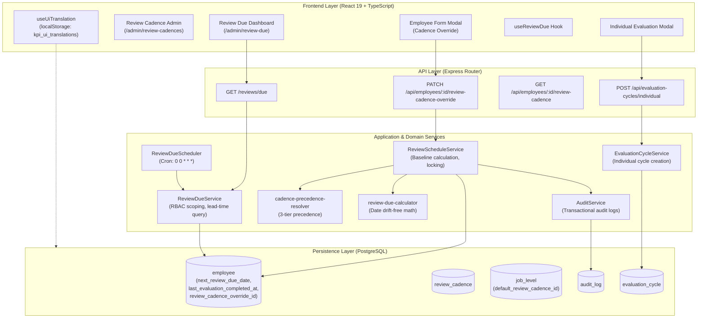
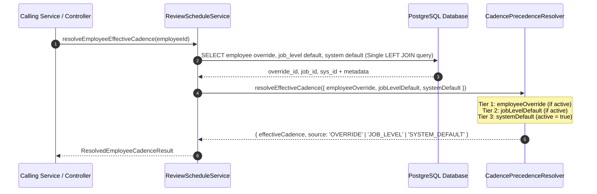
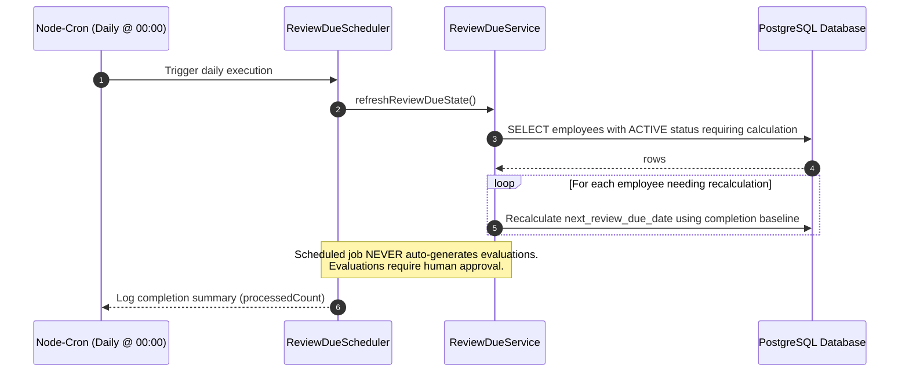
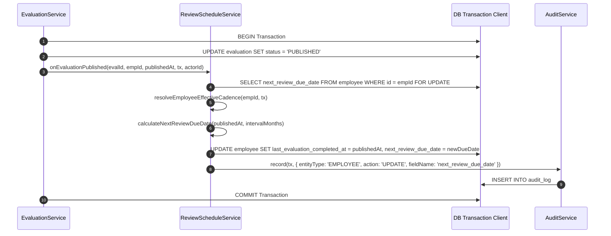
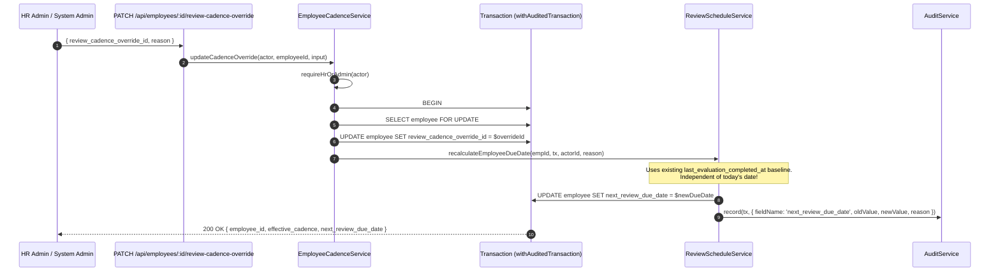

# Step 9 — System Documentation: Review Cadence & Review Due Scheduling Dashboard

## 1. Feature Overview & Purpose

The **Review Cadence & Review Due Scheduling** capability introduces automated cadence resolution, schedule-drift-free due date tracking, scoped monitoring dashboards, and transactional cadence override management to the KPI & Performance Evaluation platform.

Key capabilities delivered:
1. **Authoritative 3-Tier Precedence Resolver**: Seamlessly determines the effective review interval based on Employee Override &rarr; Job Level Default &rarr; System Default.
2. **Schedule-Drift-Free Review Due Date Calculation**: Ensures due dates anchor strictly to completed evaluation baselines (`last_evaluation_completed_at + interval_months`), eliminating calendar drift across fiscal years.
3. **Daily Scheduled State Refresh (`0 0 * * *`)**: Lightweight background cron job refreshing due dates and overdue statuses without automatically generating evaluations.
4. **Scoped Review Due Monitoring Dashboard**:
   - `HR_ADMIN` / `SYSTEM_ADMIN`: Organization-wide visibility, multi-filter query, bulk review initiation.
   - `MANAGER`: Scoped strictly to direct team members (`managedTeamIds`).
   - `EMPLOYEE`: Access forbidden (`403 Forbidden`).
5. **Strict Anti-Ranking Assurance**: Dashboard display order is strictly constrained to `next_review_due_date ASC NULLS LAST`. The UI explicitly avoids ranking, scores, or competitive comparative indicators.
6. **Pure Dynamic UI Internationalization (i18n)**: Adheres to the established `AUDIT_UI` pattern, storing localized strings in PostgreSQL and synchronizing to browser `localStorage` (`kpi_ui_translations`), enabling instantaneous zero-network language switching.
7. **Responsive Multi-Device & Dark Mode Experience**: Fluid mobile card layout, sticky bulk actions bar, and contrast-validated dark mode styling.

---

## 2. System Architecture & Component Interactions



---

## 3. Sequence Diagrams

### 3.1. Cadence Precedence Resolution (3-Tier)



---

### 3.2. Daily Scheduled Review Due Job (`0 0 * * *`)



---

### 3.3. Evaluation Publish Event & Baseline Registration



---

### 3.4. Cadence Override Mutation & Drift-Free Recalculation



---

## 4. REST API Specification

### 4.1. `GET /reviews/due`
Returns employees scheduled for performance evaluation within the given lead-time window.

- **Access**: Authenticated (`HR_ADMIN`, `SYSTEM_ADMIN`, `MANAGER`).
- **Query Parameters**:
  - `lead_time_days` *(optional, integer, default: 30)*: Lookahead window in days.
  - `status` *(optional, string)*: Filter by `OVERDUE`, `DUE`, `UPCOMING`, `NOT_DUE`.
  - `team_id` *(optional, UUID)*: Filter by team (validated against manager's team permissions).
  - `cadence_id` *(optional, UUID)*: Filter by assigned cadence.
  - `search` *(optional, string)*: Keyword search against employee name or employee code.
  - `page` *(optional, integer, default: 1)*: Pagination page index.
  - `page_size` *(optional, integer, default: 20)*: Page size limit.
- **Sorting Rule**: Guaranteed `next_review_due_date ASC NULLS LAST` (Strict anti-ranking).
- **Response `200 OK`**:
```json
{
  "success": true,
  "data": {
    "items": [
      {
        "employee_id": "c1f7a2d8-4b2e-4b9e-9d2a-1b2c3d4e5f6a",
        "employee_code": "EMP-0042",
        "employee_name": "Nguyen Van A",
        "team_id": "a1b2c3d4-e5f6-7a8b-9c0d-1e2f3a4b5c6d",
        "team_name": "Core Engineering",
        "job_level_id": "b2c3d4e5-f6a7-8b9c-0d1e-2f3a4b5c6d7e",
        "job_level_name": "Senior Software Engineer",
        "effective_cadence_id": "d3e4f5a6-b7c8-9d0e-1f2a-3b4c5d6e7f8a",
        "effective_cadence_name": "Bán niên (6 tháng)",
        "effective_cadence_code": "CAD-SEMIANNUAL",
        "effective_cadence_interval_months": 6,
        "cadence_source": "JOB_LEVEL",
        "last_evaluation_completed_at": "2025-10-15T00:00:00.000Z",
        "next_review_due_date": "2026-04-15",
        "days_remaining": -5,
        "status": "OVERDUE"
      }
    ],
    "summary": {
      "total_due_count": 14,
      "overdue_count": 3,
      "due_today_count": 1,
      "upcoming_count": 10
    },
    "pagination": {
      "page": 1,
      "page_size": 20,
      "total_items": 14,
      "total_pages": 1
    }
  }
}
```

---

### 4.2. `PATCH /api/employees/:employeeId/review-cadence-override`
Assigns or clears an individual employee's cadence override and immediately recalculates `next_review_due_date`.

- **Access**: Strictly restricted to `HR_ADMIN` and `SYSTEM_ADMIN`.
- **Request Body**:
```json
{
  "review_cadence_override_id": "e4f5a6b7-c8d9-0e1f-2a3b-4c5d6e7f8a9b",
  "reason": "Probationary period review cadence adjustment"
}
```
*Note: Pass `null` for `review_cadence_override_id` to revert back to Job Level or System Default.*

- **Response `200 OK`**:
```json
{
  "success": true,
  "message": "Employee review cadence override updated successfully.",
  "data": {
    "employee_id": "c1f7a2d8-4b2e-4b9e-9d2a-1b2c3d4e5f6a",
    "review_cadence_override_id": "e4f5a6b7-c8d9-0e1f-2a3b-4c5d6e7f8a9b",
    "last_evaluation_completed_at": "2025-10-15T00:00:00.000Z",
    "next_review_due_date": "2026-01-15",
    "effective_cadence": {
      "id": "e4f5a6b7-c8d9-0e1f-2a3b-4c5d6e7f8a9b",
      "code": "CAD-QUARTERLY",
      "name": "Định kỳ Quý (3 tháng)",
      "interval_months": 3
    }
  }
}
```

---

### 4.3. `GET /api/employees/:employeeId/review-cadence`
Inspects the resolved cadence breakdown for an employee.

- **Response `200 OK`**:
```json
{
  "success": true,
  "data": {
    "effectiveCadence": {
      "id": "e4f5a6b7-c8d9-0e1f-2a3b-4c5d6e7f8a9b",
      "code": "CAD-QUARTERLY",
      "name": "Định kỳ Quý (3 tháng)",
      "intervalMonths": 3,
      "isSystemDefault": false,
      "active": true
    },
    "employeeOverride": {
      "id": "e4f5a6b7-c8d9-0e1f-2a3b-4c5d6e7f8a9b",
      "code": "CAD-QUARTERLY",
      "name": "Định kỳ Quý (3 tháng)",
      "intervalMonths": 3,
      "isSystemDefault": false,
      "active": true
    },
    "jobLevelDefault": {
      "id": "d3e4f5a6-b7c8-9d0e-1f2a-3b4c5d6e7f8a",
      "code": "CAD-SEMIANNUAL",
      "name": "Bán niên (6 tháng)",
      "intervalMonths": 6,
      "isSystemDefault": false,
      "active": true
    },
    "systemDefault": {
      "id": "f5a6b7c8-d9e0-1f2a-3b4c-5d6e7f8a9b0c",
      "code": "CAD-ANNUAL",
      "name": "Thường niên (12 tháng)",
      "intervalMonths": 12,
      "isSystemDefault": true,
      "active": true
    }
  }
}
```

---

### 4.4. `POST /api/evaluation-cycles/individual`
Creates individual review cycles for selected review-due employees with team conflict validation.

- **Request Body**:
```json
{
  "employee_ids": ["c1f7a2d8-4b2e-4b9e-9d2a-1b2c3d4e5f6a"],
  "template_id": "a0b1c2d3-e4f5-6a7b-8c9d-0e1f2a3b4c5d",
  "start_date": "2026-04-15",
  "end_date": "2026-04-30",
  "name_prefix": "Đánh giá Kỳ Hạn"
}
```

---

## 5. Database Schema & Migration Details

### 5.1. Migration `1791000000002_add_employee_review_due_indexes.ts`
Creates compound indexes on table `employee` to accelerate `GET /reviews/due`:
```sql
-- Organization-wide search: filters by active employees and orders by due date
CREATE INDEX IF NOT EXISTS idx_employee_review_due 
ON employee (employment_status, next_review_due_date)
WHERE employment_status = 'ACTIVE';

-- Team-scoped search: filters by team and orders by due date
CREATE INDEX IF NOT EXISTS idx_employee_team_review_due 
ON employee (employment_status, team_id, next_review_due_date)
WHERE employment_status = 'ACTIVE';
```

### 5.2. Migration `1791000000003_seed_review_due_ui_i18n_translations.ts`
Registers entity type `REVIEW_DUE_UI` in `app_entity_type` and seeds bilingual translations (`en` and `vi`) into `ui_translation`.

---

## 6. Frontend Internationalization Architecture

Matches the pure dynamic pattern established in `AUDIT_UI`:
- **Storage Location**: Browser `localStorage.getItem('kpi_ui_translations')`.
- **Hydration**: Handled on application bootstrap via `AuthProvider.tsx` (`fetchAndStoreUiTranslations()`).
- **Hook Integration**: `useReviewDueTranslation()` calls `useUiTranslation('REVIEW_DUE_UI')`, with support for interpolation placeholders (`{count}`, `{days}`).
- **Zero Static Bundles**: Eliminated all hardcoded static dictionary fallbacks from frontend source code, ensuring single source of truth in PostgreSQL.

---

## 7. Operational & Deployment Guide

### Environment Variables
| Variable | Default | Purpose |
|---|---|---|
| `REVIEW_DUE_CRON_SCHEDULE` | `"0 0 * * *"` | Cron pattern for the daily review due background refresh job |
| `BATCH_CYCLE_LEAD_TIME_WEEKS` | `4` | Threshold in weeks to alert managers if a batch cycle is impending |

### Rollback Strategy
If review-due scheduling needs to be reverted:
1. Revert Git commits on the release branch.
2. Run database rollback down migrations:
   ```bash
   npm run migrate down
   ```
3. Restart backend service (daily cron will cease). Historical evaluation records and criterion snapshots remain 100% intact due to absolute immutability guarantees.
