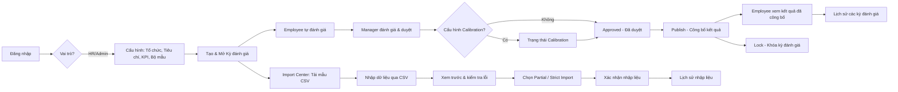

# Hệ thống Quản lý Đánh giá Hiệu suất Nhân viên
# Hướng dẫn sử dụng

## 1. Giới thiệu

### 1.1 Mục đích

Tài liệu này hướng dẫn cách sử dụng Hệ thống Quản lý Đánh giá Hiệu suất Nhân viên (Employee Performance Evaluation Management System) trên giao diện web thực tế của hệ thống. Nội dung mô tả đúng những gì người dùng nhìn thấy và có thể thao tác trên màn hình: menu nào đang có, nút nào bấm được, cần nhập/chọn gì, hệ thống phản hồi ra sao.

Tài liệu **không** mô tả kiến trúc kỹ thuật, API, cơ sở dữ liệu hay mã nguồn.

### 1.2 Đối tượng sử dụng

- **Employee** (Nhân viên): thực hiện tự đánh giá hiệu suất theo từng kỳ.
- **Manager** (Quản lý): đánh giá và duyệt kết quả của nhân viên trong nhóm mình quản lý.
- **HR/Admin**: cấu hình tiêu chí, bộ mẫu đánh giá, kỳ đánh giá, quản lý tổ chức, nhập dữ liệu CSV, theo dõi nhật ký hệ thống.
- **System Admin**: có quyền tương tự HR/Admin đối với dữ liệu nghiệp vụ, đồng thời có thể sử dụng các màn hình dành cho Employee (Mục 15 nêu chi tiết khác biệt).

### 1.3 Vai trò người dùng

Hệ thống có 4 vai trò: **Employee**, **Manager**, **HR_ADMIN**, **SYSTEM_ADMIN**. Vai trò của một tài khoản được xác định ngay khi đăng nhập và quyết định menu nào hiển thị trên thanh điều hướng bên trái, cũng như trang nào có thể truy cập.

> **Lưu ý:** Việc ẩn/hiện menu trên giao diện chỉ nhằm mục đích thuận tiện sử dụng. Việc phân quyền thật sự được máy chủ kiểm soát — nếu bạn cố truy cập một trang không được phép (kể cả qua đường dẫn trực tiếp), hệ thống sẽ hiển thị màn hình **403 — Access Denied**.

## 2. Quy trình tổng thể

### 2.1 Sơ đồ tổng quan

### 2.2 Vòng đời một kỳ đánh giá

Một kỳ đánh giá (Evaluation Cycle) đi qua các trạng thái theo thứ tự sau (chi tiết ý nghĩa từng trạng thái xem Mục 16):

`DRAFT` → `OPEN` → `IN_PROGRESS` → `SUBMITTED` → `REVIEWING` → `CALIBRATION` (tùy chọn) → `APPROVED` → `PUBLISHED` → `LOCKED`

Trong khi đó, một bản đánh giá cá nhân (evaluation) của từng nhân viên có trạng thái riêng: **Chưa mở (Draft/Open)** → **Đã nộp / Chờ Manager (Submitted)** → **Đang Review (Manager Review)** → **Đã duyệt (Approved)** → **Đã công bố (Published)** → **Đã khóa (Locked)**.

### 2.3 Vai trò nào làm gì

| Giai đoạn | Người thực hiện |
|---|---|
| Cấu hình tổ chức, tiêu chí, bộ mẫu, kỳ đánh giá | HR/Admin, System Admin |
| Mở kỳ đánh giá | HR/Admin, System Admin |
| Tự đánh giá (Self-Assessment) | Employee (và Manager/System Admin khi tự đánh giá cho chính mình) |
| Đánh giá & duyệt cho nhân viên (Manager Assessment / Approve) | Manager |
| Công bố kết quả (Publish) | HR/Admin |
| Khóa kỳ đánh giá / bản đánh giá (Lock) | HR/Admin |
| Nhập dữ liệu CSV | HR/Admin, System Admin |
| Xem nhật ký hệ thống | HR/Admin, System Admin |

## 3. Đăng nhập

### 3.1 Mục đích

Xác thực người dùng trước khi cho phép truy cập hệ thống.

### 3.2 Cách đăng nhập

Màn hình đăng nhập có tiêu đề **"KPI System — Sign in"** và cung cấp hai cách đăng nhập:

**Cách 1 — Email và mật khẩu:**
1. Nhập **Email**.
2. Nhập **Password**.
3. Bấm **Sign in**.
4. Trong lúc xử lý, nút hiển thị **"Signing in…"**.

**Cách 2 — Tài khoản Google của công ty:**
1. Bấm **"Sign in with company Google account"**.
2. Chọn tài khoản Google thuộc tên miền công ty (`cyberlogitec.com`).
3. Hoàn tất xác thực với Google.
4. Hệ thống tự động đưa bạn vào trang phù hợp với quyền của tài khoản.

### 3.3 Các thông báo lỗi có thể gặp

| Tình huống | Thông báo hiển thị |
|---|---|
| Email/mật khẩu sai (lỗi xác thực) | Thông báo lỗi do máy chủ trả về, hiển thị ngay trên form |
| Lỗi không xác định khác khi đăng nhập | "An unexpected error occurred. Please try again." |
| Sai định dạng email | "Invalid email format" |
| Chưa nhập mật khẩu | "Password is required" |
| Google Sign-In chưa được cấu hình trên máy chủ | "Google sign-in is not configured." |
| Dịch vụ Google Identity không tải được | "Google Identity Services is unavailable." hoặc thông báo tải thất bại tương tự |
| Đăng nhập Google thất bại | "Google sign-in failed. Please try again." |

## 4. Tổ chức (Organization)

### 4.1 Mục đích

Quản lý cơ cấu tổ chức (phòng ban, nhóm, nhân viên) và kiến trúc công việc (chức danh, cấp bậc) dùng làm cơ sở cho việc đánh giá.

### 4.2 Ai được sử dụng

| Vai trò | Quyền truy cập |
|---|---|
| HR/Admin, System Admin | Xem và quản lý toàn bộ |
| Manager, Employee | Không có menu này |

### 4.3 Cách truy cập

1. Đăng nhập.
2. Trên thanh điều hướng, chọn **Organization** (trong nhóm **Configuration**).

### 4.4 Màn hình tổng quan

Trang **Organization** có 2 tab: **Org Structure** và **Job Architecture**.

#### Tab Org Structure

- Cây điều hướng bên trái: **All Organization** → **Departments** → **Teams** (mở rộng được).
- Khi chưa chọn gì: hiển thị bảng **Departments** (danh sách phòng ban) và bảng **Employees** (toàn bộ nhân viên).
- Khi chọn một phòng ban: hiển thị bảng **Teams** thuộc phòng ban đó và bảng **Employees** lọc theo phòng ban.
- Khi chọn một nhóm (team): hiển thị bảng **Employees** là thành viên của nhóm đó.

**Quản lý Phòng ban (Department):**
1. Bấm nút tạo phòng ban, nhập **Department Code** (bắt buộc) và **Department Name** (bắt buộc).
2. Bấm nút lưu để tạo mới.
3. Để sửa: mở phòng ban cần sửa, cập nhật **Department Name**, có thể bật/tắt cờ **Active** (chỉ khi sửa), sau đó lưu.

**Quản lý Nhóm (Team):**
1. Bấm nút tạo nhóm, nhập **Team Code** (bắt buộc, tối đa 20 ký tự, chỉ khi tạo mới), **Team Name** (bắt buộc), chọn **Department** (bắt buộc), có thể nhập **Description** (tối đa 500 ký tự).
2. Bấm nút lưu để tạo mới, hoặc **Save Changes** khi sửa (khi sửa không đổi được mã nhóm).
3. **Deactivate Team**: hộp thoại xác nhận hiển thị "Are you sure you want to deactivate **{Tên nhóm}**?". Nếu nhóm còn nhân viên đang hoạt động (active member), hệ thống cảnh báo: "This team has **{n}** active employee(s). You must reassign them to a different team before deactivating this one." và khóa nút **Deactivate** cho đến khi đã chuyển hết nhân viên sang nhóm khác.

**Quản lý Nhân viên (Employee):**
1. Bấm **+ Add Employee**.
2. Nhập/chọn các trường:
   - **Employee Code** (không bắt buộc — để trống sẽ tự sinh mã).
   - **Full Name** (bắt buộc).
   - **Email** (không bắt buộc, phải đúng định dạng email nếu nhập).
   - **Employment Status**: ACTIVE / INACTIVE / ON_LEAVE / TERMINATED.
   - **Review Cadence** (chu kỳ đánh giá định kỳ của nhân viên): tùy chọn "-- No Cadence --", **Monthly**, **Quarterly**, **Biannually**, **Annually**.
   - **Department** (bắt buộc), **Team** (không bắt buộc, phụ thuộc phòng ban đã chọn).
   - **Job Role** (bắt buộc), **Job Level** (bắt buộc).
3. Bấm **Add Employee** để tạo mới, hoặc **Edit** trên một dòng rồi bấm **Save Changes** để cập nhật (khi sửa không đổi được **Employee Code**).

Bảng **Employees** hiển thị các cột: Code, Name, Role, Level, Email, **Review Cadence**, **Last Review Date**, **Next Review Date**, Status, và cột **Actions** (nút **Edit**) chỉ hiển thị với HR/Admin và System Admin.

> **Về "kích hoạt lại tài khoản nhân viên":** hệ thống không có nút Activate/Deactivate riêng cho nhân viên — để đổi trạng thái hoạt động, mở **Edit** và chọn lại **Employment Status**.

#### Tab Job Architecture

Gồm 2 khối:
- **Job Roles**: danh sách chức danh công việc, có thể tạo/sửa.
- **Job Levels**: danh sách cấp bậc công việc, có thể tạo/sửa.

### 4.5 Kết quả

Sau khi lưu thành công, danh sách tương ứng (phòng ban/nhóm/nhân viên/chức danh/cấp bậc) được cập nhật ngay trên bảng.

## 5. Kỳ đánh giá (Evaluation Cycles)

### 5.1 Mục đích

Tạo và điều phối các kỳ đánh giá hiệu suất: chọn bộ mẫu, phạm vi áp dụng, thời gian, và theo dõi tiến trình từ khi mở đến khi khóa.

### 5.2 Ai được sử dụng

| Vai trò | Quyền truy cập |
|---|---|
| HR/Admin, System Admin | Toàn quyền tạo, chỉnh sửa, vận hành |
| Manager, Employee | Không có menu này |

### 5.3 Cách truy cập

Trên thanh điều hướng, chọn **Evaluation Cycles** (trong nhóm **Configuration**).

### 5.4 Tạo kỳ đánh giá mới

1. Bấm **+ Create New**.
2. Nhập **Cycle Code \*** (ví dụ: `2026-ENG-EVAL`) và **Cycle Name \***.
3. Chọn **Published Template Version \*** — chỉ các bộ mẫu đã **Publish** mới xuất hiện trong danh sách.
4. (Tùy chọn) Bật **Enable calibration** nếu kỳ đánh giá này cần bước Calibration.
5. Nhập **Start Date \***, **End Date \***, và **Grace Period (days)** (số ngày gia hạn, mặc định 7).
6. Chọn **Applicable Scope**: theo **Department**, **Team**, **Job Role**, **Job Level**, hoặc chọn trực tiếp danh sách **Employee**.
   - Khi chọn nhân viên, mỗi người hiển thị kèm badge trạng thái đến hạn đánh giá định kỳ: **Overdue** (quá hạn), **Due in Nd** / **Due today** (sắp đến hạn), **Nd left** (chưa đến hạn), hoặc **No schedule** (chưa cấu hình Review Cadence) — dựa trên **Review Cadence** đã cấu hình ở Mục 4.4.
   - Nếu người dùng đang đăng nhập là **Manager**, phạm vi chỉ giới hạn trong các nhóm mà Manager đó quản lý (**Managed Teams**).
7. Bấm **Save Draft** để lưu, hoặc **Cancel** để hủy.

**Kiểm tra bắt buộc trước khi lưu:** Cycle Code, Cycle Name, Evaluation Template, Start Date, End Date là bắt buộc; End Date phải sau Start Date; Grace Period không được âm.

### 5.5 Mở và vận hành kỳ đánh giá

Trên trang chi tiết một kỳ đánh giá, các nút thao tác xuất hiện tùy theo trạng thái hiện tại:

| Trạng thái hiện tại | Hành động khả dụng |
|---|---|
| DRAFT | **Edit Configuration**, **Open Cycle** (có hộp thoại xác nhận) |
| OPEN | **Start In Progress** |
| IN_PROGRESS | **Submit All Evaluations** |
| SUBMITTED | **Start Reviewing** |
| REVIEWING | **Move to Calibration**, **Approve Cycle** |
| CALIBRATION | **Approve Cycle** |
| APPROVED | **Publish Results** |
| Bất kỳ trạng thái nào chưa khóa | **Lock Cycle** |

Trang chi tiết còn hiển thị: badge trạng thái, dòng thời gian (**Cycle Timeline**), bản tóm tắt phạm vi (**Scope Preview**), và tóm tắt cấu hình (bao gồm dòng **Calibration: Enabled/Disabled**).

### 5.6 Khóa kỳ đánh giá

Bấm **Lock Cycle**. Hệ thống hiển thị cảnh báo xác nhận trước khi khóa, nêu rõ rằng toàn bộ đánh giá liên quan sẽ trở thành chỉ đọc vĩnh viễn. Sau khi khóa, một biểu ngữ (banner) đen với tiêu đề **"Cycle Status: LOCKED"** xuất hiện, giải thích rằng mọi cấu hình, bản đánh giá, điểm tiêu chí và chuyển trạng thái đã đóng băng.

### 5.7 Kết quả

Mỗi hành động (mở, chuyển trạng thái, khóa) cập nhật ngay badge trạng thái và các nút thao tác khả dụng trên trang chi tiết.

## 6. Tiêu chí & Quy tắc (Criteria & Rules)

### 6.1 Mục đích

Quản lý danh sách tiêu chí (criterion) và quy tắc chấm điểm dùng để xây dựng bộ mẫu đánh giá.

### 6.2 Ai được sử dụng

| Vai trò | Quyền truy cập |
|---|---|
| HR/Admin, System Admin | Xem và tạo tiêu chí mới |
| Manager, Employee | Không có menu này |

### 6.3 Cách truy cập

Chọn **Criteria & Rules** trên thanh điều hướng.

### 6.4 Màn hình tổng quan

Trang **Criteria & Rules Library** hiển thị bảng gồm các cột: **Code**, **Name**, **Category**, **Current Version** (phiên bản hiện hành, ví dụ `v1`), **Status**.

### 6.5 Tạo tiêu chí mới

1. Bấm **+ Create Criterion**.
2. Nhập **Criterion Code \*** và **Criterion Name \*** (bắt buộc).
3. Chọn **Category**: Performance, Capability, Contribution, hoặc Behavior.
4. Nhập **Description** (tùy chọn).
5. Bấm **Create**. Trong lúc xử lý, nút hiển thị **"Creating..."**.

Nếu thiếu **Code** hoặc **Name**, hệ thống báo lỗi: "Code and Name are required."

### 6.6 Tìm kiếm và lọc

- Ô tìm kiếm **"Search by code or name..."**.
- Bộ lọc **Category**: All Categories, Performance, Capability, Contribution, Behavior.

### 6.7 Kết quả

Tiêu chí mới xuất hiện ngay trong bảng. Danh sách hiển thị phiên bản hiện hành của từng tiêu chí; việc chỉnh sửa hoặc quản lý phiên bản chi tiết của một tiêu chí được thực hiện trong quá trình xây dựng bộ mẫu đánh giá (xem Mục 8).

## 7. Thư viện KPI (KPI Library)

### 7.1 Mục đích

Quản lý các KPI (chỉ số đo lường) và mối quan hệ giữa KPI với tiêu chí, dùng trong bộ mẫu đánh giá.

### 7.2 Ai được sử dụng

| Vai trò | Quyền truy cập |
|---|---|
| HR/Admin, System Admin | Toàn quyền |
| Manager, Employee | Không có menu này |

### 7.3 Cách truy cập

Chọn **KPI Library** trên thanh điều hướng.

### 7.4 Màn hình tổng quan

Trang có 2 tab: **KPI Library (n)** và **Dependency Map (n)**.

**Tab KPI Library:**
- Ô tìm kiếm để lọc theo tên/mã KPI.
- Nút **+ Create KPI** để tạo mới.
- Bảng KPI gồm Code, Name, Description và cột **Actions** với **Edit** và **Delete** (bấm Delete sẽ hiện xác nhận nội tuyến **"Delete?"** với hai lựa chọn **Yes**/**No**).
- Bấm vào một dòng KPI sẽ mở bảng chi tiết tiêu chí liên kết với KPI đó bên dưới.

**Tab Dependency Map:**
- Hiển thị bảng quan hệ giữa các KPI.
- Nút **Add Relationship** để thêm quan hệ mới.

### 7.5 Kết quả

Thay đổi (tạo/sửa/xóa KPI, thêm quan hệ) được phản ánh ngay trên bảng tương ứng.

## 8. Bộ mẫu đánh giá (Template Builder)

### 8.1 Mục đích

Xây dựng bộ mẫu đánh giá (Evaluation Template): chọn KPI/tiêu chí, cấu hình trọng số, kiểm tra hợp lệ, và phát hành phiên bản chính thức để sử dụng trong kỳ đánh giá.

### 8.2 Ai được sử dụng

| Vai trò | Quyền truy cập |
|---|---|
| HR/Admin, System Admin | Toàn quyền |
| Manager, Employee | Không có menu này |

### 8.3 Cách truy cập

Chọn **Template Builder** trên thanh điều hướng.

### 8.4 Danh sách bộ mẫu

Bảng hiển thị: Template Name/Code, Version, Status (badge), Criteria Count, Last Updated, Updated By.

- Nếu bộ mẫu đã **PUBLISHED**: hàng có nút **View** và **Create New Version**.
- Nếu chưa publish (DRAFT): hàng có nút **Edit Draft**.

### 8.5 Tạo bộ mẫu mới

1. Bấm **+ Create Template**.
2. Nhập **Code \***, **Name \***, **Description** (tùy chọn).
3. Xác nhận tạo — bộ mẫu mới ở trạng thái **DRAFT**, sẵn sàng để chỉnh sửa nội dung.

### 8.6 Chỉnh sửa nội dung bộ mẫu (workspace)

Màn hình xây dựng bộ mẫu gồm:
- Breadcrumb, badge trạng thái, số phiên bản ("Version N").
- Chỉ báo thay đổi chưa lưu: **"● Unsaved changes"** hoặc **"● All changes saved · Last saved {thời điểm}"**.
- Thanh công cụ: **Version Diff**, **Validate Template**, và (chỉ khi chưa publish) **Save Draft**, **Publish Version**.
- Hai cột nội dung: bên trái là tab **KPI Library** / **Criterion Library** để chọn; bên phải là khu vực cấu hình — thẻ KPI kèm điều khiển trọng số, kéo-thả tiêu chí, thanh trạng thái tổng trọng số (**Weight Status Bar**).
- Bấm vào một tiêu chí sẽ mở khung cấu hình chi tiết (**Criterion Config**) dạng trượt từ cạnh phải màn hình.

**Kiểm tra hợp lệ:** bấm **Validate Template** để mở hộp thoại kết quả kiểm tra (ví dụ: tổng trọng số chưa đủ/vượt 100%).

**Phát hành:** bấm **Publish Version**, xác nhận trong hộp thoại **Publish Confirmation**.

**Xem lịch sử phiên bản:** bấm **Version Diff** để so sánh giữa các phiên bản đã lưu.

**Xử lý xung đột đồng thời:** nếu một người khác đã lưu thay đổi trước bạn (lỗi HTTP 409), hệ thống mở hộp thoại **Conflict Resolution** để bạn xử lý trước khi lưu tiếp.

### 8.7 Phiên bản đã Publish là bất biến

> **Vì sao không sửa được bộ mẫu đã Publish?**
> Khi một phiên bản đã được **Publish**, nội dung trở thành cố định để đảm bảo các kỳ đánh giá đang dùng phiên bản đó không bị thay đổi ngầm. Màn hình hiển thị biểu ngữ: **"🔒 Published Version is Immutable. This configuration is locked and cannot be modified."** Để thay đổi, bấm **Create New Draft Version** để tạo một phiên bản nháp mới dựa trên phiên bản đã publish.

Khi ở chế độ chỉ đọc này, các nút **Save Draft** và **Publish Version** không hiển thị.

### 8.8 Kết quả

Sau khi **Publish Version** thành công, bộ mẫu chuyển sang trạng thái **PUBLISHED** và có thể được chọn khi tạo Kỳ đánh giá (Mục 5.4).

## 9. Trung tâm nhập liệu CSV (Import Center)

### 9.1 Mục đích

Nhập hàng loạt kết quả đánh giá (điểm số) vào một kỳ đánh giá thông qua tệp CSV, thay vì nhập tay từng mục.

### 9.2 Ai được sử dụng

| Vai trò | Quyền truy cập |
|---|---|
| HR/Admin, System Admin | Toàn quyền tải mẫu, tải lên, xem lịch sử |
| Manager, Employee | Không có menu này |

### 9.3 Cách truy cập

Chọn **Import Center** trên thanh điều hướng — mở thẳng vào màn hình **Upload CSV**. Để xem lịch sử các lần nhập trước, vào đường dẫn **Import History** (xem Mục 9.9).

### 9.4 Tải mẫu CSV (Download Template)

Màn hình **Upload CSV** hiển thị **Template Details**: Code, Version, Status, Effective From, kèm bảng cột **Columns** (Order, Column, Type, Required, Validation). Bấm **Download CSV Template** để tải tệp mẫu CSV theo đúng cấu trúc cột đang hiệu lực.

### 9.5 Tải lên và kiểm tra (Upload & Validate)

1. Nhập **Evaluation Cycle ID** — mã của kỳ đánh giá cần nhập dữ liệu vào.
2. Chọn tệp CSV ở ô **Select CSV File** (chỉ nhận tệp `.csv`).
3. Bấm **Upload & Validate**. Trong lúc xử lý, nút hiển thị **"Uploading..."**.

### 9.6 Xem trước kết quả kiểm tra (Preview)

Sau khi tải lên, khu vực **Validation Preview** hiển thị 3 ô số liệu: **Total Rows**, **Valid Rows**, **Errors**.

Nếu toàn bộ dòng hợp lệ, hệ thống hiển thị: "All rows passed validation successfully! You may proceed with the import."

Nếu có lỗi, bảng **Row Validation Errors** liệt kê từng lỗi theo cột **Row** (số dòng), **Field** (trường dữ liệu), **Error Code** (mã lỗi), **Message** (nội dung lỗi). Bảng chỉ hiển thị tối đa 100 lỗi đầu tiên, kèm ghi chú "Showing first 100 errors." nếu còn nhiều hơn.

**Cách xử lý lỗi:** mở lại tệp CSV, tìm đúng số dòng (Row) và cột (Field) được báo lỗi, sửa theo nội dung **Message**, sau đó tải lên lại từ đầu (Mục 9.5).

### 9.7 Chọn chế độ nhập liệu

Ở khu vực **Import Settings**, chọn một trong hai chế độ:

- **Partial Import (Recommended)**: "Valid rows will be imported. Rows with errors will be skipped." — Các dòng hợp lệ được nhập, dòng lỗi bị bỏ qua.
- **Strict Mode**: "All or nothing. If any row has an error, the entire import will be rejected." — Chỉ nhập khi toàn bộ tệp hợp lệ; nếu còn dòng lỗi, toàn bộ lần nhập bị từ chối. Nếu chọn Strict Mode khi vẫn còn lỗi, hệ thống hỏi xác nhận thêm trước khi tiếp tục.

Bấm **Confirm and Import** để bắt đầu. Nút này bị vô hiệu hóa nếu chọn Strict Mode mà vẫn còn dòng lỗi.

### 9.8 Theo dõi quá trình xử lý

Sau khi xác nhận, khu vực trạng thái hiển thị **"Import Status: {trạng thái}"**, tự động cập nhật mỗi 2 giây trong khi đang xử lý. Ý nghĩa từng trạng thái xem Mục 16.

Khi quá trình kết thúc (**Completed**, **Partially Completed**, hoặc **Failed**), bấm **View Import History** để chuyển sang màn hình lịch sử.

### 9.9 Lịch sử nhập liệu (Import History)

Bảng liệt kê các lần nhập: File, Status (badge — Completed/Partial/Failed/Importing...), Total Rows, Imported, Errors, Created At, Completed At. Danh sách tự làm mới mỗi 5 giây khi có lần nhập đang chạy. Bấm biểu tượng mắt trên một dòng để xem **chi tiết**.

**Chi tiết một lần nhập:** hiển thị tóm tắt (Status, File, Total Rows, Successfully Imported, Errors/Skipped) và bảng **Row History** — từng dòng dữ liệu với trạng thái riêng: **Valid**, **Invalid**, **Imported**, **Skipped**, kèm Employee, Criterion·KPI, Value, Errors. Bảng chi tiết tự làm mới mỗi 3 giây khi lần nhập đang chạy.

### 9.10 Kết quả

Sau khi nhập thành công, kết quả (điểm số) được ghi nhận vào các bản đánh giá tương ứng trong kỳ đánh giá đã chọn; lần nhập được lưu lại trong **Import History** để tra cứu sau này.

## 10. Bản dịch đa ngôn ngữ (I18n Translation)

### 10.1 Mục đích

Quản lý nội dung đa ngôn ngữ hiển thị trên hệ thống.

### 10.2 Ai được sử dụng

| Vai trò | Quyền truy cập |
|---|---|
| HR/Admin, System Admin | Toàn quyền |
| Manager, Employee | Không có menu này |

### 10.3 Cách truy cập

Chọn **I18n Translation** trên thanh điều hướng.

## 11. Quản lý Định danh & Quyền truy cập (Identity & Access)

### 11.1 Mục đích

Quản lý tài khoản người dùng hệ thống, vai trò (role) và quyền hạn (permission) gắn với từng vai trò.

### 11.2 Ai được sử dụng

| Vai trò | Quyền truy cập |
|---|---|
| HR/Admin, System Admin | Toàn quyền |
| Manager, Employee | Không có menu này |

### 11.3 Cách truy cập

Chọn **Identity & Access** trên thanh điều hướng. Trang có 3 tab: **Users**, **Roles**, **Permissions**.

### 11.4 Quản lý người dùng (Users)

- Bảng: Name, Email, Role, Status.
- **+ Create User**: nhập **Full Name \***, **Email \***, **Password \***, chọn **Role \***.
- **Edit** trên một dòng: chỉnh **Full Name** và **Role** (không đổi được email/mật khẩu tại đây).
- **Deactivate**/**Activate**: hộp thoại xác nhận với tiêu đề tương ứng **"Deactivate User"** hoặc **"Activate User"**.

### 11.5 Quản lý vai trò (Roles)

- Bảng: Code, Name, Description, số lượng Permissions, Actions.
- **+ Create Role**: nhập **Code \*** (chữ hoa/gạch dưới, không đổi được khi sửa), **Name \***, **Description**.

### 11.6 Quản lý quyền hạn (Permissions)

Hiển thị ma trận quyền: các mã quyền (permission code) theo hàng, các vai trò theo cột, mỗi ô là một hộp kiểm để gán/gỡ quyền cho vai trò tương ứng.

### 11.7 Kết quả

Thay đổi tài khoản/vai trò/quyền có hiệu lực ngay cho lần đăng nhập tiếp theo của người dùng liên quan.

## 12. Nhật ký hệ thống (Audit Log)

### 12.1 Mục đích

Cung cấp lịch sử các hành động quan trọng trong hệ thống để người có thẩm quyền biết ai đã thực hiện thao tác gì, vào lúc nào.

### 12.2 Ai được sử dụng

| Vai trò | Quyền truy cập |
|---|---|
| HR/Admin, System Admin | Xem toàn bộ nhật ký |
| Manager, Employee | Không có menu này |

### 12.3 Cách truy cập

Chọn **Audit Log** trên thanh điều hướng.

### 12.4 Màn hình tổng quan

**Bộ lọc:** ô nhập **Entity ID**, chọn **Entity Type** (All / TEAM / EMPLOYEE / KPI), chọn **Action** (All / CREATE / UPDATE / DELETE).

**Bảng nhật ký** gồm: Timestamp (thời điểm), Action (dạng huy hiệu màu), Entity Type, Entity ID, Performed By (người thực hiện), Details (trường dữ liệu thay đổi: giá trị cũ → giá trị mới, kèm Reason nếu có).

**Phân trang:** nút **Previous**/**Next**, dòng chữ "Showing X results. Total: Y".

### 12.5 Các trạng thái màn hình

- Đang tải: hiển thị "Loading audit logs…".
- Không tìm thấy dữ liệu phù hợp bộ lọc: "No audit logs found matching the criteria."
- Lỗi tải dữ liệu: hiển thị thông báo lỗi kèm tùy chọn thử lại.

## 13. Đánh giá nhóm (Team Reviews) — Dành cho Manager

### 13.1 Mục đích

Cho phép Manager xem, đánh giá và duyệt kết quả tự đánh giá của các nhân viên trong nhóm mình quản lý.

### 13.2 Ai được sử dụng

| Vai trò | Quyền truy cập |
|---|---|
| Manager | Xem và đánh giá nhân viên thuộc phạm vi quản lý của mình |
| HR/Admin, System Admin | Có quyền truy cập tương tự (để hỗ trợ/giám sát) |
| Employee | Không có menu này |

### 13.3 Cách truy cập

Chọn **Team Reviews** trên thanh điều hướng.

### 13.4 Màn hình tổng quan

Trang **Team Reviews** có ô tìm kiếm **"Search by employee name, code, or cycle..."** và bộ lọc trạng thái: **All Statuses**, **Ready for Review**, **In Progress (Employee)**, **Approved**.

Danh sách được nhóm thành 3 khu vực:
- **Currently in Review (n)** — gồm các trạng thái: "Self-Review In Progress", "Ready for Manager Review", "In Review".
- **Completed Reviews (n)** — gồm: "Approved" và các trạng thái đã công bố/khóa.
- **Upcoming Reviews (n)** — các trường hợp khác.

Mỗi thẻ hiển thị tên nhân viên, mã nhân viên, chức danh, tên nhóm, badge trạng thái, tên kỳ đánh giá, ngày nộp (nếu có), và nút **"Review Now"** (khi sẵn sàng duyệt) hoặc **"View Details"**.

### 13.5 Thực hiện đánh giá cho nhân viên

1. Từ danh sách, bấm vào thẻ nhân viên cần đánh giá (badge **"Ready for Manager Review"**).
2. Với từng tiêu chí: chọn **"Chọn mức đánh giá quản lý"** và nhập **"Nhận xét của quản lý"**.
3. Có thể bấm **"Lưu mục này"** để lưu riêng một tiêu chí, hoặc **"Lưu thay đổi (Draft)"** để lưu toàn bộ.
4. Khi hoàn tất, bấm **"Duyệt đánh giá"**.

### 13.6 Xác nhận duyệt

Hộp thoại xác nhận hiển thị:
- Nếu còn tiêu chí chưa chọn mức đánh giá: tiêu đề **"Chưa hoàn thành đánh giá"**, liệt kê các tiêu chí còn thiếu, và không cho duyệt cho đến khi hoàn thành.
- Nếu đã hoàn thành: tiêu đề **"Xác nhận duyệt đánh giá"**, cảnh báo "Duyệt đánh giá là bước workflow chính thức. Sau khi duyệt, đánh giá sẽ chuyển sang trạng thái đã duyệt và không còn chỉnh sửa được." Bấm **"Xác nhận duyệt"** để hoàn tất, hoặc **"Huỷ bỏ"** để đóng hộp thoại.

### 13.7 Sau khi duyệt

Hệ thống hiển thị thông báo "Đã duyệt đánh giá thành công." Bản đánh giá chuyển sang trạng thái **Đã duyệt (Approved)**.

### 13.8 Các thao tác dành riêng cho HR/Admin trên trang chi tiết đánh giá

- **Tính lại điểm** (khi đang ở trạng thái có thể sửa và chưa khóa).
- **Override Score**: mở hộp thoại **"Override KPI Score"** để chỉnh tay điểm của một KPI cụ thể — phải chọn KPI, nhập **New Score (0-100)** và bắt buộc nhập **Reason for Override**, sau đó bấm **Apply Override**. Thao tác chỉ hiển thị khi đánh giá ở trạng thái **Approved** hoặc **Published** và chưa bị khóa.
- **Publish Results** (khi đánh giá ở trạng thái Approved) và **Lock Evaluation** (khi ở trạng thái Approved hoặc Published).

> **Lưu ý:** giao diện hiện tại không có chức năng "trả đánh giá về cho nhân viên sửa lại" (yêu cầu chỉnh sửa). Nếu cần điều chỉnh sau khi nhân viên đã nộp, Manager thực hiện đánh giá và duyệt như bình thường; việc chỉnh điểm sau khi đã duyệt/công bố chỉ thực hiện được qua **Override Score** (dành cho HR/Admin).

## 14. Đánh giá của tôi (My Evaluation) — Dành cho Employee

### 14.1 Mục đích

Cho phép mỗi nhân viên tự đánh giá hiệu suất của mình theo từng kỳ đánh giá, theo dõi tiến độ, và xem kết quả chính thức sau khi được công bố.

### 14.2 Ai được sử dụng

| Vai trò | Quyền truy cập |
|---|---|
| Employee | Xem và thực hiện tự đánh giá của chính mình |
| Manager, System Admin | Cũng có thể dùng để tự đánh giá cho chính bản thân |
| HR_ADMIN | Không có menu này |

### 14.3 Cách truy cập

Chọn **My Evaluation** trên thanh điều hướng.

### 14.4 Màn hình tổng quan

Trang **My Evaluation** gồm:
- Thẻ **"Kỳ đánh giá hiện tại"**: tên kỳ, thời gian, badge trạng thái, thanh tiến độ tự đánh giá, cảnh báo sắp/đã quá hạn (nếu còn ≤3 ngày hoặc đã trễ), nút hành động ở góc dưới bên phải.
- Mục **"Lịch sử các kỳ đánh giá"**: bảng các kỳ đánh giá trước đó gồm Kỳ đánh giá, Thời gian, Trạng thái, Điểm chính thức.

**Trạng thái trống:** nếu chưa được gán kỳ đánh giá nào, hiển thị "Chưa có kỳ đánh giá nào" kèm giải thích: "Hiện tại bạn chưa được gán kỳ đánh giá nào. Khi Phòng Nhân sự (HR) hoặc Quản lý mở kỳ đánh giá mới, thông tin sẽ xuất hiện tại đây."

**Trạng thái lỗi:** "Không thể tải dữ liệu đánh giá" kèm nút **"Thử lại"**.

### 14.5 Thực hiện tự đánh giá

1. Ở thẻ kỳ đánh giá hiện tại, bấm nút hành động: **"Bắt đầu tự đánh giá"** (chưa làm gì) hoặc **"Tiếp tục đánh giá"** (đã làm dở).
2. Với từng tiêu chí: chọn **"Chọn mức độ tự đánh giá"** (bắt buộc) và nhập **"Ý kiến / Giải trình tự đánh giá"** (mô tả kết quả công việc, dẫn chứng số liệu hoặc lý do chọn mức đánh giá).
3. Có thể bấm **"Lưu mục này"** để lưu riêng từng tiêu chí, hoặc **"Lưu nháp (Draft)"** / **"Lưu thay đổi (Draft)"** để lưu toàn bộ mà chưa nộp chính thức.
4. Một số tiêu chí có thể hiển thị nhãn **"Không áp dụng cho bạn"** — không cần thực hiện các tiêu chí này.
5. Khi đã hoàn tất, bấm **"Nộp tự đánh giá"**.

Thanh tiến độ trên đầu trang hiển thị "Tiến độ hoàn thành: {đã làm}/{tổng} tiêu chí" và cảnh báo "Còn {n} tiêu chí cần tự đánh giá" nếu chưa xong.

### 14.6 Kiểm tra trước khi nộp

- Nếu còn tiêu chí chưa chọn mức đánh giá, hộp thoại **"Chưa hoàn thành tự đánh giá"** liệt kê các tiêu chí còn thiếu (mã và tên) và yêu cầu hoàn thành trước khi nộp; bấm **"Đóng và tiếp tục đánh giá"** để quay lại.
- Nếu đã hoàn tất, hộp thoại **"Xác nhận Nộp Tự Đánh Giá"** cảnh báo: "Nộp đánh giá là bước workflow chính thức. Sau khi gửi, bảng đánh giá sẽ chuyển sang trạng thái **Chờ Quản lý (Manager Review)** và bạn sẽ không thể chỉnh sửa điểm hay ý kiến giải trình của mình nữa." Bấm **"Xác nhận nộp"** để hoàn tất, hoặc **"Huỷ bỏ"**.

### 14.7 Sau khi nộp

Hệ thống hiển thị thông báo: "Đã nộp bản tự đánh giá thành công! Đánh giá đã chuyển sang trạng thái Chờ Quản lý." Đánh giá chuyển sang chế độ **chỉ đọc** với biểu ngữ **"STATUS: READ ONLY"**, giải thích: "Bạn đã gửi tự đánh giá thành công. Đánh giá hiện đang ở trạng thái Chờ Quản lý (Manager Review) và ở chế độ Chỉ đọc."

### 14.8 Xem kết quả đã công bố (Published Result)

Khi Manager đã duyệt và HR/Admin đã **Publish Results**, đánh giá chuyển sang trạng thái **Đã công bố (Published)**. Trang chi tiết hiển thị:
- Biểu ngữ: "Đánh giá đã được công bố chính thức. Bạn có thể xem toàn bộ điểm số, nhận xét và kết quả cuối cùng bên dưới."
- Bảng **"Tổng quan kết quả đánh giá"**: **Điểm Tự Đánh Giá (Self)**, **Điểm Quản Lý Đánh Giá**, **Điểm Chính Thức (Final)**.
- Trên thẻ kỳ đánh giá ở trang danh sách: nhãn **"Kết quả chính thức"** kèm **"Final Score: {điểm}"**, và nút **"Xem kết quả đã công bố"**.

> Hệ thống chỉ hiển thị điểm số và nhận xét của cá nhân bạn. Giao diện hiện tại không cung cấp thông tin xếp hạng cá nhân so với đồng nghiệp.

### 14.9 Xem lịch sử các kỳ đánh giá trước

Trong bảng **"Lịch sử các kỳ đánh giá"**, bấm vào một dòng để mở lại chi tiết kỳ đánh giá đó ở chế độ chỉ đọc — có thể xem lại toàn bộ tiêu chí, mức đánh giá và nhận xét đã ghi nhận, nhưng không chỉnh sửa được.

## 15. Dữ liệu bị khóa / Chỉ đọc (Locked / Read-only)

Hệ thống khóa dữ liệu ở ba cấp độ, mỗi cấp có biểu ngữ cảnh báo riêng:

**Kỳ đánh giá bị khóa (Cycle LOCKED):** biểu ngữ "Cycle Status: LOCKED" — toàn bộ cấu hình, các bản đánh giá, điểm tiêu chí và việc chuyển trạng thái trong kỳ này vĩnh viễn không sửa được.

**Bản đánh giá cá nhân ở trạng thái chỉ đọc:** tùy trạng thái, biểu ngữ hiển thị khác nhau:
- **LOCKED**: "Kỳ đánh giá đã bị KHÓA. Toàn bộ thông tin điểm số và phản hồi là cố định và không thể chỉnh sửa."
- **Đã nộp, chờ Manager (chỉ với chế độ tự đánh giá)**: "Bạn đã gửi tự đánh giá thành công... đang ở chế độ Chỉ đọc."
- **APPROVED**: "Đánh giá đã được cấp quản lý phê duyệt. Kết quả sẽ được công bố chính thức theo lịch của công ty."
- **PUBLISHED**: "Đánh giá đã được công bố chính thức. Bạn có thể xem toàn bộ điểm số, nhận xét và kết quả cuối cùng bên dưới."

**Bộ mẫu đánh giá đã Publish:** biểu ngữ "🔒 Published Version is Immutable. This configuration is locked and cannot be modified." — phải tạo **New Draft Version** để chỉnh sửa tiếp.

Khi ở bất kỳ trạng thái khóa/chỉ đọc nào ở trên, bạn **có thể**: xem thông tin, xem kết quả/điểm số, xem lịch sử. Bạn **không thể**: thay đổi điểm số, thay đổi mức đánh giá, chỉnh sửa nhận xét, hoặc thực hiện các thao tác yêu cầu chỉnh sửa.

## 16. Bảng tra cứu trạng thái

### Trạng thái Kỳ đánh giá (Cycle)

| Trạng thái | Ý nghĩa |
|---|---|
| DRAFT | Kỳ đánh giá đang được cấu hình, chưa mở |
| OPEN | Đã mở, đang chờ bắt đầu quá trình đánh giá |
| IN_PROGRESS | Đang trong quá trình đánh giá |
| SUBMITTED | Các bản đánh giá đã được nộp |
| REVIEWING | Đang trong giai đoạn review |
| CALIBRATION | Đang trong giai đoạn Calibration (nếu kỳ này bật Calibration) |
| APPROVED | Đã được duyệt |
| PUBLISHED | Kết quả đã được công bố |
| LOCKED | Đã khóa, chỉ đọc vĩnh viễn |

### Trạng thái bản đánh giá cá nhân (Evaluation)

| Trạng thái | Ý nghĩa |
|---|---|
| Chưa mở (Draft) | Chưa đến giai đoạn tự đánh giá |
| Đang tự đánh giá (Open) | Nhân viên đang thực hiện tự đánh giá |
| Đã nộp / Chờ Manager (Submitted) | Đã nộp, đang chờ Manager đánh giá |
| Đang Review (Manager Review) | Manager đang thực hiện đánh giá |
| Đang Calibration | Đang trong giai đoạn Calibration |
| Đã duyệt (Approved) | Manager đã duyệt |
| Đã công bố (Published) | Kết quả chính thức đã công bố cho nhân viên |
| Đã khóa (Locked) | Không thể chỉnh sửa |

### Trạng thái bộ mẫu đánh giá (Template)

| Trạng thái | Ý nghĩa |
|---|---|
| DRAFT | Đang soạn thảo, có thể chỉnh sửa |
| PUBLISHED | Đã phát hành, bất biến, dùng được cho kỳ đánh giá |
| ARCHIVED | Đã lưu trữ, không còn sử dụng |

### Trạng thái lần nhập liệu CSV (Import Job)

| Trạng thái | Ý nghĩa |
|---|---|
| UPLOADED / VALIDATING / IMPORTING / PREVIEW | Đang xử lý |
| COMPLETED | Hoàn tất, toàn bộ dòng hợp lệ đã nhập |
| PARTIALLY_COMPLETED | Hoàn tất một phần — một số dòng bị bỏ qua do lỗi |
| FAILED | Thất bại |

### Trạng thái từng dòng dữ liệu nhập (Import Row)

| Trạng thái | Ý nghĩa |
|---|---|
| VALID | Dòng hợp lệ, sẵn sàng nhập |
| INVALID | Dòng có lỗi |
| IMPORTED | Đã nhập thành công |
| SKIPPED | Bị bỏ qua (do lỗi, khi dùng Partial Import) |

## 17. Ma trận phân quyền

| Chức năng | Employee | Manager | HR/Admin | System Admin |
|---|---:|---:|---:|---:|
| Xem/thực hiện My Evaluation (tự đánh giá) | ✓ | ✓ | — | ✓ |
| Xem/đánh giá Team Reviews | — | ✓ | ✓ | ✓ |
| Organization (Employees/Teams/Departments/Roles/Levels) | — | — | ✓ | ✓ |
| Evaluation Cycles | — | — | ✓ | ✓ |
| Criteria & Rules | — | — | ✓ | ✓ |
| KPI Library | — | — | ✓ | ✓ |
| Template Builder | — | — | ✓ | ✓ |
| Import Center | — | — | ✓ | ✓ |
| I18n Translation | — | — | ✓ | ✓ |
| Identity & Access (IAM) | — | — | ✓ | ✓ |
| Audit Log | — | — | ✓ | ✓ |
| Override Score / Publish / Lock (trên bản đánh giá) | — | — | ✓ | ✓* |

`*` Cột System Admin dựa trên `isHrAdmin` (điều kiện `role === HR_ADMIN || role === SYSTEM_ADMIN`) trong giao diện chi tiết đánh giá.

> Đây là quyền hiển thị/truy cập trên giao diện. Máy chủ là nơi thực sự kiểm soát quyền — giao diện chỉ ẩn/hiện để thuận tiện sử dụng.

## 18. Xử lý sự cố thường gặp

### Không nộp được tự đánh giá / không duyệt được đánh giá

Nguyên nhân có thể:
- Còn tiêu chí chưa chọn mức đánh giá — hộp thoại xác nhận sẽ liệt kê rõ các tiêu chí còn thiếu.
- Đánh giá đang ở trạng thái chỉ đọc (đã nộp, đã duyệt, đã công bố, hoặc đã khóa) — không còn nút Nộp/Duyệt.

### Không chỉnh sửa được đánh giá/kỳ đánh giá/bộ mẫu

Nguyên nhân có thể:
- Kỳ đánh giá hoặc bản đánh giá đã bị **Locked**.
- Bộ mẫu đã ở trạng thái **PUBLISHED** (cần tạo **New Draft Version**).
- Tài khoản không có quyền truy cập trang này — hệ thống hiển thị **"403 — Access Denied"**.
- Có người khác đã lưu thay đổi trước bạn khi chỉnh sửa bộ mẫu (xung đột phiên bản) — hộp thoại **Conflict Resolution** sẽ xuất hiện để xử lý.

### Đăng nhập không thành công

Xem chi tiết các thông báo lỗi tại Mục 3.3. Nếu dùng tài khoản Google, đảm bảo tài khoản thuộc đúng tên miền công ty.

### Nhập liệu CSV báo lỗi

1. Mở lại khu vực **Validation Preview** sau khi tải tệp lên.
2. Xem bảng **Row Validation Errors**, ghi lại số dòng (**Row**) và trường (**Field**) bị lỗi.
3. Đọc nội dung **Message** để biết nguyên nhân cụ thể.
4. Sửa lại tệp CSV theo đúng cấu trúc cột đã tải về ở Mục 9.4.
5. Tải lên lại (Mục 9.5).

Nếu chọn **Strict Mode** mà vẫn còn lỗi, toàn bộ lần nhập sẽ bị từ chối — hãy chuyển sang **Partial Import** nếu chỉ muốn nhập các dòng hợp lệ trước.

## 19. Câu hỏi thường gặp

**Tôi không thấy menu nào ngoài "Dashboard", "Team Reviews", "My Evaluation" — vì sao?**
Nhóm menu **Configuration** (Organization, Evaluation Cycles, Criteria & Rules, KPI Library, Template Builder, Import Center, I18n Translation, Identity & Access, Audit Log) chỉ hiển thị cho tài khoản HR/Admin hoặc System Admin.

**Tại sao tôi không thể sửa điểm sau khi đã nộp?**
Sau khi nộp tự đánh giá, bản đánh giá chuyển sang trạng thái chỉ đọc để chờ Manager xử lý — đây là bước workflow chính thức, không thể tự ý sửa lại.

**Kết quả đánh giá của tôi công bố khi nào?**
Sau khi Manager duyệt và HR/Admin thực hiện **Publish Results**, bạn sẽ thấy kết quả tại **My Evaluation**.

**Tôi có thể xem xếp hạng của mình so với đồng nghiệp không?**
Không. Giao diện chỉ hiển thị kết quả cá nhân của bạn (điểm tự đánh giá, điểm quản lý, điểm chính thức), không có tính năng xếp hạng cá nhân.

**Tôi nhập sai dữ liệu CSV, phải làm sao?**
Sửa lại tệp theo hướng dẫn ở Mục 18 ("Nhập liệu CSV báo lỗi") và tải lên lại — quá trình nhập là độc lập cho từng lần tải lên.

## 20. Tra cứu nhanh theo vai trò

### Employee

- Vào **My Evaluation** để xem kỳ đánh giá hiện tại và thực hiện tự đánh giá.
- Bấm **"Bắt đầu tự đánh giá"**/**"Tiếp tục đánh giá"**, chọn mức cho từng tiêu chí, nhập giải trình, **"Lưu nháp (Draft)"** rồi **"Nộp tự đánh giá"**.
- Xem lại kết quả và lịch sử tại **"Lịch sử các kỳ đánh giá"**.

### Manager

- Vào **Team Reviews** để xem danh sách nhân viên cần đánh giá.
- Mở thẻ có badge **"Ready for Manager Review"**, nhập mức đánh giá và nhận xét cho từng tiêu chí, **"Duyệt đánh giá"**.
- Cũng có thể tự đánh giá cho chính mình tại **My Evaluation**.

### HR/Admin

- Cấu hình nền tảng theo thứ tự: **Organization** → **Criteria & Rules** / **KPI Library** → **Template Builder** (Publish) → **Evaluation Cycles** (tạo, mở, theo dõi, khóa).
- Dùng **Import Center** để nhập điểm hàng loạt qua CSV khi cần.
- Theo dõi **Audit Log** để tra cứu lịch sử thao tác.
- Quản lý tài khoản/vai trò tại **Identity & Access**.
- Trên trang chi tiết đánh giá: **Publish Results**, **Lock Evaluation**, **Override Score** khi cần điều chỉnh điểm với lý do rõ ràng.

### System Admin

- Có quyền truy cập tương đương HR/Admin đối với toàn bộ dữ liệu nghiệp vụ.
- Có thể tự đánh giá cho chính mình tại **My Evaluation** (khác với HR_ADMIN, vốn không có menu này).
