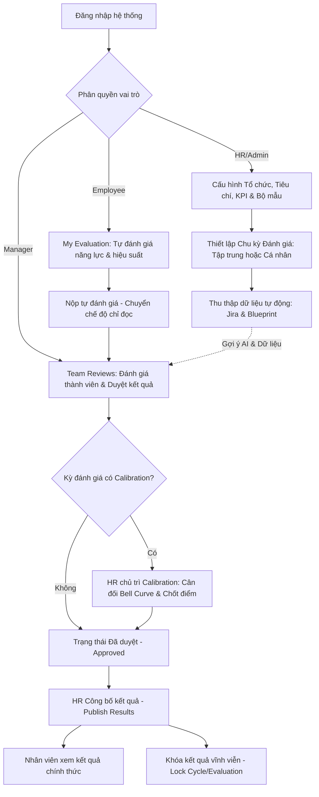
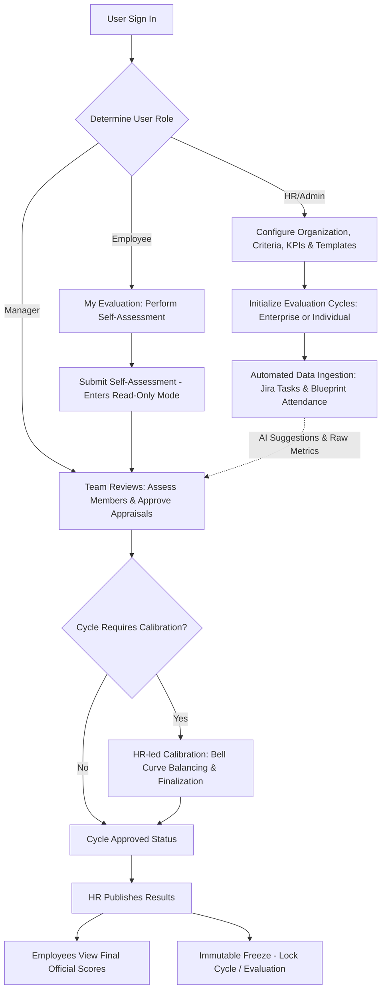

# Hệ thống Quản lý Đánh giá Hiệu suất Nhân viên
## Hướng dẫn sử dụng chi tiết

---

## 1. Giới thiệu

### 1.1 Mục đích
Tài liệu này hướng dẫn toàn diện cách sử dụng Hệ thống Quản lý Đánh giá Hiệu suất Nhân viên (Employee Performance Evaluation Management System) trên giao diện web thực tế. Nội dung mô tả chính xác những gì người dùng nhìn thấy và có thể thao tác: menu điều hướng, các nút chức năng, trường nhập liệu, quy tắc nghiệp vụ và phản hồi của hệ thống.

### 1.2 Đối tượng sử dụng
- **Employee (Nhân viên):** Thực hiện tự đánh giá năng lực và hiệu suất cá nhân (Self-assessment), theo dõi hạn đánh giá định kỳ và xem kết quả sau khi được công bố.
- **Manager (Quản lý):** Đánh giá hiệu suất nhân viên trực thuộc nhóm, nhận xét tiêu chí, phê duyệt (Approve) đánh giá, theo dõi hạn review nhóm và can thiệp ghi đè điểm KPI khi có lý do chính đáng.
- **HR_ADMIN (Quản trị Nhân sự):** Quản lý cơ cấu tổ chức, chu kỳ review, thư viện tiêu chí, KPI, bộ mẫu đánh giá, điều phối các kỳ đánh giá, chủ trì phiên hiệu chỉnh điểm (Calibration) và công bố kết quả.
- **SYSTEM_ADMIN (Quản trị Hệ thống):** Toàn quyền quản trị hệ thống, bao gồm phân quyền (IAM), kiểm tra nhật ký kiểm toán bất biến (Audit Log), cấu hình dịch vụ thu thập dữ liệu (Data Ingestion), thông báo email và dịch ngôn ngữ (I18n).

### 1.3 Cơ chế phân quyền
Hệ thống có 4 vai trò chính: `EMPLOYEE`, `MANAGER`, `HR_ADMIN`, `SYSTEM_ADMIN`. Quyền hạn được máy chủ kiểm tra nghiêm ngặt tại mọi API endpoint. Giao diện frontend tự động hiển thị các menu tương ứng với vai trò của người dùng. Nếu người dùng cố truy cập đường dẫn trái phép, hệ thống sẽ chặn và hiển thị màn hình **403 — Access Denied**.

---

## 2. Quy trình tổng thể & Vòng đời Đánh giá

### 2.1 Sơ đồ quy trình tổng quan

### 2.2 Vòng đời một kỳ đánh giá (Cycle Lifecycle)
Một kỳ đánh giá tuần tự trải qua các trạng thái:
`DRAFT` → `OPEN` → `IN_PROGRESS` → `SUBMITTED` → `REVIEWING` → `CALIBRATION` (tùy chọn) → `APPROVED` → `PUBLISHED` → `LOCKED`

### 2.3 Vòng đời một bản đánh giá cá nhân (Evaluation Lifecycle)
Mỗi bản đánh giá của từng nhân viên trải qua các trạng thái:
`DRAFT` (Bản nháp) → `IN_PROGRESS` (Đang tự đánh giá) → `SUBMITTED` (Đã nộp, chờ Manager) → `IN_REVIEW` (Manager đang đánh giá) → `CALIBRATION` (Đang hiệu chỉnh) → `APPROVED` (Đã duyệt) → `PUBLISHED` (Đã công bố) → `LOCKED` (Đã khóa bất biến).

---

## 3. Đăng nhập & Xác thực (Sign In)

### 3.1 Giao diện đăng nhập hiện đại
Hệ thống sử dụng giao diện đăng nhập doanh nghiệp (Split-screen Enterprise UI):
- **Cột trái:** Khung giới thiệu nhận diện thương hiệu hệ thống quản trị hiệu suất.
- **Cột phải:** Khung đăng nhập tập trung, hỗ trợ hai phương thức xác thực an toàn:
  1. **Đăng nhập Email & Mật khẩu:** Nhập Email công ty (`@cyberlogitec.com`) và Password, bấm **Sign in**.
  2. **Đăng nhập Google Workspace:** Bấm **Sign in with company Google account** để xác thực một chạm qua tài khoản Google công ty.

### 3.2 Các thông báo lỗi xác thực
- **Tài khoản hoặc mật khẩu không chính xác:** "Invalid email or password."
- **Chưa nhập thông tin bắt buộc:** "Email is required" / "Password is required".
- **Lỗi tài khoản Google:** "Google sign-in failed. Please ensure your account belongs to @cyberlogitec.com."

---

## 4. Cấu trúc Điều hướng Hệ thống (Sidebar Navigation)

Thanh menu điều hướng bên trái được tổ chức thành 4 nhóm nghiệp vụ chính:

| Nhóm | Menu item | Đối tượng sử dụng | Mô tả chức năng |
|---|---|---|---|
| **Overview** | **Dashboard** | Tất cả vai trò | Bảng điều khiển phân quyền theo vai trò (Employee / Manager / HR). |
| | **User Guide** | Tất cả vai trò | Xem tài liệu hướng dẫn sử dụng song ngữ (VI / EN). |
| | **Email Notifications** | Tất cả vai trò | Tùy chọn bật/tắt nhận email thông báo cá nhân. |
| **Performance** | **Employee Search** | Tất cả vai trò | Tra cứu danh bạ nhân sự, xem tóm tắt KPI và trạng thái. |
| | **Team Reviews** | Manager, HR, Admin | Xem danh sách đánh giá của nhóm, chấm điểm và duyệt kết quả. |
| | **Team Review Due** | Manager | Cảnh báo hạn đánh giá định kỳ của các thành viên trong nhóm. |
| | **My Evaluation** | Employee, Manager, Admin | Thực hiện tự đánh giá cá nhân và xem kết quả công bố. |
| **Reporting** | **Performance Reports** | Tất cả vai trò (theo scope) | Báo cáo hiệu suất hợp nhất, phổ điểm và tiến độ theo kỳ đánh giá. |
| **Configuration** | **Individual Evaluation** | Manager, HR, Admin | Khởi tạo chu kỳ đánh giá riêng lẻ cho từng nhân sự. |
| | **Organization** | HR, Admin | Quản lý Phòng ban, Nhóm, Nhân viên, Chức danh, Cấp bậc. |
| | **Evaluation Cycles** | HR, Admin | Quản lý và vận hành kỳ đánh giá tập trung toàn công ty. |
| | **Review Due** | HR, Admin | Bảng tổng hợp theo dõi hạn review của toàn bộ nhân viên. |
| | **Review Cadences** | HR, Admin | Cấu hình các loại chu kỳ đánh giá định kỳ (1, 3, 6, 12 tháng). |
| | **Calibration** | HR_ADMIN | Quản lý phiên hiệu chỉnh điểm số hội đồng theo đường cong Bell Curve. |
| | **Criteria & Rules** | HR, Admin | Thư viện tiêu chí và quy tắc chấm điểm. |
| | **KPI Library** | HR, Admin | Thư viện chỉ số KPI và sơ đồ quan hệ phụ thuộc. |
| | **Template Builder** | HR, Admin | Xây dựng bộ mẫu đánh giá, cân bằng trọng số 100%, phát hành bất biến. |
| | **Data Ingestion Hub** | HR, Admin | Trung tâm thu thập dữ liệu Jira/Blueprint, AI Evaluator, nhập CSV. |
| | **I18n Translation** | HR, Admin | Quản lý bản dịch đa ngôn ngữ cho hệ thống. |
| | **Email Templates** | HR, Admin | Quản lý các mẫu email thông báo tự động. |
| | **Email Delivery Logs** | HR, Admin | Tra cứu nhật ký gửi email hệ thống. |
| | **Identity & Access** | HR, Admin | Quản trị người dùng, vai trò và phân quyền (IAM). |
| | **Audit Log** | HR, Admin | Nhật ký kiểm toán bất biến ghi lại mọi thay đổi trọng yếu. |

---

## 5. Bảng điều khiển Tổng quan (Dashboard)

Giao diện Dashboard tự động điều chỉnh theo vai trò của người dùng đang đăng nhập:
- **Employee View:** Hiển thị thẻ tóm tắt tiến độ tự đánh giá hiện tại, cảnh báo số ngày còn lại đến hạn nộp, điểm số chính thức của các kỳ trước và biểu đồ xu hướng.
- **Manager View:** Tổng hợp tiến độ hoàn thành đánh giá của các thành viên trong nhóm, số lượng đánh giá cần duyệt (**Ready for Review**), cảnh báo nhân sự sắp đến hạn review theo chu kỳ.
- **HR/Admin View:** Thống kê toàn cảnh tỷ lệ hoàn thành đánh giá trên toàn công ty, trạng thái các kỳ đánh giá đang mở, phân bổ điểm trung bình giữa các phòng ban.

---

## 6. Đánh giá của tôi (My Evaluation) — Dành cho Employee

### 6.1 Tổng quan màn hình
- **Thẻ Kỳ đánh giá hiện tại:** Tên kỳ, thời gian bắt đầu/kết thúc, badge trạng thái, thanh tiến độ số lượng tiêu chí đã hoàn thành và nút thao tác chính.
- **Lịch sử các kỳ đánh giá:** Bảng tổng hợp các kỳ trước gồm tên kỳ, khoảng thời gian, trạng thái và điểm chính thức (**Final Score**).

### 6.2 Các bước thực hiện tự đánh giá
1. Bấm **Bắt đầu tự đánh giá** (nếu mới mở) hoặc **Tiếp tục đánh giá** (nếu đã lưu dở).
2. Với từng tiêu chí:
   - Chọn mức độ tự đánh giá (Rating Level) từ thang điểm được định nghĩa.
   - Nhập **Ý kiến / Dẫn chứng tự đánh giá** (Self-assessment Comments): trình bày kết quả đạt được, dữ liệu thực tế chứng minh cho mức điểm đã chọn.
3. Bấm **Lưu mục này** để lưu từng tiêu chí, hoặc bấm **Lưu nháp (Draft)** ở cuối trang để lưu toàn bộ phiếu đánh giá.
4. Khi đã hoàn thành tất cả tiêu chí bắt buộc, bấm **Nộp tự đánh giá**.
5. Hộp thoại xác nhận sẽ xuất hiện:
   - Nếu còn tiêu chí bị bỏ sót: Hệ thống liệt kê chi tiết các tiêu chí chưa hoàn thành và chặn không cho nộp.
   - Nếu đã đầy đủ: Cảnh báo *"Nộp tự đánh giá là bước workflow chính thức. Sau khi nộp, phiếu sẽ chuyển sang trạng thái Chờ Quản lý (Submitted) và chuyển sang chế độ Chỉ đọc."*
   - Bấm **Xác nhận nộp** để hoàn tất.

### 6.3 Xem kết quả đã công bố (Published Final Score)
Khi kỳ đánh giá được Quản lý duyệt và HR công bố kết quả:
- Phiếu chuyển sang trạng thái **Published**.
- Hiển thị bảng tổng hợp so sánh: **Điểm Tự Đánh Giá (Self Score)**, **Điểm Quản Lý Đánh Giá (Manager Score)** và **Điểm Chính Thức (Final Score)** kèm nhận xét chi tiết của cấp trên.

---

## 7. Đánh giá Nhóm (Team Reviews) — Dành cho Manager

### 7.1 Danh sách đánh giá nhóm
Trang hiển thị danh sách nhân viên trực thuộc nhóm do bạn quản lý:
- Bộ lọc theo trạng thái: **All Statuses**, **Ready for Review** (Đã nộp, sẵn sàng chấm), **In Progress** (Nhân viên đang tự đánh giá), **Approved** (Đã duyệt).
- Nhấp vào thẻ nhân viên có badge **Ready for Review** để mở giao diện chấm điểm.

### 7.2 Thao tác chấm điểm & Duyệt
1. Xem thông tin tự đánh giá và dẫn chứng của nhân viên ở cột bên trái.
2. Với từng tiêu chí ở cột Quản lý:
   - Chọn mức đánh giá của Quản lý (**Manager Rating**).
   - Nhập nhận xét đánh giá (**Manager Comments**).
3. Bấm **Lưu thay đổi (Draft)** để lưu tạm thời tiến độ.
4. Bấm **Duyệt đánh giá (Approve)** khi đã hoàn tất mọi tiêu chí. Hộp thoại xác nhận yêu cầu quản lý cam kết tính khách quan trước khi chốt kết quả chuyển lên cấp HR.

### 7.3 Ghi đè điểm cấp độ KPI (KPI-Level Manual Override)
Khi phát hiện điểm số tính toán tự động chưa phản ánh đúng tình hình thực tế:
- Quản lý/HR bấm nút **Override Score** trên tiêu chí KPI tương ứng.
- Nhập **Điểm mới (New Score: 0 - 100)**.
- Bắt buộc nhập **Lý do giải trình (Rationale)** và **Bằng chứng đính kèm (Evidence)**.
- Thao tác này được hệ thống ghi nhận nguyên tử vào **Audit Log** để phục vụ kiểm toán nội bộ.

---

## 8. Tra cứu Nhân sự (Employee Search & Directory)

- Cho phép tìm kiếm nhanh nhân sự theo Họ tên, Mã nhân viên (`Employee Code`), Phòng ban hoặc Chức danh.
- Hiển thị thẻ tóm tắt nhân sự: hình đại diện, email công ty, phòng ban, nhóm làm việc, chức vụ, chu kỳ đánh giá định kỳ (`Review Cadence`), và điểm số đánh giá kỳ gần nhất.

---

## 9. Theo dõi Hạn Đánh giá & Chu kỳ Review (Review Due & Cadences)

### 9.1 Cơ chế Chu kỳ Review định kỳ (Review Cadence)
Hệ thống hỗ trợ 4 chu kỳ đánh giá cá nhân hóa:
- **Monthly (1 tháng):** Phù hợp nhân viên thử việc hoặc dự án ngắn hạn.
- **Quarterly (3 tháng):** Đánh giá định kỳ hàng quý.
- **Biannually / Semi-annual (6 tháng):** Đánh giá nửa năm.
- **Annually (12 tháng):** Đánh giá thường niên.

### 9.2 Tính toán ngày đến hạn tự động (Next Review Date)
- Hệ thống tự động tính ngày review tiếp theo:  
  > 💡 **Công thức:** `Next Review Date` = Ngày hoàn tất đánh giá gần nhất + Chu kỳ review (tháng)
- Trên bảng theo dõi **Review Due**, hệ thống hiển thị badge trạng thái trực quan:
  - 🔴 **Overdue (Quá hạn):** Đã vượt quá ngày đến hạn mà chưa hoàn tất đánh giá.
  - 🟡 **Due in Nd / Due today (Sắp đến hạn):** Còn dưới 7 ngày hoặc đến hạn hôm nay.
  - 🟢 **Nd left (Còn hạn):** Chưa đến hạn review.
  - ⚪ **No schedule:** Nhân viên chưa được gán chu kỳ review.

---

## 10. Báo cáo Hiệu suất Hợp nhất (Unified Performance Reports)

- **Bộ chọn Kỳ Đánh giá Nhất quán (CycleSelector):** Cho phép người dùng chuyển đổi nhanh giữa các kỳ đánh giá trên toàn bộ các biểu đồ phân tích.
- **Biểu đồ Phân bổ Điểm số:** Trực quan hóa tỷ lệ nhân viên đạt các mức xếp loại (Xuất sắc, Tốt, Đạt, Cần cải thiện).
- **So sánh Phòng ban:** Biểu đồ so sánh điểm trung bình và tiến độ hoàn thành giữa các bộ phận trong doanh nghiệp.

---

## 11. Chu kỳ Đánh giá Cá nhân (Individual Evaluation Creation)

- Cho phép Quản lý và HR khởi tạo kỳ đánh giá linh hoạt cho **một nhân sự duy nhất** mà không cần mở kỳ đánh giá chung cho toàn công ty.
- Thường áp dụng cho: Kết thúc thời gian thử việc (Probationary Review), xét tăng lương đột xuất, hoặc chuyển đổi vị trí công tác.
- Giao diện hỗ trợ đầy đủ đa ngôn ngữ, chế độ giao diện sáng/tối và tương thích thiết bị di động.

---

## 12. Chu kỳ Đánh giá Doanh nghiệp (Evaluation Cycles)

### 12.1 Khởi tạo Kỳ đánh giá mới
1. Vào menu **Evaluation Cycles** → bấm **+ Create New**.
2. Nhập **Cycle Code** (ví dụ: `2026-Q3-ENGINEERING`) và **Cycle Name**.
3. Chọn **Published Template Version** (bộ mẫu đã được phát hành chính thức).
4. Tùy chọn **Enable calibration**: Bật nếu kỳ đánh giá cần bước hội đồng hiệu chỉnh điểm.
5. Cấu hình **Start Date**, **End Date**, và **Grace Period (days)** (số ngày gia hạn nộp trễ).
6. Chọn phạm vi áp dụng (**Applicable Scope**): Toàn công ty, theo Phòng ban, Nhóm, Chức danh, hoặc chọn danh sách nhân viên cụ thể.
7. Bấm **Save Draft**.

### 12.2 Điều phối trạng thái Kỳ đánh giá
Trên trang chi tiết kỳ đánh giá, người quản trị thực hiện các lệnh chuyển trạng thái tuần tự:
- `DRAFT` → bấm **Open Cycle** để mở cho nhân viên tự đánh giá.
- `OPEN` → bấm **Start In Progress** khi bắt đầu thu thập dữ liệu.
- `IN_PROGRESS` → bấm **Submit All Evaluations** khi hết hạn tự đánh giá.
- `SUBMITTED` → bấm **Start Reviewing** để chuyển sang giai đoạn Quản lý chấm điểm.
- `REVIEWING` → bấm **Move to Calibration** (nếu có) hoặc **Approve Cycle**.
- `APPROVED` → bấm **Publish Results** để công bố kết quả cho toàn bộ nhân viên.
- **Khóa kỳ đánh giá (Lock Cycle):** Bấm **Lock Cycle** để đóng băng vĩnh viễn kỳ đánh giá. Toàn bộ dữ liệu điểm số trở thành bất biến và chỉ đọc (Read-only).

---

## 13. Phiên họp Hiệu chỉnh Điểm số (Calibration Session)

*Tính năng dành riêng cho HR_ADMIN và Hội đồng Đánh giá.*

- **Biểu đồ Phân bổ Chuẩn (Bell Curve Distribution):** Hiển thị trực quan tỷ lệ phân bổ điểm số của nhân viên so với hạn mức tỷ lệ mục tiêu (ví dụ: Xuất sắc ≤ 10%, Tốt ≤ 30%, Đạt 50%, Cần cải thiện 10%).
- **Điều chỉnh điểm hàng loạt (Bulk Adjustments):** Hội đồng có thể tăng/giảm điểm của từng cá nhân hoặc nhóm nhân sự để đảm bảo sự công bằng giữa các phòng ban.
- **Chốt phiên (Finalize Session):** Khi đạt được sự đồng thuận, HR bấm **Finalize Calibration Session** để tự động cập nhật điểm chính thức vào phiếu đánh giá của nhân viên.
- **Kiểm soát đồng thời (Concurrency Security):** Hệ thống khóa phiên khi đang chốt điểm để ngăn chặn việc nhiều thành viên cùng chỉnh sửa gây sai lệch kết quả.

---

## 14. Tổ chức & Kiến trúc Công việc (Organization)

### 14.1 Tab Org Structure (Cơ cấu Tổ chức)
- **Phòng ban (Departments):** Tạo mới và quản lý mã phòng ban, tên phòng ban và trạng thái hoạt động.
- **Nhóm (Teams):** Quản lý mã nhóm, tên nhóm, phòng ban trực thuộc. Khi Deactivate một nhóm, hệ thống kiểm tra và cảnh báo nếu nhóm vẫn còn nhân viên hoạt động.
- **Nhân viên (Employees):** Quản lý danh sách nhân sự, thông tin liên hệ, phòng ban, nhóm, chức vụ, cấp bậc, trạng thái việc làm (`ACTIVE`, `INACTIVE`, `ON_LEAVE`, `TERMINATED`) và cấu hình **Review Cadence**.

### 14.2 Tab Job Architecture (Kiến trúc Công việc)
- **Job Roles (Chức danh):** Định nghĩa danh mục chức danh công việc (ví dụ: Software Engineer, QA Specialist, Product Owner).
- **Job Levels (Cấp bậc):** Định nghĩa khung cấp bậc năng lực (ví dụ: Junior, Middle, Senior, Lead, Principal).

---

## 15. Thư viện Tiêu chí & Quy tắc (Criteria & Rules)

- Quản lý các tiêu chí đánh giá đơn lẻ, phân loại theo 4 nhóm danh mục chính:
  1. **Performance (Hiệu suất công việc):** Năng suất bàn giao, chất lượng code, độ đúng hạn.
  2. **Capability (Năng lực chuyên môn):** Kỹ năng kỹ thuật, tư duy thiết kế hệ thống, giải quyết vấn đề.
  3. **Contribution (Đóng góp tổ chức):** Đào tạo kèm cặp (mentoring), chia sẻ tri thức, cải tiến quy trình.
  4. **Behavior (Thái độ & Kỷ luật):** Tinh thần đồng đội, tuân thủ nội quy lao động, tính chuyên cần.
- Mỗi tiêu chí quản lý mã tiêu chí (`Criterion Code`), tên hiển thị, mô tả hướng dẫn và lịch sử phiên bản (`v1`, `v2`...).

---

## 16. Thư viện KPI & Bản đồ Phụ thuộc (KPI Library)

- Quản lý các chỉ số KPI cấp cao, gộp nhiều tiêu chí thành phần.
- **Tab KPI Library:** Thêm/sửa/xóa chỉ số KPI và liên kết các tiêu chí tương ứng vào từng thẻ KPI.
- **Tab Dependency Map:** Thiết lập quan hệ phụ thuộc giữa các chỉ số KPI để phục vụ thuật toán tính điểm tổng hợp.

---

## 17. Bộ Mẫu Đánh giá (Template Builder)

- **Cấu hình Trọng số 2 Cấp (2-Level Weighting Pipeline):**
  - Cấp 1: Phân bổ tỷ trọng phần trăm giữa các nhóm KPI.
  - Cấp 2: Phân bổ tỷ trọng phần trăm giữa các tiêu chí thành phần trong từng KPI.
- **Thanh trạng thái Trọng số (Weight Status Bar):** Tự động kiểm tra và hiển thị tổng trọng số. Hệ thống yêu cầu tổng trọng số phải đạt chính xác **100%** mới cho phép phát hành.
- **Validate Template:** Kiểm tra tính hợp lệ về logic, cấu trúc và ràng buộc trước khi lưu.
- **Tính Bất biến khi Phát hành (Published Immutability):** Bộ mẫu đã **Publish** sẽ bị khóa cứng vĩnh viễn để bảo vệ tính nhất quán cho các kỳ đánh giá đang sử dụng. Muốn chỉnh sửa, người dùng phải bấm **Create New Draft Version** để tạo phiên bản nháp tiếp theo.
- **Version Diff & Conflict Resolution:** So sánh sự khác biệt giữa hai phiên bản bộ mẫu và hỗ trợ giải quyết xung đột khi có nhiều quản trị viên cùng thao tác.

---

## 18. Trung tâm Thu thập Dữ liệu & Nhập liệu (Data Ingestion Hub)

### 18.1 Tự động thu thập dữ liệu Jira & Blueprint
- **Jira Tasks Crawler:** Tự động đồng bộ các task đã làm (`completedTasks`) và đang làm (`inProgressTasks`), số giờ log work, lỗi phát sinh (`bugs`). Cơ chế phân giải đa tài khoản tự động nhận diện đúng nhân sự qua mã nhân viên, username hoặc email prefix.
- **Blueprint Attendance Crawler:** Tự động đồng bộ dữ liệu chấm công hàng ngày, giờ vào/ra, số ngày đi trễ và ngày nghỉ phép.
- **Snapshot Caching theo Tháng (`collector_monthly_snapshot`):** Tự động lưu cache dữ liệu chấm công theo tháng, giúp tải nhanh chóng và tránh gửi request trùng lặp lên máy chủ nguồn.

### 18.2 Động cơ Chấm điểm AI (Gemini AI Evaluator)
- Tự động phân tích đóng góp công việc và gợi ý điểm số theo 3 chế độ nghiêm ngặt:
  - **Mức 1 — Dễ (Easy):** Chấm nhanh, ưu tiên động viên khuyến khích.
  - **Mức 2 — Vừa (Medium):** Tiêu chuẩn Tech Lead, cân đối giữa tiến độ và chất lượng.
  - **Mức 3 — Khó (Hard):** Tiêu chuẩn Solution Architect khắt khe, chỉ các task kiến trúc hoặc độ phức tạp cao mới đạt điểm tối đa; phạt nặng task bàn giao trễ hạn.

### 18.3 Nguyên tắc Tính điểm Vi phạm & Trần Vi phạm (Infraction Ceiling)
- Xuất phát điểm ban đầu: 100 điểm.
- Tự động trừ điểm kỷ luật: Đi trễ trừ điểm theo mức độ nghiêm ngặt, trừ điểm critical bugs và trễ deadline.
- **Trần vi phạm (Infraction Ceiling):** Nếu nhân viên có vi phạm kỷ luật (đi trễ, nghỉ không phép), điểm chuyên cần tối đa chỉ đạt mức 9.0/10 (Mức 4 - Tốt). **Nhân viên có vi phạm kỷ luật không bao giờ được phép đạt Mức 5 (Xuất sắc) dù điểm công việc có cao đến đâu.**

### 18.4 Trung tâm Nhập liệu CSV (CSV Import Center)
- **Tải tệp mẫu (Download CSV Template):** Tải cấu trúc cột chuẩn tương thích với phiên bản hiện hành.
- **Kiểm tra trước dữ liệu (Validation Preview):** Tải file lên để hệ thống rà soát lỗi từng dòng (hiển thị rõ số dòng, cột lỗi và thông báo chi tiết).
- **Chế độ nhập liệu:**
  - **Partial Import (Khuyên dùng):** Nhập các dòng hợp lệ, bỏ qua các dòng lỗi để sửa sau.
  - **Strict Mode:** Toàn bộ file phải hợp lệ 100%; nếu có bất kỳ dòng nào sai, hệ thống từ chối toàn bộ đợt nhập.
- **Lịch sử nhập liệu (Import History):** Tra cứu nhật ký các lần tải file, số dòng thành công, số dòng lỗi và chi tiết từng bản ghi.

---

## 19. Bản dịch Đa ngôn ngữ (I18n Translation)

- Cung cấp giao diện quản trị bản dịch cho dữ liệu danh mục (Master Data) và các nhãn hiển thị trên giao diện (UI Strings).
- Hỗ trợ hai ngôn ngữ cơ sở chính: **Tiếng Anh (en - Baseline)** và **Tiếng Việt (vi)**.
- Cho phép tra cứu nhanh bản dịch qua ô Global Search hoặc lọc theo phân loại đối tượng (`Department`, `Job Role`, `KPI`, `Criterion`).

---

## 20. Hệ thống Thông báo Email (Email Notifications)

- **Tùy chọn nhận Email (Notification Preferences):** Người dùng có thể chủ động bật/tắt nhận email cho từng nhóm sự kiện: Nhắc kỳ đánh giá mới, Cảnh báo sắp đến hạn review, Thông báo khi kết quả được công bố.
- **Quản lý Mẫu Email (Email Templates):** Dành cho HR/Admin tùy biến tiêu đề và nội dung email thông báo gửi tự động qua hệ thống mã biến mẫu (Template Variables).
- **Nhật ký Gửi Email (Delivery Logs):** Tra cứu lịch sử gửi email, trạng thái thành công/thất bại và nội dung phản hồi từ máy chủ SMTP/Resend/Gmail API.

---

## 21. Quản lý Định danh & Quyền truy cập (IAM)

- **Quản lý Người dùng (Users):** Danh sách tài khoản, thêm người dùng mới, kích hoạt / vô hiệu hóa tài khoản, gán vai trò.
- **Quản lý Vai trò (Roles):** Xem danh sách vai trò hệ thống (`EMPLOYEE`, `MANAGER`, `HR_ADMIN`, `SYSTEM_ADMIN`).
- **Ma trận Quyền hạn (Permissions Matrix):** Bảng phân quyền chi tiết cho phép xem các quyền hạn thao tác (Read, Write, Delete, Approve, Publish, Lock) gắn với từng vai trò.

---

## 22. Nhật ký Kiểm toán Bất biến (Audit Log)

- Mọi thao tác làm thay đổi dữ liệu quan trọng đều được ghi nhận tự động vào bảng nhật ký kiểm toán dạng **chỉ thêm mới (Append-only)**.
- Giao diện cho phép lọc theo:
  - **Entity ID:** Mã định danh của đối tượng bị thay đổi.
  - **Entity Type:** Loại đối tượng (`EMPLOYEE`, `TEAM`, `KPI`, `EVALUATION`, `CYCLE`).
  - **Action:** Hành động thực hiện (`CREATE`, `UPDATE`, `DELETE`, `OVERRIDE`, `PUBLISH`, `LOCK`).
- Chi tiết hiển thị rõ: Người thực hiện (`Performed By`), Thời gian chính xác (`Timestamp`), Giá trị cũ → Giá trị mới (`Old Value` → `New Value`) và Lý do giải trình (`Reason`).

---

## 23. Cơ chế Khóa & Dữ liệu Chỉ đọc (Locked / Read-Only Guarantees)

Hệ thống bảo vệ dữ liệu đánh giá thông qua 3 cấp độ khóa nghiêm ngặt:
1. **Kỳ đánh giá đã khóa (Cycle LOCKED):** Biểu ngữ đen *"Cycle Status: LOCKED"* xuất hiện. Toàn bộ thông tin cấu hình, điểm số và các phiếu đánh giá bên trong kỳ này bị đóng băng vĩnh viễn.
2. **Phiếu đánh giá ở chế độ chỉ đọc (Read-Only):**
   - Khi nhân viên đã nộp: Chuyển sang chỉ đọc chờ quản lý chấm điểm.
   - Khi quản lý đã duyệt: Chuyển sang chỉ đọc chờ HR hiệu chỉnh/công bố.
   - Khi đã công bố hoặc khóa: Toàn bộ điểm số và nhận xét là cố định, không thể chỉnh sửa.
3. **Bộ mẫu đánh giá đã phát hành (Published Template):** Biểu ngữ *"🔒 Published Version is Immutable"* cảnh báo cấu hình đã bị khóa cứng để bảo vệ tính toàn vẹn dữ liệu.

---

## 24. Bảng Tra cứu Trạng thái Toàn Hệ thống

### Trạng thái Kỳ đánh giá (Cycle Status)
| Trạng thái | Ý nghĩa nghiệp vụ |
|---|---|
| `DRAFT` | Kỳ đánh giá đang được khởi tạo cấu hình, chưa mở cho người dùng. |
| `OPEN` | Đã mở kỳ đánh giá, sẵn sàng bắt đầu tiến trình. |
| `IN_PROGRESS` | Đang trong giai đoạn thu thập dữ liệu và nhân viên thực hiện tự đánh giá. |
| `SUBMITTED` | Đã hết hạn tự đánh giá, toàn bộ phiếu nộp về hệ thống. |
| `REVIEWING` | Quản lý đang thực hiện chấm điểm và nhận xét cho thành viên nhóm. |
| `CALIBRATION` | Hội đồng đánh giá đang họp hiệu chỉnh điểm số theo phân bổ Bell Curve. |
| `APPROVED` | Quá trình chấm điểm và hiệu chỉnh đã được phê duyệt chính thức. |
| `PUBLISHED` | Kết quả đánh giá đã được công bố cho toàn bộ nhân viên xem. |
| `LOCKED` | Kỳ đánh giá đã bị khóa vĩnh viễn, toàn bộ dữ liệu chỉ đọc. |

### Trạng thái Phiếu Đánh giá Cá nhân (Evaluation Status)
| Trạng thái | Ý nghĩa nghiệp vụ |
|---|---|
| `DRAFT` | Phiếu mới tạo, chưa bắt đầu tự đánh giá. |
| `IN_PROGRESS` | Nhân viên đang thực hiện tự đánh giá năng lực. |
| `SUBMITTED` | Nhân viên đã nộp bản tự đánh giá, đang chờ Quản lý xử lý. |
| `IN_REVIEW` | Quản lý đang thực hiện đánh giá và ghi nhận xét. |
| `CALIBRATION` | Đang trong phiên họp hiệu chỉnh điểm số của hội đồng. |
| `APPROVED` | Quản lý và hội đồng đã phê duyệt kết quả đánh giá. |
| `PUBLISHED` | Kết quả chính thức đã công bố, nhân viên xem được điểm cuối cùng. |
| `LOCKED` | Phiếu đánh giá đã bị đóng băng vĩnh viễn. |

---

## 25. Ma trận Phân quyền Nghiệp vụ (RBAC Matrix)

| Chức năng hệ thống | Employee | Manager | HR_ADMIN | SYSTEM_ADMIN |
|---|:---:|:---:|:---:|:---:|
| **Xem Dashboard phân quyền** | ✓ | ✓ | ✓ | ✓ |
| **Xem tài liệu hướng dẫn (User Guide)** | ✓ | ✓ | ✓ | ✓ |
| **Tự đánh giá cá nhân (My Evaluation)** | ✓ | ✓ | — | ✓ |
| **Đánh giá & Duyệt nhóm (Team Reviews)** | — | ✓ | ✓ | ✓ |
| **Theo dõi hạn review nhóm (Team Review Due)** | — | ✓ | — | — |
| **Ghi đè điểm có giải trình (Score Override)** | — | ✓ (nhóm) | ✓ (toàn quyền) | ✓ (toàn quyền) |
| **Xem Báo cáo Hiệu suất (Performance Reports)** | Cá nhân | Nhóm | Toàn công ty | Toàn công ty |
| **Tạo kỳ đánh giá cá nhân (Individual Cycle)** | — | ✓ (nhóm) | ✓ | ✓ |
| **Quản lý Kỳ đánh giá Doanh nghiệp (Cycles)** | — | — | ✓ | ✓ |
| **Chủ trì phiên hiệu chỉnh (Calibration)** | — | — | ✓ | — |
| **Quản lý Tổ chức (Organization)** | — | — | ✓ | ✓ |
| **Quản lý Tiêu chí & KPI (Criteria & KPIs)** | — | — | ✓ | ✓ |
| **Thiết kế Bộ mẫu đánh giá (Template Builder)** | — | — | ✓ | ✓ |
| **Trung tâm Data Ingestion & Nhập CSV** | — | — | ✓ | ✓ |
| **Quản lý Bản dịch (I18n Translation)** | — | — | ✓ | ✓ |
| **Quản lý Email Templates & Delivery Logs** | — | — | ✓ | ✓ |
| **Quản lý Người dùng & Phân quyền (IAM)** | — | — | — | ✓ |
| **Xem Nhật ký Kiểm toán (Audit Log)** | — | — | ✓ | ✓ |

---

## 26. Xử lý Sự cố & Câu hỏi Thường gặp (Troubleshooting & FAQ)

### Q1: Tại sao tôi không thể bấm nút "Nộp tự đánh giá"?
- **Nguyên nhân:** Phiếu đánh giá của bạn còn tiêu chí bắt buộc chưa chọn mức điểm. Hãy kiểm tra thanh tiến độ và thông báo danh sách tiêu chí còn thiếu trong hộp thoại cảnh báo.

### Q2: Tại sao tôi không thể chỉnh sửa điểm sau khi đã nộp?
- **Giải thích:** Nộp tự đánh giá là thao tác workflow chính thức nhằm chuyển giao phiếu cho Quản lý chấm điểm. Để đảm bảo tính khách quan, phiếu tự động chuyển sang chế độ Chỉ đọc (Read-only). Nếu có sai sót nghiêm trọng, hãy báo với Quản lý trực tiếp để được hỗ trợ qua bước chấm điểm của Quản lý.

### Q3: Vì sao nhân viên có điểm task cao nhưng không đạt Mức 5 (Xuất sắc)?
- **Giải thích:** Hệ thống áp dụng **Quy chuẩn Trần Vi phạm (Infraction Ceiling)**. Nếu nhân viên có ngày đi trễ (late days > 0) hoặc vi phạm kỷ luật, điểm chuyên cần bị khống chế tối đa 9.0/10 (Mức 4 - Tốt) và không thể xếp loại Xuất sắc toàn diện.

### Q4: Tôi không thấy các menu Cấu hình (Configuration) trên thanh điều hướng?
- **Giải thích:** Nhóm menu Cấu hình chỉ dành cho tài khoản có vai trò `HR_ADMIN` hoặc `SYSTEM_ADMIN`. Tài khoản `EMPLOYEE` chỉ thấy các menu liên quan trực tiếp đến công việc của mình.

### Q5: Khi tải file CSV nhập điểm báo lỗi thì phải xử lý thế nào?
- **Khắc phục:** Xem bảng **Row Validation Errors**, đối chiếu số dòng (`Row`) và tên cột (`Field`) bị báo lỗi. Sửa lại tệp CSV đúng định dạng dữ liệu mẫu và tiến hành tải lên lại bằng chế độ **Partial Import**.

---

<!-- LANGUAGE_SPLIT -->

# Employee Performance Evaluation Management System
## Detailed User Guide

---

## 1. Introduction

### 1.1 Purpose
This document provides a comprehensive operational guide for the Employee Performance Evaluation Management System based on its live web application interface. It accurately details all visual components and interactions available to users: navigation menus, action buttons, input fields, business rules, and system responses.

### 1.2 Target Audience
- **Employee:** Conducts self-assessments, tracks periodic review schedules, and reviews published official evaluation results.
- **Manager:** Evaluates team members' performance, writes qualitative feedback, approves appraisals, monitors review deadlines, and performs score overrides when justified.
- **HR_ADMIN (Human Resources Admin):** Manages organizational structures, evaluation cycles, review cadences, criteria, KPI libraries, evaluation templates, conducts calibration sessions, and publishes results.
- **SYSTEM_ADMIN (System Administrator):** Holds complete system governance, including identity and access management (IAM), append-only audit log inspection, data ingestion crawlers, email notifications, and internationalization (I18n).

### 1.3 Role-Based Access Control
The application defines 4 primary roles: `EMPLOYEE`, `MANAGER`, `HR_ADMIN`, and `SYSTEM_ADMIN`. Access rights are strictly enforced by the backend on every API request. The frontend UI dynamically renders available menu items according to the authenticated user's role. Attempting to access an unauthorized path displays the **403 — Access Denied** error page.

---

## 2. End-to-End Workflow & Evaluation Lifecycle

### 2.1 Process Flowchart

### 2.2 Evaluation Cycle Lifecycle
An evaluation cycle sequentially transitions through the following statuses:  
`DRAFT` → `OPEN` → `IN_PROGRESS` → `SUBMITTED` → `REVIEWING` → `CALIBRATION` (optional) → `APPROVED` → `PUBLISHED` → `LOCKED`

### 2.3 Individual Evaluation Lifecycle
Each employee's appraisal record advances through:  
`DRAFT` → `IN_PROGRESS` (Self-Assessment) → `SUBMITTED` (Pending Manager Review) → `IN_REVIEW` (Manager Assessing) → `CALIBRATION` (Session Ongoing) → `APPROVED` (Manager/HR Approved) → `PUBLISHED` (Official Score Public) → `LOCKED` (Immutable Read-Only).

---

## 3. Sign In & Authentication

### 3.1 Modern Enterprise Login Interface
The login screen features an enterprise split-screen layout:
- **Left Panel:** Atmospheric branding section introducing the enterprise performance platform.
- **Right Panel:** Centered authentication card offering two secure methods:
  1. **Corporate Email & Password:** Enter your company email (`@cyberlogitec.com`) and password, then click **Sign in**.
  2. **Google Workspace Single Sign-On:** Click **Sign in with company Google account** to authenticate via your corporate Google profile.

### 3.2 Authentication Error Feedback
- **Invalid credentials:** "Invalid email or password."
- **Missing inputs:** "Email is required" / "Password is required".
- **Google auth failure:** "Google sign-in failed. Please ensure your account belongs to @cyberlogitec.com."

---

## 4. System Navigation (Sidebar Navigation)

The left sidebar navigation is organized into 4 functional groups:

| Group | Nav Item | Accessible Roles | Description |
|---|---|---|---|
| **Overview** | **Dashboard** | All Roles | Role-customized dashboard overview. |
| | **User Guide** | All Roles | Access this comprehensive bilingual documentation. |
| | **Email Notifications** | All Roles | Manage personal email alert preferences. |
| **Performance** | **Employee Search** | All Roles | Search corporate staff directory, view KPI summaries and statuses. |
| | **Team Reviews** | Manager, HR, Admin | Review, score, and approve team members' appraisals. |
| | **Team Review Due** | Manager | Monitor upcoming and overdue review deadlines for managed staff. |
| | **My Evaluation** | Employee, Manager, Admin | Conduct personal self-appraisal and view published results. |
| **Reporting** | **Performance Reports** | All Roles (scoped) | Unified performance reports, score distributions, and cycle trends. |
| **Configuration** | **Individual Evaluation** | Manager, HR, Admin | Initiate flexible, tailored evaluation cycles for individual employees. |
| | **Organization** | HR, Admin | Manage departments, teams, employees, job roles, and job levels. |
| | **Evaluation Cycles** | HR, Admin | Configure and coordinate company-wide evaluation cycles. |
| | **Review Due** | HR, Admin | Global scheduling dashboard tracking all upcoming review cadences. |
| | **Review Cadences** | HR, Admin | Define review intervals (1, 3, 6, 12 months) and due date formulas. |
| | **Calibration** | HR_ADMIN | Conduct committee score calibration sessions using Bell Curve models. |
| | **Criteria & Rules** | HR, Admin | Maintain criterion library and scoring rule definitions. |
| | **KPI Library** | HR, Admin | Manage high-level KPI indicators and dependency maps. |
| | **Template Builder** | HR, Admin | Build evaluation rubrics, balance 100% weights, and publish versions. |
| | **Data Ingestion Hub** | HR, Admin | Automated Jira & Blueprint crawlers, AI Evaluator, and CSV import. |
| | **I18n Translation** | HR, Admin | Master data and UI string multilingual translation management. |
| | **Email Templates** | HR, Admin | Configure automated notification email templates. |
| | **Email Delivery Logs** | HR, Admin | Audit system email dispatch history and delivery status. |
| | **Identity & Access** | HR, Admin | Manage user accounts, role definitions, and permission matrices. |
| | **Audit Log** | HR, Admin | Append-only audit trail recording all critical system mutations. |

---

## 5. Role-Based Dashboard

The dashboard dynamically adjusts based on the authenticated user's role:
- **Employee View:** Displays current evaluation progress, days remaining until deadline, historical official scores, and personal trend charts.
- **Manager View:** Summarizes team completion rates, count of appraisals awaiting review (**Ready for Review**), and review cadence due date alerts for team members.
- **HR/Admin View:** Company-wide completion rates, active cycle health, and department-level score distributions.

---

## 6. My Evaluation — For Employees

### 6.1 Screen Overview
- **Active Cycle Card:** Displays cycle name, period, status badge, criteria completion progress bar, deadline countdown, and primary action button.
- **Evaluation History:** Table summarizing past cycles, periods, statuses, and official **Final Scores**.

### 6.2 Self-Assessment Step-by-Step
1. Click **Start Self-Assessment** (new) or **Continue Evaluation** (in-progress).
2. For each assigned criterion:
   - Select your self-rating level (**Rating Level**).
   - Enter **Self-assessment Comments / Evidence**: Describe accomplishments, deliverables, and factual rationale supporting your chosen rating.
3. Click **Save this item** to save individually, or click **Save Draft** at the bottom to preserve all changes without submitting.
4. Once all mandatory criteria are complete, click **Submit Self-Assessment**.
5. Confirmation Dialog:
   - If mandatory criteria remain incomplete: The system lists missing items and blocks submission.
   - If complete: A warning states *"Submitting your evaluation is a formal workflow action. Your appraisal will transition to Submitted (Pending Manager Review) and enter Read-Only mode."*
   - Click **Confirm Submission** to finalize.

### 6.3 Viewing Published Results
Once approved by your manager and published by HR:
- The appraisal status updates to **Published**.
- A summary breakdown compares: **Self Score**, **Manager Score**, and **Official Final Score** alongside managerial comments.

---

## 7. Team Reviews — For Managers

### 7.1 Team Appraisal List
Displays employees assigned to teams under your supervisory scope:
- Filter by status: **All Statuses**, **Ready for Review**, **In Progress**, **Approved**.
- Click an employee card marked **Ready for Review** to open the scoring interface.

### 7.2 Scoring & Approval Workflow
1. Review the employee's self-ratings and submitted evidence on the left panel.
2. In the Manager section for each criterion:
   - Select your **Manager Rating**.
   - Provide qualitative **Manager Comments**.
3. Click **Save Changes (Draft)** to save partial progress.
4. Click **Approve Evaluation** once all criteria are evaluated. The confirmation dialog requires confirming objective review before submitting results to HR.

### 7.3 KPI-Level Manual Override
When automated scores do not fully capture actual circumstances:
- Click **Override Score** on the target KPI.
- Enter the **New Score (0 - 100)**.
- **Mandatory fields:** Provide both **Rationale** and **Evidence**.
- Overrides are atomically recorded in the **Audit Log** for governance compliance.

---

## 8. Employee Search & Directory

- Quickly search staff by Full Name, Employee Code, Department, or Job Role.
- Displays employee cards with profile photos, corporate email, team, position, review cadence, and recent performance score summary.

---

## 9. Review Due & Review Cadences

### 9.1 Review Cadence Model
The system supports 4 individualized review cadences:
- **Monthly (1 month):** For probationary periods or short-term milestone tracking.
- **Quarterly (3 months):** Standard quarterly evaluations.
- **Biannually / Semi-annual (6 months):** Mid-year reviews.
- **Annually (12 months):** Annual appraisals.

### 9.2 Automated Next Review Date Calculation
- The system calculates due dates automatically:  
  > 💡 **Formula:** `Next Review Date` = Last Completed Evaluation Date + Cadence Duration (Months)
- The **Review Due** dashboard displays visual alert badges:
  - 🔴 **Overdue:** Past scheduled review due date.
  - 🟡 **Due in Nd / Due today:** Due within 7 days or today.
  - 🟢 **Nd left:** Active review window open.
  - ⚪ **No schedule:** Cadence not configured.

---

## 10. Unified Performance Reports

- **Consistent CycleSelector:** Seamlessly switch evaluation cycles across all analytical charts and summary widgets.
- **Score Distribution Charts:** Visual breakdown of employee performance tiers (Excellent, Good, Satisfactory, Needs Improvement).
- **Cross-Departmental Comparison:** Comparative benchmarks tracking completion velocity and average scores across business units.

---

## 11. Individual Evaluation Creation

- Allows Managers and HR to launch standalone evaluation cycles for **a single employee** outside the global company schedule.
- Ideal for probationary completions, promotion reviews, or role reassignments.
- Fully responsive, multilingual, and supports dark/light themes.

---

## 12. Enterprise Evaluation Cycles

### 12.1 Creating a New Cycle
1. Navigate to **Evaluation Cycles** → click **+ Create New**.
2. Enter **Cycle Code** (e.g., `2026-Q3-ENGINEERING`) and **Cycle Name**.
3. Select an official **Published Template Version**.
4. (Optional) Toggle **Enable calibration** if committee normalization is required.
5. Set **Start Date**, **End Date**, and **Grace Period (days)**.
6. Configure **Applicable Scope**: Company-wide, by Department, Team, Job Role, Job Level, or specific employee selection.
7. Click **Save Draft**.

### 12.2 Managing Cycle Transitions
On the cycle detail view, administrators sequentially trigger status transitions:
- `DRAFT` → Click **Open Cycle** to invite employee self-assessments.
- `OPEN` → Click **Start In Progress** as data collection begins.
- `IN_PROGRESS` → Click **Submit All Evaluations** when the submission window closes.
- `SUBMITTED` → Click **Start Reviewing** to enable manager appraisals.
- `REVIEWING` → Click **Move to Calibration** or **Approve Cycle**.
- `APPROVED` → Click **Publish Results** to disclose scores to employees.
- **Lock Cycle:** Click **Lock Cycle** to permanently freeze all scores, evaluations, and configurations into immutable read-only state.

---

## 13. Calibration Sessions

*Exclusive to HR_ADMIN and the Performance Calibration Committee.*

- **Bell Curve Distribution:** Visualizes employee score distributions against target quotas (e.g., Top Performers ≤ 10%, Above Average ≤ 30%, Satisfactory 50%, Improvement Needed 10%).
- **Bulk Adjustments:** Committee members adjust individual or group scores to normalize cross-departmental rating strictness.
- **Finalize Session:** Upon consensus, click **Finalize Calibration Session** to update official appraisal scores.
- **Concurrency Security:** The session is locked during finalization to prevent conflicting edits.

---

## 14. Organization & Job Architecture

### 14.1 Org Structure Tab
- **Departments:** Create and maintain department codes, names, and active statuses.
- **Teams:** Manage team codes, names, and department associations. Deactivating a team triggers a validation check if active members remain.
- **Employees:** Manage employee profiles, contact emails, assignments, employment status (`ACTIVE`, `INACTIVE`, `ON_LEAVE`, `TERMINATED`), and **Review Cadence** settings.

### 14.2 Job Architecture Tab
- **Job Roles:** Define functional positions (e.g., Software Engineer, QA Specialist, Product Owner).
- **Job Levels:** Define seniority levels (e.g., Junior, Middle, Senior, Lead, Principal).

---

## 15. Criteria & Rules Library

- Manages modular performance criteria categorized across 4 pillars:
  1. **Performance:** Delivery volume, code quality, deadline adherence.
  2. **Capability:** Technical depth, system design, problem-solving skills.
  3. **Contribution:** Mentoring, knowledge sharing, process improvements.
  4. **Behavior:** Teamwork, discipline, company cultural values.
- Tracks `Criterion Code`, display titles, scoring instructions, and revision history (`v1`, `v2`...).

---

## 16. KPI Library & Dependency Map

- Manages composite Key Performance Indicators grouping multiple criteria.
- **KPI Library Tab:** Create, edit, and delete KPIs and assign specific criteria to each indicator card.
- **Dependency Map Tab:** Configure relational dependencies between KPIs for weighted composite computations.

---

## 17. Template Builder

- **2-Level Weighting Pipeline:**
  - Level 1: Weight distribution across top-level KPI categories.
  - Level 2: Weight distribution across specific criteria within each KPI.
- **Weight Status Bar:** Validates that total weight equals exactly **100%** before allowing publication.
- **Validate Template:** Runs automated structural checks.
- **Published Immutability:** Published templates are permanently locked to guarantee historical evaluation integrity. To make updates, click **Create New Draft Version**.
- **Version Diff & Conflict Resolution:** Visual diff tools compare revisions and resolve concurrent edit conflicts (HTTP 409).

---

## 18. Data Ingestion Hub

### 18.1 Automated Jira & Blueprint Crawlers
- **Jira Tasks Crawler:** Automatically crawls completed tasks (`completedTasks`), in-progress tasks (`inProgressTasks`), worklogs, and critical bugs. Multi-account resolution matches employee IDs, Jira usernames, and email prefixes.
- **Blueprint Attendance Crawler:** Synchronizes daily clock-in/out times, hours worked, late days, and leave records.
- **Monthly Snapshot Caching (`collector_monthly_snapshot`):** Caches monthly attendance snapshots with incremental fetching to accelerate page loads.

### 18.2 Gemini AI Evaluator
- Analyzes work contributions and generates score recommendations across 3 strictness levels:
  - **Easy:** Encouraging, recognizes effort.
  - **Medium (Tech Lead Standard):** Balanced evaluation of velocity and quality.
  - **Hard (Architect Level):** Strict criteria requiring architectural impact; heavily penalizes overdue deliverables.

### 18.3 Penalty Scoring & Infraction Ceiling
- Base starting score: 100 points.
- Automatic penalty deductions for tardiness, critical bugs, and missed deadlines.
- **Infraction Ceiling Principle:** Staff with attendance infractions (late days > 0) are capped at a maximum attendance score of 9.0/10 (Level 4 - Good). **Employees with disciplinary infractions cannot achieve Level 5 (Excellent) regardless of productivity.**

### 18.4 CSV Import Center
- **Download CSV Template:** Download structural CSV templates aligned with the active schema.
- **Validation Preview:** Upload files to inspect pre-validation errors (row number, field name, error message).
- **Import Modes:**
  - **Partial Import (Recommended):** Imports valid rows and skips rows with errors.
  - **Strict Mode:** Rejects the entire file if any error is encountered.
- **Import History:** Audit past import jobs, success counts, and error logs.

---

## 19. I18n Translation Management

- Manages multilingual translations for master data entities and UI labels.
- Baseline language: **English (en - Baseline)** alongside **Vietnamese (vi)**.
- Features global search and category filtering (`Department`, `Job Role`, `KPI`, `Criterion`).

---

## 20. Email Notification System

- **Notification Preferences:** Users configure personal alerts for cycle openings, approaching deadlines, and result publications.
- **Email Templates:** HR/Admin customize automated notification copy using template variables.
- **Delivery Logs:** Audit email dispatch timestamps, recipients, and server delivery responses (SMTP / Resend / Gmail API).

---

## 21. Identity & Access Management (IAM)

- **Users:** Create corporate accounts, toggle active/inactive status, and assign user roles.
- **Roles:** Review system roles (`EMPLOYEE`, `MANAGER`, `HR_ADMIN`, `SYSTEM_ADMIN`).
- **Permissions Matrix:** Inspect granular permissions (Read, Write, Delete, Approve, Publish, Lock) assigned to each role.

---

## 22. Append-Only Audit Log

- Records all critical mutations to an append-only audit trail.
- Filter by:
  - **Entity ID:** Unique identifier of the modified record.
  - **Entity Type:** `EMPLOYEE`, `TEAM`, `KPI`, `EVALUATION`, `CYCLE`.
  - **Action:** `CREATE`, `UPDATE`, `DELETE`, `OVERRIDE`, `PUBLISH`, `LOCK`.
- Displays actor (`Performed By`), exact `Timestamp`, changes (`Old Value` → `New Value`), and stated `Reason`.

---

## 23. Locked & Read-Only Guarantees

The system protects performance data integrity through 3 locking levels:
1. **Cycle LOCKED:** Banner *"Cycle Status: LOCKED"* appears. All configurations, evaluations, and scores are frozen permanently.
2. **Evaluation Read-Only Mode:**
   - Post-submission: Read-only pending manager appraisal.
   - Post-approval: Read-only awaiting HR publication.
   - Post-publication/lock: Scores and comments are completely immutable.
3. **Published Template Immutability:** Banner *"🔒 Published Version is Immutable"* warns that published templates cannot be edited.

---

## 24. System Status Reference Guide

### Cycle Statuses
| Status | Definition |
|---|---|
| `DRAFT` | Initial cycle configuration, hidden from general users. |
| `OPEN` | Cycle open, awaiting evaluation initiation. |
| `IN_PROGRESS` | Data collection active; employees conducting self-assessments. |
| `SUBMITTED` | Self-assessment window closed; appraisals submitted. |
| `REVIEWING` | Managers conducting evaluations and appraisals. |
| `CALIBRATION` | Committee reviewing score distributions on Bell Curve. |
| `APPROVED` | All appraisals and calibration sessions approved. |
| `PUBLISHED` | Official results published to all employees. |
| `LOCKED` | Cycle permanently frozen in immutable read-only state. |

### Evaluation Statuses
| Status | Definition |
|---|---|
| `DRAFT` | Newly initialized evaluation. |
| `IN_PROGRESS` | Employee self-assessment in progress. |
| `SUBMITTED` | Self-assessment submitted, awaiting manager review. |
| `IN_REVIEW` | Manager actively evaluating and commenting. |
| `CALIBRATION` | Calibration committee reviewing scores. |
| `APPROVED` | Appraisal approved by manager and HR. |
| `PUBLISHED` | Official results disclosed to employee. |
| `LOCKED` | Evaluation permanently locked. |

---

## 25. Role-Based Access Control (RBAC) Matrix

| Functional Module | Employee | Manager | HR_ADMIN | SYSTEM_ADMIN |
|---|:---:|:---:|:---:|:---:|
| **Access Dashboard** | ✓ | ✓ | ✓ | ✓ |
| **Access User Guide** | ✓ | ✓ | ✓ | ✓ |
| **My Evaluation (Self-Assessment)** | ✓ | ✓ | — | ✓ |
| **Team Reviews (Manager Appraisal)** | — | ✓ | ✓ | ✓ |
| **Team Review Due Dashboard** | — | ✓ | — | — |
| **Score Override (with Rationale)** | — | ✓ (team) | ✓ (global) | ✓ (global) |
| **Performance Reports** | Personal | Team | Company | Company |
| **Create Individual Evaluation Cycle** | — | ✓ (team) | ✓ | ✓ |
| **Enterprise Evaluation Cycles** | — | — | ✓ | ✓ |
| **Calibration Session Management** | — | — | ✓ | — |
| **Organization Management** | — | — | ✓ | ✓ |
| **Criteria & KPI Management** | — | — | ✓ | ✓ |
| **Template Builder** | — | — | ✓ | ✓ |
| **Data Ingestion Hub & CSV Import** | — | — | ✓ | ✓ |
| **I18n Translation Management** | — | — | ✓ | ✓ |
| **Email Templates & Delivery Logs** | — | — | ✓ | ✓ |
| **Identity & Access Management (IAM)** | — | — | — | ✓ |
| **Audit Log Inspection** | — | — | ✓ | ✓ |

---

## 26. Troubleshooting & FAQ

### Q1: Why is the "Submit Self-Assessment" button disabled or blocked?
- **Answer:** One or more mandatory criteria have not been assigned a rating level. Check the progress indicator and review the missing criteria listed in the validation dialog.

### Q2: Why cannot I edit my ratings after submitting?
- **Answer:** Submitting self-assessments is a formal workflow milestone transitioning the appraisal to your Manager. The appraisal enters read-only status to protect review integrity.

### Q3: Why does a high-performing employee not qualify for Level 5 (Excellent)?
- **Answer:** The system enforces an **Infraction Ceiling**. If an employee has recorded attendance infractions (tardiness > 0), their attendance score is capped at 9.0/10 (Level 4 - Good), which disqualifies them from receiving an overall Level 5 (Excellent) rating.

### Q4: Why are Configuration menus not visible in my sidebar?
- **Answer:** Configuration modules are restricted to `HR_ADMIN` and `SYSTEM_ADMIN` roles. Standard `EMPLOYEE` accounts only see operational menus.

### Q5: How should I resolve CSV import errors?
- **Answer:** Inspect the **Row Validation Errors** table to identify the exact line number (`Row`) and attribute (`Field`). Correct the CSV file per the downloadable template specifications and re-upload using **Partial Import**.

---
*Documentation updated in alignment with the active KPI System architecture and codebase.*
